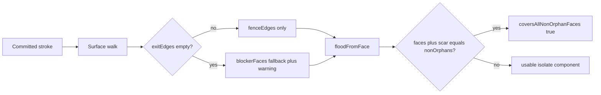

# Remediate QA Slice 1 (isolation logic)

Working SSOT remains [docs/plans/product/qa-isolation-slice1.md](docs/plans/product/qa-isolation-slice1.md). Append decision outcomes and finding status there; do not rewrite audit history. Do not start epic Slice 2 until High findings are closed or explicitly waived.

## Locked policy (from this planning pass)

| # | Choice | Rule to implement |
|---|--------|-------------------|
| **D1** | Hybrid | Prefer separating `EdgeKey` fences. `blockerFaces` only when a stroke walk has **no** exit edges (ADR 0101 fallback). Do **not** always paint walked faces as opaque. |
| **D2** | Option A | Whole-mesh warn when flood + stroke **scar** (fallback blockers) cover every non-orphan face — i.e. “mesh minus ribbon” counts as whole-mesh. |
| **D3** | Follow hybrid | No dual-side blockers when exits exist → vertex-ring bracelets must not eat the adjacent band. When fallback blockers *are* used, only record the **walked** face, not every face incident to the exit edge. |
| **Perf** | Include 008 if easy | Prefer one `WorkingMesh` per stroke (or per `fenceEdgesFromStrokes` call) while touching the walk; slip only if the refactor fights the fence semantic change. |

### Exact hybrid fence contract

In [`fenceEdgesFromStrokes.ts`](src/logic/isolation/fenceEdgesFromStrokes.ts) / [`types.ts`](src/logic/isolation/types.ts):

1. Always union stroke **exit** `EdgeKey`s into `fenceEdges`.
2. Keep a full **walked-face** set for classification / diagnostics (used by [`classifyStrokeVsMask`](src/logic/isolation/classifyStrokeVsMask.ts)).
3. Union walked faces into `blockerFaces` **only if** that stroke’s `exitEdges.size === 0` (and faces nonempty) — same path that already emits the “approximate fence” warning.
4. Change `recordExit`: add `exit.faceIndex` only (not `faceIndicesWithEdge` dual neighbor). Classification still sees the walked face; dual-side eating goes away under fallback.
5. Update `FenceFromStrokesResult` / comments to match ADR (blockers = fallback-only). Optionally clarify one sentence in [ADR 0101](docs/decisions/product/0101-mesh-isolation.md) that cut-through faces are **not** opaque when exit edges exist (thin virtual seams).

**Why midpoint bracelets break under this rule:** [`tubeBraceletStroke`](src/logic/isolation/testMeshes.ts) (longitudinal midpoints) tends to produce non-separating exit keys; today’s green “arm band” test is carried by opaque band faces. After hybrid, the **canonical** bracelet fixture must be a **circumferential vertex-ring** stroke whose exit keys match (or contain) [`tubeCircumferentialLoop`](src/logic/isolation/testMeshes.ts). Midpoint strokes become a characterizing case: either they separate via real cycles, or flood wraps and whole-mesh warn fires (correct product signal).



---

## Workstreams (all findings)

### A — Fence + flood semantics (High + related Medium)

**ISO-S1-001 / 004 / 002**

- Implement hybrid contract above.
- [`floodFromFace`](src/logic/isolation/floodFromFace.ts): redefine

```ts
coversAllNonOrphanFaces =
  faces.length + countNonOrphanBlockersNotInFlood === nonOrphanCount
```

  where “scar” = non-orphan faces in `blockerFaces` that were not entered (seed-on-blocker still returns `[seed]` and should not claim whole-mesh unless `nonOrphanCount === 1`).
- With fence-only incomplete cycles, flood wraps → `faces.length === nonOrphanCount` → warn without needing blockers (ISO-S1-005 product mode).
- Add defensive neighbor range check (`neighbor` in `[0, faceCount)`) before enqueue (audit note on stale topology).

**ISO-S1-012** (cheap while editing flood): use true BFS (`shift` / head index), match the file comment that already says BFS.

**Tests (must fail first if semantics wrong):**

- Flood with **stroke-derived** `fenceEdges` and **omitted / empty** `blockerFaces` isolates the arm band (ISO-S1-001 oracle).
- Circumferential **vertex-ring** stroke: adjacent band faces are **not** in `blockerFaces`; flood keeps the isolate band (ISO-S1-004).
- Incomplete bracelet (drop one segment): `coversAllNonOrphanFaces === true` (ISO-S1-002 + 005).
- Chest scribble / non-cycle with fallback blockers: mesh-minus-ribbon → `coversAllNonOrphanFaces === true` (ISO-S1-002).

### B — Fixtures that can fail for the right reasons

**ISO-S1-003** — Add a **branched** mesh in [`testMeshes.ts`](src/logic/isolation/testMeshes.ts) (e.g. two open tubes sharing a vertex ring / T-junction). Bracelet on limb A + seed on A must not flood limb B.

**ISO-S1-005** — Gapped cycle on the tube (covered in A).

**ISO-S1-011** — Single-point stroke → approximate warning + local blockers; empty `points` → empty fences, no warning; duplicate overlapping bracelets → set-union idempotent (warnings may duplicate; assert edges/faces stable).

Replace or demote tautological checks (**ISO-S1-010**): exact expected `fenceEdges` ⊇ circumferential loop (or equality where safe); wall-bracelet classify asserts exact `"outside"` or `"crossing"` per fixture; drop or merge redundant “hand/torso leak” duplicate of the exact face-set test.

### C — Warnings and non-manifold (Medium)

**ISO-S1-006** — In `floodFromFace`, when scanning a face edge: if `topology.edgeToFaces.get(key)?.length > 2`, treat as wall (already `getNeighborAcrossEdge === null`) **and** push a warning on the result (extend [`FloodFromFaceResult`](src/logic/isolation/types.ts) with `warnings?: string[]`, or always `warnings: string[]`). Add a 3-face-around-edge fixture. Do not silently pretend it is a normal boundary without messaging.

**ISO-S1-007** — In fence walk / `fenceEdgesFromStrokes`: warn when `locate === none` on a segment endpoint, when hop cap exhausts with unfinished path, or when a multi-point stroke yields empty `fenceEdges` and empty faces. Prefer gapped fences to still return partial edges **with** warning (UI toast later).

### D — Extract / Slice 3 landmines (ISO-S1-009)

Keep [`extractFaceSubset`](src/logic/isolation/extractFaceSubset.ts) allowing `faceCount === 0` (current contract), but add tests:

- Disjoint mask → extract → `partitionIslands` length 2; vertex indices unchanged.
- Document/assert: subset face ids are packed (≠ original); strokes/classification stay on **original** face indices via session mesh.
- Empty subset → `buildTopology` throws; add a tiny helper used by future Slice 3 (e.g. `assertSubsetHasFaces`) rather than changing extract silently — UI must not call topology on empty.

### E — Performance + walk drift (Medium / Low)

**ISO-S1-008** — While editing the fence walk: construct **one** `WorkingMesh` in `traceStrokeFences` (reuse across segments). If still small, one mesh for the whole `fenceEdgesFromStrokes` call. Do not change `locate` asymptotics in this pass.

**ISO-S1-013** — Prefer extracting a shared internal hop helper used by `tessellateSurfaceSegment` and the fence tracer (path samples vs exit edges/faces), **if** the diff stays localized to [`surfacePath.ts`](src/logic/cuts/surfacePath.ts) + fence module. If that balloons, ship warnings + a cross-reference comment and park full dedupe as a follow-up note in the QA file (not a Slice 2 blocker).

---

## Suggested implementation order

1. **Policy docs** — Append D1–D3 resolutions + hybrid rule to the QA decision queue; optional one-paragraph ADR 0101 clarification.
2. **Fence semantics + WorkingMesh reuse** — A + E(008) together in `fenceEdgesFromStrokes.ts`.
3. **Flood scar flag + BFS + non-manifold warnings** — `floodFromFace.ts` / types.
4. **Fixtures** — circumferential stroke helper, branched mesh, incomplete bracelet, non-manifold toy.
5. **Rewrite / add Vitest** — 001–007, 009–012; tighten 010; 013 only if shared walk lands.
6. **Mark findings** in QA table + [qa-audits.md](docs/plans/product/qa-audits.md) index; `npm test` + `npm run lint`.

## Out of scope (this remediation)

- Epic Slice 2 (Zustand overlay), viewer, Flatten wiring.
- Dense 84k-tri runtime benchmark (optional manual note only).
- Auto-snapping user strokes to geodesic bracelets (product UX).
- Mask-aware `partitionIslands` (still extract-then-topology for Flatten).

## Verification

- `npm test` — new oracles must fail under old always-blocker behavior and pass after hybrid.
- `npm run lint`
- Manual spot-check not required for pure logic; confirm QA High rows Closed before Slice 2.

## Edge cases still deferred after this pass

- Seed on fence-incident face that is not a blocker (thin fence): face may join isolate — acceptable under hybrid; add a characterizing test if time.
- Seams **and** stroke fences combined — one integration test if cheap.
- Closed cube / capped cylinder — nice-to-have, not required to close Highs.
- Full dedupe of fence walk vs tessellate if ISO-S1-013 slips.
