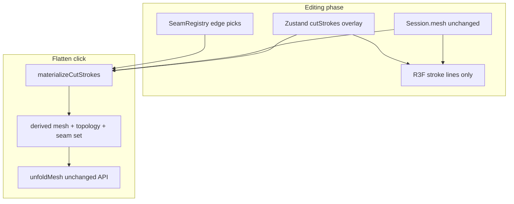

# Phase 2: Freeform cut strokes (3D) — revised

## Pivot (accepted)

| Before | After |
|--------|--------|
| `subdivideMeshAlongStroke` on pointer-up | Strokes stored as **overlay**; base `MeshModel` in session **unchanged** |
| `meshLoadVersion` bumps per cut | **Only file load** bumps `meshLoadVersion`; stroke edits bump **`patternRevision`** (or equivalent) for flatten staleness |
| Immediate seam overlay from new topology | 3D **stroke overlay** while editing; **SeamOverlay** + flatten use **materialized** mesh at Flatten time |

## Goal

- **3D** draw cuts across face interiors (freeform), not limited to pre-existing edges.
- **Non-destructive** edit: delete / move / partial erase strokes before committing geometry.
- **Lazy commit:** `materializeCutStrokes(canonicalMesh, cutStrokes[], manualSeams)` runs inside **Flatten** (pure logic in `src/logic/`).
- **Open loops** allowed with **warning toast** before unfold proceeds ([ADR 0002](docs/decisions/poc/0002-unfold-step-1-hinge-island.md) triangle soup supports slits/darts in principle).

## Architecture

**Preserve**

- Final seam identity remains `EdgeKey` on **materialized** mesh.
- [`unfoldIsland`](src/logic/unfold/unfoldIsland.ts) / [`partitionIslands`](src/logic/mesh/partitionIslands.ts) unchanged — they consume materialized inputs only.
- Canonical stroke coordinates (inverse of [`computeDisplayVertices`](src/viewer/displayNormalization.ts)).

**Future-proof metadata (v1 fields, optional)**

- Per stroke: stable `id`, `points[]`, later `role: cut | fold`, `foldKind: mountain | valley`.
- Materialize output: `CutManifest` — `{ strokeId, segmentIndex, edgeKeys[] }` for **edge ID matching** on SVG without coupling to Zustand in export logic.

## ADR 0100 topics (before code)

1. Overlay vs materialized mesh; reload file clears strokes.
2. Stroke order deterministic (array order); materialize is pure function.
3. Snapping epsilon (scale-aware, align with weld / `SAT_EPS` spirit).
4. Internal endpoints + fan triangulation rules; reject self-intersecting polylines per face.
5. Open-loop validation semantics + warn-and-continue on Flatten.
6. Explicit non-goals v1: glue flaps, page scale, fold line styling in SVG (hooks only).

## Slices (unchanged count, revised content)

### Slice 1 — Logic: materialize + subdivide

- `materializeCutStrokes(mesh, strokes, seams)` → `{ mesh, topology, seams, warnings, manifest?, validation: { openLoops, ... } }`
- Segment–triangle intersection; edge chord splits; **internal vertex** + fan from ordered points within face.
- Vertex/edge snapping before inserting new vertices.
- Unit tests: diagonal cut; internal stop; zigzag (valid); near-vertex snap; multi-stroke intersection order.

### Slice 2 — State + Flatten wiring

- Zustand: `cutStrokes`, add/update/delete/clear; **does not** mutate `session.mesh`.
- `patternRevision` increments on stroke CRUD (and manual seams stay as today — re-flatten message).
- [`useFlattenExport`](src/ui/useFlattenExport.ts): on Flatten → materialize → validation toasts → `unfoldMesh(derived...)`.
- Optional: memoize last materialize by hash(strokes, seams, meshLoadVersion) within session.

### Slice 3 — Viewer UX

- In-progress stroke in **component ref**; commit to Zustand on pointer-up.
- Overlay: `CutStrokesOverlay` — single BufferGeometry / LineSegments, update on store commit not every pointermove.
- Tool enum: edge pick vs draw cut.

### Slice 4 — Docs

- Promote to [docs/plans/product/phase-1-freeform-cut-strokes.md](docs/plans/product/phase-1-freeform-cut-strokes.md).

## Expert review notes (2026-07-28)

Captured in plan for ADR authors — see chat / PROJECT_SUMMARY when promoted.

### Lazy Flatten — performance & topology

- **Performance:** One batch subdivide on Flatten is acceptable for PoC; same main-thread spike class as existing UI-004. Mitigate with segment bbox culling, stroke point caps, optional progress UI. Editing stays cheap.
- **Topology:** Deterministic stroke order; weld/snap after full materialize; validate manifold summary before unfold. **Do not** persist materialized mesh in session v1 — recompute each Flatten (memo optional).

### Fan triangulation vs unfold

- **Low risk** to BFS hinge if output stays **strict triangles**, manifold, non-degenerate indices.
- **Risks:** concave fan polygons (same class as OBJ fan); self-intersecting zigzags; sliver triangles → hinge noise / quality collisions. **Mitigate:** simplify stroke; reject self-intersect per face; min angle/edge length checks.

### Open loops vs island partition

- Seam edges **do not automatically** imply “slit” in 2D — [`partitionIslands`](src/logic/mesh/partitionIslands.ts) only cuts adjacency on seams; open polyline may **not** disconnect islands but still subdivides mesh.
- ADR must define: (a) which materialized edges are seams, (b) what “open loop” warning means (e.g. stroke endpoints both interior, or no closed seam cycle separating regions), (c) expected 2D behavior (triangle soup duplicate corners along cut path).

### Zustand + R3F

- Plain `{x,y,z}[]` or `Float32Array` per stroke; stable string ids.
- Dragging: local ref only; Zustand on commit.
- Granular selector / shallow; overlay isolated from full page session selector.

### Blind spots to address in ADR

- Flatten snapshot keyed on **meshLoadVersion only today** — must include strokes/seams fingerprint ([`useFlattenExport`](src/ui/useFlattenExport.ts) ARCH-003).
- 3D SeamOverlay vs stroke overlay until Flatten — two visual layers.
- Partial erase / edit stroke — geometry re-materialize differs; ids stable, points mutable.
- Boundary vs interior stroke endpoints (boundary may already be seam).
- Multi-stroke T-junctions — snap + weld order.
- Export/SVG still tier-1; manifest reserved for edge IDs / folds / tabs later.

## Verification

- Draw → delete stroke → mesh vertex count unchanged (session base mesh).
- Flatten → islands/split match materialized cuts; warn on open loop case from fixture.
- `npm test` / `npm run lint`
