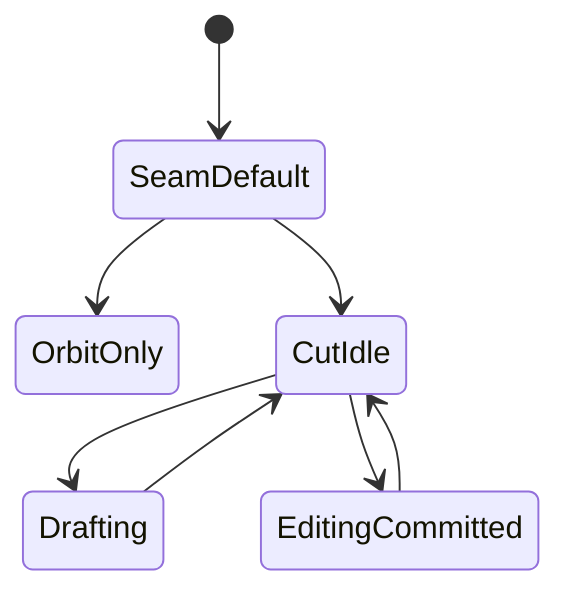

# Holistic QA strategy (post–Phase 1)

**Status:** Plan only — no code, no test edits, no audit execution until approved.  
**Scope:** Whole project after Polyline Freeform Cuts Slices A–E / [ADR 0100](docs/decisions/product/0100-freeform-cut-strokes.md).  
**Baseline:** Slice E manual matrix is already green ([qa-audits.md](docs/plans/product/qa-audits.md)). This plan does **not** re-open C-002 or CUT-UX-001/002/003 as new defects.  
**Deliverable after approval:** persist this strategy as [docs/plans/product/qa-holistic-post-phase1.md](docs/plans/product/qa-holistic-post-phase1.md) and index it from [qa-audits.md](docs/plans/product/qa-audits.md) + [docs/plans/product/README.md](docs/plans/product/README.md). Findings from a later execute-audit pass append to `qa-audits.md` (newest first), using the existing severity scale.

**Current automated baseline (static inventory, not a fresh run):** ~49 `*.test.ts` files, ~328 `it()` cases, Node-only Vitest (`environment: "node"`). No `*.test.tsx`, no Testing Library, no React/R3F tests.

```mermaid
flowchart LR
  load["parseObj_parseStl"] --> weld["weldVertices"]
  weld --> topo["buildTopology"]
  topo --> edit["seams_and_cutStrokes"]
  edit --> flatten["flattenWithCutStrokes"]
  flatten --> mat["materialize_if_strokes"]
  mat --> unfold["unfoldMesh"]
  unfold --> quality["collisions_tears"]
  quality --> svg["SVG_preview"]
```

---

## How this audit will run (later)

Follow the existing product QA rules in [qa-audits.md](docs/plans/product/qa-audits.md):

- Prefer characterizing Vitest in `src/logic/` that try to break the code.
- Do **not** fix production code during the audit pass; remediation is a separate slice.
- Each finding: **Issue**, **Severity**, **Root Cause & Proposed Strategy**, plus a link to a failing/characterizing test when one exists.
- Treat frozen items as known limits, not new bugs, unless they newly crash or corrupt `EdgeKey` / soup length.

**Suggested execution order (after this plan is approved as a document, on a later prompt):**

1. CI gate: `npm test` then `npm run lint` — record counts vs the ~328 baseline.
2. Logic & math regression (section 1) — no-cut golden path first, then derived-mesh soup after cuts.
3. Test-suite health (section 5) — classify false positives / gaps; add characterizing tests only in a later remediation/test-hardening slice.
4. Manual viewer + E2E scripts (sections 2–3) on `npm run dev`.
5. Edge-case pass (section 4), including optional `3d_models/` if present.
6. Write findings into `qa-audits.md`; do not mix fixes into that pass.

---

## Known limits (do not file as new bugs)

- **POLYCUT-C-002** — incomplete opposite-face overlay/connect walk; must not tunnel (C-001 is fixed).
- **CUT-UX-001 / 002 / 003** — no mid-segment insert, no general undo stack, no draw-time snap/weld ([PRODUCT_ROADMAP.md](PRODUCT_ROADMAP.md)).
- **UI-004** — Flatten stays on the main thread (PoC ADR 0004 deferred).
- **LOGIC-004** — geometric zero-area with distinct indices is in-scope as a known PoC limit; topology only skips **index** degeneracy.
- **Intra-island open slits** — `unfoldIsland` does not read seams (ADR 0002). Open darts warn and continue; 2D paper may stay hinged across the cut.
- **Concave n-gon fan** — OBJ load warning; do not hack triangulation.
- **POLYCUT-B-007** — digon close min-3 deferred.
- **POLYCUT-008 / 009** — Esc vs sidebar (Low).
- Sidebar **Islands (base / edge seams)** ignores overlay strokes until Flatten (ADR 0100 / POLYCUT-B-001). That is expected.

---

## 1. Logic and math (regression)

Cuts do not rewrite parse or unfold APIs. They can still break flatten by feeding a **derived** mesh and **remapped** `EdgeKey` seams into the same pipeline. Overlay and Flatten share `findExitEdgeAtPoint` in [cutSurfaceWalk.ts](src/logic/cuts/cutSurfaceWalk.ts), so C-002 is also a Flatten-connect failure, not only a preview gap.

**Empty `cutStrokes` is the identity path** — [flattenWithCutStrokes.ts](src/logic/cuts/flattenWithCutStrokes.ts) calls `unfoldMesh(baseMesh, baseTopology, manualSeams)`. That is the golden no-cut regression.

### Invariants to re-verify

**ADR 0001**

- Packed `vertices` (`3 * vertexCount`) and triangle `faces` (`3 * faceCount`); 0-based indices.
- `EdgeKey` via `makeEdgeKey` — never float matching. Seams are `Set<EdgeKey>` on the **derived** mesh after materialize.
- After `splitEdge`, parent seam keys are gone; only finest children remain (`seamEdgesExistOnMesh`).
- XY flatten plane; SVG Y-flip only at export.

**ADR 0002**

- `positions2d.length === 6 * islandFaceCount`; no `Map<VertexIndex, Vec2>`.
- Parent-soup-copy BFS; 2D edge lengths ≈ 3D; tree hinges agree in 2D.
- `unfoldIsland` does not read seams. On `error`, discard soup.

**ADR 0003**

- Quality is detect-and-report; collisions/tears must not set `UnfoldMeshResult.error`.
- Closed cube, no seams → many collisions + tears (not a regression).

**ADR 0100**

- Base `session.mesh` unchanged while drawing; materialize is pure and does not replace session mesh.
- Stroke coords = canonical mesh space (`displayToCanonical`).
- Stroke CRUD bumps `patternRevision` only; `meshLoadVersion` is load-only.
- Flatten fingerprint: `meshLoadVersion:patternRevision:seamsContentKey` in [meshSessionStore.ts](src/state/meshSessionStore.ts).
- Open loops: warn + continue; may not increase island count.
- Self-intersecting whole-stroke 3D: skip that stroke.

### High-risk coupling (must stay green)

- [flattenWithCutStrokes.ts](src/logic/cuts/flattenWithCutStrokes.ts) — identity vs materialize-then-unfold; ignores session topology when strokes exist.
- [materializeCutStrokes.ts](src/logic/cuts/materializeCutStrokes.ts) / [workingMesh.ts](src/logic/cuts/workingMesh.ts) — Steiner fan, `splitEdge` seam remap, T-junction order.
- [unfoldIsland.ts](src/logic/unfold/unfoldIsland.ts) / [unfoldMesh.ts](src/logic/unfold/unfoldMesh.ts) — hinge fail on slivers from near-edge cuts.
- [partitionIslands.ts](src/logic/mesh/partitionIslands.ts) — seams cut dual adjacency only; open slits stay one island.
- [seamSegments2d.ts](src/logic/unfold/seamSegments2d.ts) — stale parent keys silently drop from SVG.
- [displayNormalization.ts](src/viewer/displayNormalization.ts) — must not leak into `src/logic/`.

### Automated regression gate (existing — keep green)

Strong today: [unfoldIsland.test.ts](src/logic/unfold/unfoldIsland.test.ts), [unfoldMesh.test.ts](src/logic/unfold/unfoldMesh.test.ts), [layoutIslands.test.ts](src/logic/unfold/layoutIslands.test.ts), [parseStl.test.ts](src/logic/io/stl/parseStl.test.ts), [materializeCutStrokes.adversarial.test.ts](src/logic/cuts/materializeCutStrokes.adversarial.test.ts), [polylineClosedLoop.audit.test.ts](src/logic/cuts/polylineClosedLoop.audit.test.ts), [meshSessionStore.test.ts](src/state/meshSessionStore.test.ts) versioning, [displayNormalization.test.ts](src/viewer/displayNormalization.test.ts).

**Critical gap to treat as a later test-hardening item (not a silent pass):** [flattenWithCutStrokes.test.ts](src/logic/cuts/flattenWithCutStrokes.test.ts) asserts `islands.length >= 1` after a diagonal cut — a no-op materialize still passes. Closed-loop **island split** lives only in the Slice B audit file. Production flatten tests must later pin: closed ring on `unitQuad` → `islands.length >= 2`; empty strokes → identical to `unfoldMesh`; open dart → warning and island count may not increase.

**Derived-mesh soup (missing):** reuse unfoldIsland length / CCW / 3D=2D / tree-hinge asserts **after** `flattenWithCutStrokes` on triangle, closed quad ring, and cube + manual seams. That is the real “cuts did not break unfold” check.

### Manual golden (no-cut)

- Demo **Cube** (STL) and **D20** (OBJ): Flatten with no seams/cuts; soup finite; quality overlay matches “closed shell” expectation on the cube.
- Seam-only: pick a manifold cube edge cycle (or enough edges to split) → Flatten islands increase; `meshLoadVersion` unchanged (sidebar islands update; 2D clears until Flatten).
- OBJ vs STL twin if present in `3d_models/`: parse + Flatten counts comparable.

---

## 2. UI and viewer (React Three Fiber)

Zustand owns durable session (`mesh`, `seams`, `cutStrokes`, `meshEditTool`). Draft/edit clones live only in [useCutPolylineDraft.ts](src/viewer/cutPolyline/useCutPolylineDraft.ts) refs until Done. Flatten snapshot is **page-local** in [useFlattenExport.ts](src/ui/useFlattenExport.ts), not the store.

Tools in the sidebar select: **Orbit only** / **Edge seam pick** / **Draw cut polyline**. Flatten does **not** change `meshEditTool`. Uncommitted draft points are **not** flattened.

### Risks to verify manually (and later characterize in logic where possible)

**State**

- Seam toggle / clear: `meshLoadVersion` unchanged; `seamsContentKey` changes; 2D snapshot **silently empties** (no stale-pattern toast).
- Cut Done: `patternRevision++`; load version unchanged; 2D empties until Flatten.
- Draft without Done: store and Flatten ignore the draft.
- Successful reload: `cutStrokes = []`, `patternRevision = 0`, Canvas remounts via `key={mesh-${meshLoadVersion}}` (draft gone). Failed load keeps prior session, strokes, and 2D.
- Demo fetch in [useMeshLoadHandlers.ts](src/ui/hooks/useMeshLoadHandlers.ts) runs **before** `loadSeq` increments — two rapid “Load demo” clicks can commit the slower fetch.
- Leaving Cut tool calls `cancel()` — unsaved re-edit discarded with no confirm (same class as old D-001, which only blocked picking another stroke).

**Picking / Orbit**

- Fat-line raycast + `stopPropagation` on draft line (D-002) and idle committed proxies: orbit **cannot start** on those lines (dead zone). Marker drag disables Orbit via React state (one-frame race possible).
- Click draft line body must not append; click mesh away from line appends; amber first marker closes; drag first marker moves.
- Model scale: draw after changing scale; overlay must sit on the mesh (canonical store, display overlay).

**Memory / performance**

- [InProgressPolylineLine.tsx](src/viewer/cutPolyline/InProgressPolylineLine.tsx) replaces `BufferAttribute` on every hover/drag without disposing the previous attribute — long Cut sessions may grow GPU buffers until unmount.
- Rubber-band / drag rebuilds a full `tessellateDraftDisplayPath` / `WorkingMesh` walk **per pointermove** — hitch risk on Big_M / large `3d_models/`.
- Home page is not memoized: toast, seam, and stroke updates re-render `MeshViewport`.
- Flatten is synchronous on click: `setFlattening(true)` may never paint “Flattening…”; Orbit freezes (UI-004). Do not file as a new High unless it **newly** crashes; record as confirmed deferred + note if Big_M is unusable.

**Not covered by unit tests (must be this manual pass)**

`MeshViewport`, `PickableMesh`, `CutPolylineSession`, markers, fat-line pick, OrbitControls, Canvas remount, `AppSidebar` tool switch, `useFlattenExport` hook (silent stale 2D, sync freeze), Esc vs sidebar, GPU dispose.

Stay **Node-only** for automated tests unless a later plan explicitly adds jsdom. That matches [AGENTS.md](AGENTS.md) and [vitest.config.ts](vitest.config.ts).

---

## 3. End-to-end user journeys (manual)

Run on `npm run dev`. Record Pass / Fail / N/A, browser, and mesh. Use demo **Cube** unless noted. Do not treat C-002 or CUT-UX backlog as failures.

### Journey A — Golden seam-only papercraft (no cuts)

**Goal:** Prove load → topology → seam pick → unfold → SVG still works after Phase 1.

1. Load demo **Cube**. 3D mesh visible; sidebar shows islands = 1; Cut strokes = 0.
2. Tool **Edge seam pick**. Click several manifold edges until sidebar islands > 1. Confirm 2D panel emptied (stale snapshot). Confirm no load-reset of camera/mesh identity (same model, seams only).
3. **Flatten**. 2D islands match sidebar island count (no cuts). Quality overlay optional.
4. Export SVG with seam overlay on, then off. File downloads; polygons present.
5. **Clear seams**. 2D empties. Flatten again → one island (closed cube collisions/tears expected).
6. Load demo **D20**. Prior cube session replaced; cuts empty; Flatten succeeds.

**Fail if:** seam pick does nothing, Flatten errors, SVG empty, or a seam toggle remounts the Canvas / clears as if a new file loaded.

### Journey B — Closed-loop cut → extra island → export

**Goal:** ADR 0100 happy path (Slice E plus Flatten island contract).

1. Load Cube. Tool **Draw cut polyline**. Place ≥3 vertices on **one face**, orbit between clicks. Rubber-band follows hover.
2. Click **amber first-vertex marker** to close. Stroke commits (cyan). Sidebar Cut strokes = 1. Sidebar **Islands (base / …)** still 1. Base vertex count unchanged (stats).
3. **Flatten**. Toast only if open-loop (should not). **Flatten islands** ≥ 2. 2D shows a split panel.
4. Export SVG. Cut appears as seam overlay in 2D when enabled.
5. **Delete last cut**. 2D empties. Flatten → back to single island / cube quality.

**Fail if:** close does not commit, Flatten island count stays 1 for a true closed ring on a face, or session mesh vertex count grows before Flatten.

### Journey C — Mixed seams + re-edit + tool switching

**Goal:** Versioning, draft discard, committed re-edit (Slice D) vs Flatten.

1. Load Cube. Pick 1–2 edge seams (tool Seam). Flatten once (baseline 2D).
2. Switch to **Draw cut polyline**. Draw an open 2-point dart; **do not** Done. Click Flatten. 2D must match **committed** state only (ignore draft). Draft still visible in 3D.
3. **Done** the dart. 2D empties (`patternRevision`). Flatten → open-loop **warning** toast; unfold still runs; island count may **not** increase (known).
4. Click the cyan stroke → edit. Drag a marker (overlay on-surface; no tunnel). Click mesh to append **at end only**. **Cancel** → original stroke. Repeat, **Done**, Flatten uses new polyline.
5. Switch tool to **Orbit only** mid-draft (new stroke, unsaved) → draft discarded, store unchanged.
6. **Delete this cut** / **Clear cuts**. Flatten without strokes unfolds base + remaining manual seams.

**Fail if:** Flatten consumes uncommitted draft, Cancel persists edits, Done does not stale 2D, or `meshLoadVersion` appears to remount the viewport on cut CRUD.

### Journey D — Failure recovery and mode hygiene

**Goal:** Load races, bad files, stale 2D, scale, opposite-face (known).

1. With a good Cube session + seams + a cut + Flattened 2D, upload a **corrupt OBJ** (see section 4). Toast/error; **prior mesh, seams, cuts, and 2D remain**.
2. Rapidly click two demos (Cube then D20). Final mesh must be the **last completed load**, not a mix. File picker: two files in succession — last wins via `loadSeq`.
3. Change model scale, draw a cut, Flatten. Overlay on mesh; pattern still canonical (not display-scaled).
4. Cube: two clicks on **opposite faces** (C-002). Overlay must not chord through volume; Flatten may warn `could not connect`. Adjacent-face fold **must** hop.
5. Mobile or narrow layout if available: Flatten switches to 2D tab; toggle 3D tab (resize). Esc with sidebar open while drafting (POLYCUT-008/009 — note only).
6. Optional: demo **Big_M** Flatten — record freeze / whether “Flattening…” appears (UI-004 confirmation).

**Fail if:** failed load wipes session, loads tear, display-space cuts produce no Flatten cut on a simple same-face stroke, or opposite-face path **tunnels** (C-001 regression).

---

## 4. Edge cases and failure points

### I/O and scale

- Corrupted OBJ: bad face token (covered), empty/`f` before `v`, OOB index, negative relative indices, `v/vt` / `v//vn`, non-finite `v`, oversize vs `MAX_MESH_FILE_BYTES` / `MAX_MESH_TRIANGLES`. **Gap:** OBJ error paths are thin vs STL.
- STL: ASCII vs binary, `solid` header on binary, truncated/NaN/budget — already strong in [parseStl.test.ts](src/logic/io/stl/parseStl.test.ts).
- Huge coords (~1e8): weld grid collision, Float32 loss, noisy hinges — unit synthetic + manual `3d_models/`.
- Tiny bbox (~1e-6): snap floors toward `WELD_EPSILON`; cuts may collapse — adversarial locate exists; Flatten/hinge still weak.
- Concave n-gon OBJ: `concave_ngon` warning; fan continues.
- Failed load must not bump `meshLoadVersion`.

### Topology and unfold

- Non-manifold edge (`incidents > 2`): toast; `canSelectAsSeam` reject. **Gap:** no unit fixture with `nonManifoldEdgesCount === 1`.
- Index-degenerate faces skipped; geometric needles from near-edge cuts can still enter unfold (LOGIC-004).
- Closed cube no seams: collisions/tears, export still works.
- Manual seam + cut on same edge: remap to children; 2D shows cut.

### Cuts

- Open vs closed loops; self-intersect skip; T-junction stroke order; scale-aware snap / off-plane gate (adversarial mostly covers; disjoint-faces case does **not** assert a warning).
- No post-materialize weld → near-duplicate Steiner verts → ~0 hinge length.
- Intra-island dart: warn; 2D corners across the cut may still **agree** (hinged) — characterize, do not “fix” in this audit.
- Display-scaled points accidentally passed to logic → locate miss → skipped segment.

### Local assets

- `3d_models/` (gitignored): [localAssets.smoke.test.ts](src/logic/io/localAssets.smoke.test.ts) parse+topo; unfold if `faces ≤ 5000`; **no cuts**. Optional manual: Flatten with/without one closed stroke. Do not commit meshes.
- `tests/` gitignored and **not** wired into Vitest.

---

## 5. Test suite health (Vitest)

**Keep:** unfold soup tests, parseStl, adversarial materialize, store versioning, displayNormalization, cutPolylineHelpers, layoutIslands. **Do not add React component tests** in the first hardening slice.

### Redundancy (safe to consolidate later)

- Inline `CUBE_OBJ` + “seam top face 4–7” copied across ~13 files — move to [testMeshes.ts](src/logic/io/obj/testMeshes.ts).
- Welded icosahedron island/face counts repeated in parse + unfold.
- Closed-cube collisions/tears pinned in detectCollisions (20), detectTears (7), and loosely in unfoldMesh/qualitySummary.
- SVG preview: [tier1Preview.test.ts](src/logic/export/svg/tier1Preview.test.ts) vs [buildSvgDocument.test.ts](src/logic/export/svg/buildSvgDocument.test.ts) both assert 12 polygons + 8 seam lines.
- Overlay tessellation: `surfacePath` vs Slice C audit vs `packCutStrokeDisplaySegments`.
- Helpers vs Slice D: `appendPolylineDraftPoint`, `canPickCommittedStroke`, store `patternRevision` on update.
- `shouldAppendCutSample` in both [cutDrawSampling.test.ts](src/viewer/cutDrawSampling.test.ts) and cutPolylineHelpers.

### False-positive / weak assertions (priority to tighten)

- [flattenWithCutStrokes.test.ts](src/logic/cuts/flattenWithCutStrokes.test.ts) — `islands.length >= 1` after a cut.
- [materializeCutStrokes.test.ts](src/logic/cuts/materializeCutStrokes.test.ts) — `seams.size >= 1`; never `partitionIslands`.
- Adversarial: `warnings.length > 0` (any warning); Infinity/collinear `not.toThrow` only; disjoint-faces never asserts `"could not connect"`.
- [workingMesh.test.ts](src/logic/cuts/workingMesh.test.ts) — `hasEdge(0,m1) || hasEdge(0,m2)`.
- [cutSurfaceWalk.test.ts](src/logic/cuts/cutSurfaceWalk.test.ts) — `exit.not.toBeNull()`.
- [unfoldMesh.test.ts](src/logic/unfold/unfoldMesh.test.ts) — `Array.isArray(collisions/tears)`.
- [demoMeshes.test.ts](src/logic/io/demoMeshes.test.ts) — `vertexCount/faceCount > 0`.
- [sliceD.committedEdit.audit.test.ts](src/logic/cuts/sliceD.committedEdit.audit.test.ts) — “Cancel” never calls cancel; dart flatten uses `islands.length <= before`.
- [sliceC.polylineDrag.audit.test.ts](src/logic/cuts/sliceC.polylineDrag.audit.test.ts) — “stays on start face” **locks in C-002**. A correct wrap would fail. Split into `it.skip` / documented frozen case.
- [partitionIslands.test.ts](src/logic/mesh/partitionIslands.test.ts) — 4 random cube seams → `length > 1`.
- [meshSessionStore.test.ts](src/state/meshSessionStore.test.ts) — failed load `session.not.toBeNull()` without same-reference assert; no STL load, no overlapping `loadSeq`, no ineligible-seam toast.

### Missing coverage (critical)

- parseObj reject/warn parity with STL (empty, budget, NaN, `v/vt`, negative indices).
- Non-manifold topology + `canSelectAsSeam`.
- ADR 0002 soup invariants on **derived** meshes after flatten-with-cuts.
- `listSeamSegments2d` skip count = 0 for valid remapped cut keys.
- Store: STL `loadMeshFile`, oversize file, concurrent load, `setMeshEditTool`.
- [flattenSnapshotUi.test.ts](src/ui/flattenSnapshotUi.test.ts) — overlay reset on `meshLoadVersion` only; does not cover `patternRevision` / seams stale key.
- Untested modules (low unless a bug points here): `analyzeUnfoldedIsland.ts`, `unfoldEdge2d.ts`, `toGlobalQualityReports.ts`, `loadBudgets.ts`, `meshEditTool.ts`, `useFlattenExport.ts`.

### Refactor recommendations (test-hardening slice, after findings)

1. Promote `polylineClosedLoop.audit.test.ts` island asserts into production `flattenWithCutStrokes` tests; keep audit files as historical or thin wrappers.
2. Fold overlapping Slice D store cases into `meshSessionStore.test.ts`.
3. Mark C-002 “stays on start face” as frozen, not a success spec for a future geodesic walk.
4. Shared cube fixture; one non-manifold fixture reused by topology + eligibility.
5. Tighten adversarial `kind`/substring asserts; drop tautological `Array.isArray` / `>= 1` where a cut must change topology.
6. One STL load through the store; failed load keeps the **same** session reference.

**Architecture alignment:** No unfold test uses `Map<VertexIndex, Vec2>` (good). Store tests already distinguish load vs pattern revision (good). Main misalignment is **audit-characterizing tests still labeled as such after remediation**, and flatten production tests not owning the island-split contract.

---

## Out of scope for this plan

- Implementing CUT-UX v2, geodesic opposite-face walk, or Web Worker flatten.
- Adding jsdom / Playwright / R3F component tests (recommend a separate decision if E2E Journey C/D stays flaky).
- Committing `3d_models/` or large fixtures.
- Any production code change.

After you approve: write the markdown under `docs/plans/product/`, index it, and stop. Execution of tests and remediations waits for an explicit follow-up.
