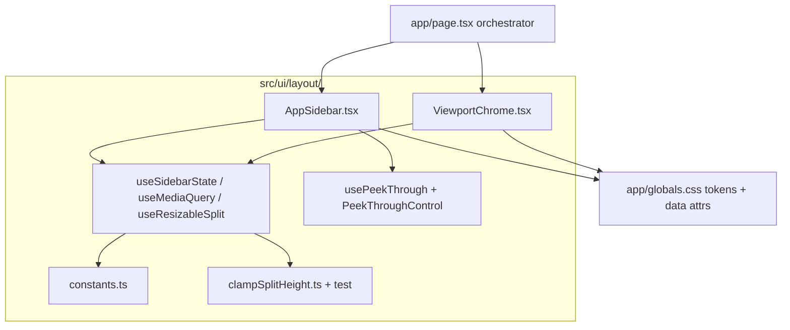
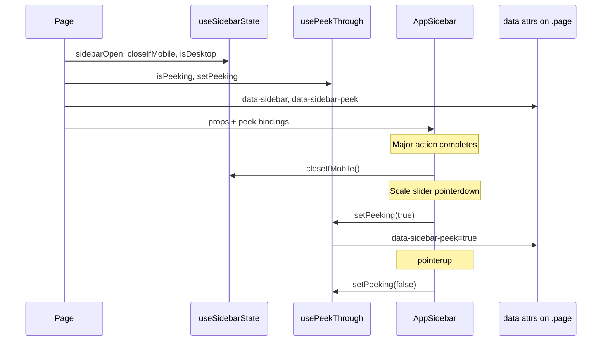

# Responsive layout — sidebar + 2D split (architecture review)

## Architecture principles (aligned with [AGENTS.md](AGENTS.md))

| Principle | Decision |
|-----------|----------|
| **Thin route, fat UI module** | [`app/page.tsx`](app/page.tsx) stays orchestration (store wiring); layout UI moves to [`src/ui/layout/`](src/ui/layout/) — same pattern as [`useFlattenExport.ts`](src/ui/useFlattenExport.ts) |
| **No logic in `src/logic/`** | Layout is presentation-only; clamp math lives in `src/ui/layout/` as pure functions with Vitest tests |
| **No new dependencies** | CSS transitions, `useSyncExternalStore`, Pointer Events, `localStorage` |
| **Single source of truth** | Breakpoint + dimensions in `constants.ts`; mirrored as CSS custom properties in `:root` |
| **Minimal inline styles** | Migrate sidebar `h2`/spacing inline styles to classes in this slice |
| **Respect user intent** | Breakpoint sets **initial** default only; never force-close/open on resize after user toggles |
| **Mobile UX is explicit** | Auto-close and peek-through are first-class, not ad-hoc callbacks scattered in `page.tsx` |

---

## Current state

- Layout: [`app/page.tsx`](app/page.tsx) + [`app/globals.css`](app/globals.css)
- Fixed `360px | 1fr` grid; no `@media` queries
- 3D/2D: `grid-template-rows: 1fr minmax(200px, 35vh)` — not resizable



---

## File layout (new)

```
src/ui/layout/
  constants.ts              # BREAKPOINT_PX, widths, storage keys, split defaults, peek opacity
  clampSplitHeight.ts       # pure clamp(viewportH, proposedPx) → px
  clampSplitHeight.test.ts
  useMediaQuery.ts          # useSyncExternalStore + matchMedia
  useSidebarState.ts        # open/collapsed + toggle + closeIfMobile + optional persist
  usePeekThrough.ts         # isPeeking + pointer bind helpers (mobile + open only)
  useResizableSplit.ts      # pointer drag + persist split height
  PeekThroughControl.tsx    # thin wrapper for continuous inputs (scale slider)
  AppSidebar.tsx            # rail, drawer, toggles, all control cards (props in)
  ViewportChrome.tsx        # mobile tabs + desktop resize handle wrapper
app/page.tsx                # wires store → layout components
app/globals.css             # layout tokens + responsive rules
```

[`app/page.tsx`](app/page.tsx) target: ~80 lines of wiring (down from ~370 lines of mixed layout + controls).

---

## CSS design tokens (`:root` in globals.css)

Define once, use everywhere — avoids magic numbers scattered in TS/CSS:

```css
:root {
  --layout-breakpoint: 769px;          /* min-width for desktop */
  --sidebar-open-width: 360px;
  --sidebar-rail-width: 80px;
  --sidebar-peek-opacity: 0.15;        /* ghost drawer during continuous drag */
  --split-2d-default: 280px;
  --split-2d-min: 140px;
  --split-2d-max-ratio: 0.6;
  --z-backdrop: 30;
  --z-sidebar: 40;
  --z-toast: 20;                       /* existing toast stack */
}
```

State driven by **data attributes** on `.page`:

```html
<div
  class="page"
  data-sidebar="open|collapsed"
  data-sidebar-peek="true|false"
  data-mobile-panel="3d|2d"
>
```

---

## Part 1 — Collapsible sidebar

### Interaction (all breakpoints)

| State | Visible | Toggle |
|-------|---------|--------|
| **Collapsed** | Fixed rail: title + `› Menu` | Open button under title |
| **Open** | Full panel (intro + cards) | `‹ Close` tab on **right edge** of panel |

### Desktop vs mobile mechanics (one clear approach each)

**Desktop (`min-width: 769px`) — in-flow column width**

- `.page` grid: `var(--sidebar-current-width) 1fr`
- Sidebar column **animates** `80px → 360px` via `--sidebar-current-width` transition (~220ms)
- Content inside sidebar uses `overflow: hidden` when collapsed — no `translateX` hack on desktop
- **No backdrop** — viewport column naturally expands when sidebar collapses

**Mobile (`max-width: 768px`) — overlay drawer**

- Grid always reserves rail: `var(--sidebar-rail-width) 1fr`
- Drawer: `position: fixed`, anchored to `left: var(--sidebar-rail-width)`, slides with `transform: translateX(-100%|0)`
- **Backdrop** covers only the viewport column (not the rail), `z-index: var(--z-backdrop)`, tap/Escape closes
- Avoids `padding-left` hacks on viewport — rail is a real grid column

### State: `useSidebarState`

Best-practice pattern — breakpoint default without clobbering user choice:

```tsx
// useSidebarState.ts
const isDesktop = useMediaQuery("(min-width: 769px)");
const [userOverride, setUserOverride] = useState<boolean | null>(null);
const sidebarOpen = userOverride ?? isDesktop; // desktop=true, mobile=false

function toggleSidebar() {
  setUserOverride((prev) => !(prev ?? isDesktop));
}

function closeIfMobile() {
  if (!isDesktop) setUserOverride(false);
}

function openIfMobile() {
  if (!isDesktop) setUserOverride(true);
}
```

- **Do NOT** snap open/closed on breakpoint cross after mount — if user opened menu on mobile, rotating to landscape keeps it open
- **Optional persist:** save `userOverride` to `localStorage` key `3dflatter.sidebarOpen` only after explicit toggle; read on mount inside `useEffect` (guarded `try/catch`)
- `useMediaQuery` implemented with **`useSyncExternalStore`** (React 18/19 recommended — no flash, correct SSR snapshot via `getServerSnapshot → true`)

### `useMediaQuery.ts`

```tsx
export function useMediaQuery(query: string): boolean {
  return useSyncExternalStore(
    (cb) => {
      const mql = window.matchMedia(query);
      mql.addEventListener("change", cb);
      return () => mql.removeEventListener("change", cb);
    },
    () => window.matchMedia(query).matches,
    () => true, // SSR: desktop-first; mobile corrects on hydration via userOverride null + isDesktop false
  );
}
```

### `AppSidebar.tsx` structure

```tsx
<aside className="sidebar" aria-label="App controls">
  <div className="sidebar-rail">
    <h2 className="sidebar-title">3D Flatter</h2>
    {!open && (
      <button type="button" className="sidebar-toggle sidebar-toggle--open"
        aria-expanded={false} aria-controls="sidebar-drawer" ...>
        <span aria-hidden>›</span><span>Menu</span>
      </button>
    )}
  </div>
  <div className="sidebar-drawer" id="sidebar-drawer">
    {open && (
      <button type="button" className="sidebar-toggle sidebar-toggle--close"
        aria-expanded={true} ...>
        <span aria-hidden>‹</span><span>Close</span>
      </button>
    )}
    {/* intro <p> + File/Seams/Flatten/Export/View cards — moved from page.tsx */}
  </div>
</aside>
```

Props: all session/actions currently in `page.tsx` (no Zustand inside sidebar — keeps component testable/pure).

### Toggle affordance (unchanged intent, tightened spec)

1. Icon + text label always (`› Menu` / `‹ Close`)
2. Min 44×44px touch target; reuse `.btn` visual language
3. Close control = vertical **edge tab** on drawer right (`border-radius` left only, subtle shadow)
4. `prefers-reduced-motion: reduce` disables width/transform transitions

### Accessibility

- `aria-expanded`, `aria-controls="sidebar-drawer"` on toggles
- **Escape** key closes sidebar when open (document listener in `useSidebarState`)
- Mobile backdrop: `<button type="button" aria-label="Close menu">` — not inert div
- Focus: move focus to open button when closed via Escape (avoid trapping focus on desktop where there's no modal)

---

## Part 2 — Draggable 2D split (desktop only)

### Pure function (tested)

```ts
// clampSplitHeight.ts
export function clampSplitHeight(
  viewportHeight: number,
  proposedPx: number,
  minPx = SPLIT_2D_MIN,
  maxRatio = SPLIT_2D_MAX_RATIO,
): number {
  const maxPx = viewportHeight * maxRatio;
  return Math.round(Math.min(maxPx, Math.max(minPx, proposedPx)));
}
```

Vitest cases: below min, above max, happy path, zero viewport edge case.

### `useResizableSplit`

- State: `split2dPx` initialized from `localStorage` (guarded) or `SPLIT_2D_DEFAULT`
- `onPointerDown` → `setPointerCapture` on handle; listen `pointermove`/`pointerup` on **handle element** (not window — fewer globals, auto-cleanup on unmount)
- Compute height from main container `getBoundingClientRect().bottom - clientY`
- `body { user-select: none }` during drag via class `.is-resizing`
- Persist to `localStorage` on `pointerup` only (not every move)
- Return `{ split2dPx, handleProps, isDragging }`

### `ViewportChrome.tsx`

Wraps children and owns layout chrome:

```tsx
<main className="viewport viewport-split" style={{ "--split-2d-height": `${split2dPx}px` }}>
  {isMobile && <ViewportTabs ... />}
  <div className="viewport-3d" role={isMobile ? "tabpanel" : undefined} ...>{children3d}</div>
  {!isMobile && <div className="viewport-split-handle" role="separator" ... {...handleProps} />}
  <div className="flatten-panel-host" role={isMobile ? "tabpanel" : undefined} ...>{children2d}</div>
</main>
```

Desktop CSS:

```css
@media (min-width: 769px) {
  .viewport-split {
    grid-template-rows: 1fr auto var(--split-2d-height, var(--split-2d-default));
  }
  .viewport-split-handle {
    height: 6px;
    cursor: row-resize;
    touch-action: none; /* prevent scroll while dragging on touch-enabled laptops */
  }
  /* Expanded hit area via ::before padding */
}
```

Mobile: hide handle; tabs switch `data-mobile-panel` on `.page` or `.viewport-split` to show one panel at full height.

---

## Part 3 — Mobile 3D / 2D tabs

- `mobilePanel: "3d" | "2d"` state in `page.tsx` or small `useViewportPanel` hook
- Proper tabs: `role="tablist"`, tabs with `aria-selected`, panels with `aria-labelledby`
- **Do not** auto-switch to 2D after flatten in v1 — surprising UX; note as optional follow-up
- Toasts remain in `.viewport-3d` (only visible on 3D tab — correct for mesh feedback)

---

## Part 4 — Mobile sidebar interaction refinements (NEW)

### Why these were omitted initially

Not for architectural reasons. They were listed under **optional follow-ups** to keep the first implementation slice focused on shell structure (collapse, resize, tabs). There is no conflict with `useSidebarState`, `useSyncExternalStore`, or CSS variables — they are orthogonal, ephemeral UI behaviors gated on `!isDesktop && sidebarOpen`.

### Control taxonomy

| Type | Examples in app | Mobile behavior |
|------|-----------------|-----------------|
| **Major actions** | File upload, Load demo, Flatten | Auto-close drawer after success |
| **Continuous** | Model scale `<input type="range">` | Peek-through (ghost) while dragging |
| **Discrete** | Seam mode checkbox, Grid/Axes/Wireframe toggles, demo `<select>`, Export/Clear buttons | Drawer stays open and opaque — no special handling |

### 4a — Auto-close on major actions (mobile only)

**When:** drawer is open on mobile, after a successful completion of:

1. **File upload** — `onPickFile` resolves after `loadMeshFile`
2. **Load demo** — `onLoadDemo` resolves after `loadMeshFile`
3. **Flatten** — `onFlatten` completes without error (user sees 3D viewport unobstructed; they can switch to 2D tab manually)

**Not auto-closed:** failed loads, Export SVG, Clear seams, discrete toggles, seam mode changes.

**Implementation:** `useSidebarState` exposes `closeIfMobile()`. `AppSidebar` calls it at the end of wrapped handlers — no logic in `page.tsx`:

```tsx
// AppSidebar.tsx — internal wrappers
const handlePickFile = async (file: File | null) => {
  await onPickFile(file);
  if (session) closeIfMobile(); // only if load succeeded (session updated)
};

const handleFlatten = () => {
  onFlatten();
  // close after flatten completes — onFlatten is sync today; if flattening becomes async, close in finally when !error
  closeIfMobile();
};
```

- Sets `userOverride(false)` — consistent with explicit user close; does not fight breakpoint defaults
- Desktop: `closeIfMobile()` is a no-op

### 4b — Peek-through ("ghost mode") on continuous inputs

**Goal:** While dragging the scale slider, user sees real-time 3D scale changes through a faded drawer.

**Critical technical note:** `pointer-events: none` on the **entire** `.sidebar-drawer` breaks the slider — the range input stops receiving `pointermove`. Solution: **scoped pointer-events** — disable on drawer, re-enable on the active control wrapper.

**State:** separate from open/closed — `isPeeking: boolean` in `usePeekThrough`, active only when `!isDesktop && sidebarOpen`.

**DOM:** set `data-sidebar-peek="true"` on `.page` while peeking.

**CSS (mobile only):**

```css
@media (max-width: 768px) {
  .page[data-sidebar-peek="true"] .sidebar-backdrop {
    opacity: 0;
    pointer-events: none; /* taps pass through to viewport */
  }
  .page[data-sidebar-peek="true"] .sidebar-drawer {
    opacity: var(--sidebar-peek-opacity);
    pointer-events: none; /* drawer body transparent to hits */
  }
  .page[data-sidebar-peek="true"] .peek-through-target {
    opacity: 1;
    pointer-events: auto; /* slider stays interactive */
  }
}
```

**Component:** `PeekThroughControl` wraps only the model scale slider block:

```tsx
// PeekThroughControl.tsx
export function PeekThroughControl({
  enabled,
  isPeeking,
  onPeekChange,
  children,
}: {
  enabled: boolean;       // !isDesktop && sidebarOpen
  isPeeking: boolean;
  onPeekChange: (v: boolean) => void;
  children: React.ReactNode;
}) {
  const bind = usePeekThroughBind(enabled, onPeekChange);
  return (
    <div
      className={isPeeking ? "peek-through-target" : undefined}
      {...bind}
    >
      {children}
    </div>
  );
}
```

```tsx
// usePeekThrough.ts — pointer bind
export function usePeekThroughBind(enabled: boolean, onPeekChange: (v: boolean) => void) {
  return {
    onPointerDown: (e: React.PointerEvent) => {
      if (!enabled) return;
      e.currentTarget.setPointerCapture(e.pointerId);
      onPeekChange(true);
    },
    onPointerUp: (e: React.PointerEvent) => {
      if (!enabled) return;
      onPeekChange(false);
    },
    onPointerCancel: () => onPeekChange(false),
  };
}
```

- `usePeekThrough` hook in layout module owns `isPeeking` state; `page.tsx` or `AppSidebar` passes `enabled={!isDesktop && sidebarOpen}` and wires `data-sidebar-peek` on `.page`
- **No effect on desktop** — `enabled` is false, zero CSS change
- **No effect on discrete controls** — only `PeekThroughControl` wraps the scale slider
- Restore on `pointerup`, `pointercancel`, and `lostpointercapture` (belt-and-suspenders)

### Integration flow (no spaghetti)



**Rules to prevent spaghetti:**

1. `useSidebarState` owns open/closed + `closeIfMobile` — nothing else calls `setUserOverride` directly
2. `usePeekThrough` owns peek boolean — only `PeekThroughControl` triggers it
3. CSS reacts to `data-*` on `.page` — components don't set inline opacity
4. Auto-close lives in `AppSidebar` handler wrappers, not in Zustand store or `meshSessionStore`
5. Adding a future continuous control = wrap it in `PeekThroughControl`; adding a future major action = call `closeIfMobile()` in its handler

---

## Part 5 — General polish

- `100dvh` on `.page` / `.viewport-split` (not `100vh`)
- `env(safe-area-inset-*)` on fixed sidebar/backdrop
- File `<input>` in sidebar: `max-width: 100%`
- Z-index: sidebar (`40`) > backdrop (`30`) > toasts (`20`) — document in `:root`

---

## Explicitly avoided (anti-patterns)

| Avoided | Why |
|---------|-----|
| All logic in `page.tsx` | 370+ line monolith; untestable drag/clamp |
| `useState(getDefaultSidebarOpen)` alone | Hydration flash on mobile; `useSyncExternalStore` is correct |
| Snapping sidebar on breakpoint resize | Overrides explicit user choice |
| `padding-left` viewport hack | Grid rail column is cleaner |
| Both `is-open` class **and** `data-open` | Redundant; single `data-sidebar` attribute |
| `translateX` drawer on desktop | Width animation on grid column is simpler |
| `pointer-events: none` on whole drawer without `.peek-through-target` exception | Breaks range slider drag |
| Inline `opacity: 0.15` in React state | Use CSS `data-sidebar-peek` + custom property |
| Auto-close in Zustand store | Layout concern, not session concern |
| Auto-switch to 2D tab after flatten | Surprising; defer |
| `localStorage` on every pointermove | Write on drag end only |

---

## Optional follow-ups (out of scope)

- Swipe-from-left-edge to open drawer
- Keyboard shortcut `[` to toggle sidebar on desktop
- Auto-switch to 2D tab after flatten
- Extend peek-through to desktop sidebar (probably unnecessary)
- Extract `readLayoutStorage` util if more keys are added

---

## Verification

1. **`npm test`** — new `clampSplitHeight.test.ts`; existing suite unchanged
2. **`npm run lint`**
3. **Manual QA**
   - Desktop: sidebar open by default; collapse/expand; viewport widens; no backdrop
   - Desktop: drag split handle; clamped; persists after refresh
   - Mobile: sidebar closed by default; overlay + backdrop; rail stays visible
   - Mobile: 3D/2D tabs; correct `aria-selected`
   - **Mobile: file upload / load demo / flatten → drawer auto-closes; mesh visible on 3D tab**
   - **Mobile: scale slider drag → drawer ghosts; 3D updates visible underneath; slider still draggable; restores on release**
   - **Mobile: seam mode checkbox / demo select → drawer stays open and opaque**
   - Rotate phone after opening menu — stays open (no snap)
   - Escape closes sidebar
   - Seam picking works sidebar collapsed
   - `prefers-reduced-motion` — no animation
