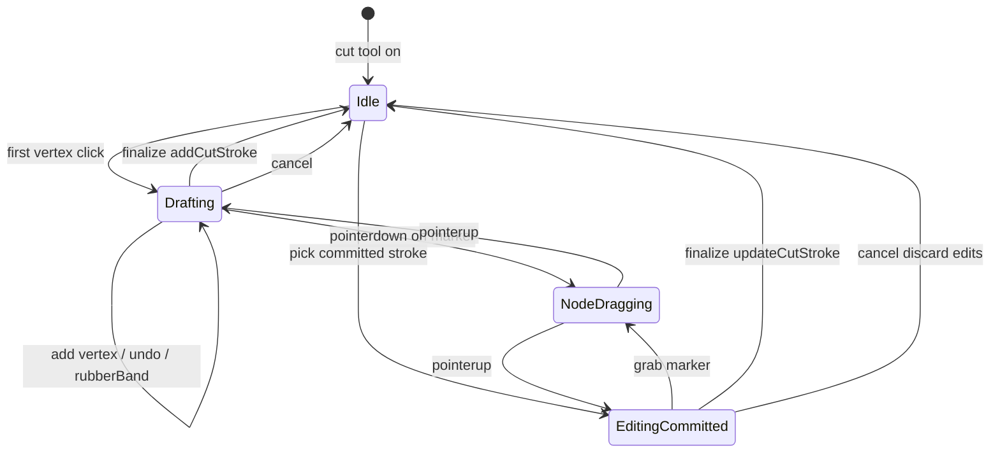
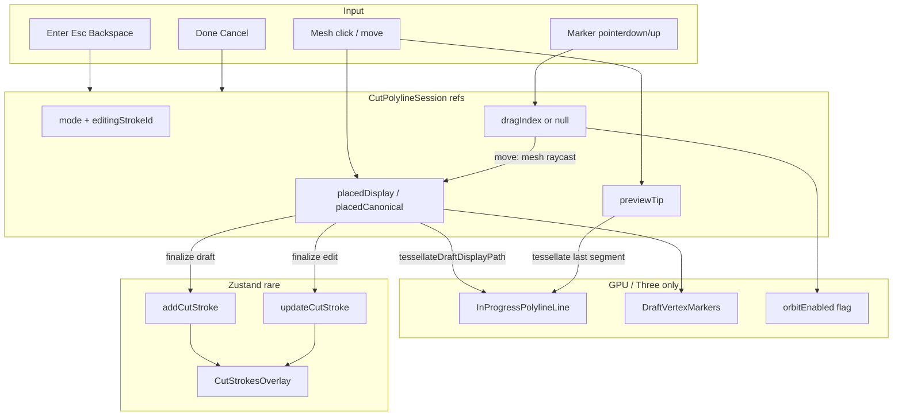

# Polyline Cut Tool + Node Editing (Full Lifecycle Blueprint)

## Context

Phase 1 logic + Zustand are done ([ADR 0100](docs/decisions/product/0100-freeform-cut-strokes.md)): `CutStroke` is already a canonical polyline; `addCutStroke` / `updateCutStroke` / overlays work. Current viewer UX in [`PickableMesh.tsx`](src/viewer/PickableMesh.tsx) is **freehand drag-sample → commit on pointer-up**. This plan **replaces** freehand with click-to-place polylines and designs **node dragging** end-to-end so later slices do not corner the architecture.

**Locked UX defaults:**

| Action | Gesture |
|--------|---------|
| Add vertex | Primary click on mesh (`pointerup`, drag ≤ 5px) |
| Finalize draft | Double-click **or** Enter **or** sidebar **Done** (requires ≥2 points; Done disabled until then) |
| Close loop | **Slice B+:** click the **first-vertex marker** → append duplicate of first as last + finalize. **Not** Euclidean “click near first on mesh” (disabled in Slice A after POLYCUT-001/002) |
| Undo last vertex | Backspace / Delete while drafting (not while dragging a node) |
| Cancel draft | Escape **or** sidebar **Cancel** **or** leave Cut tool |
| Drag node | Pointerdown on marker → move on mesh surface → pointerup |
| Re-edit committed | Click stroke / marker set → enter draft session; commit via Done / Enter → `updateCutStroke` |

Orbit stays **enabled** while drafting or idle in cut tool; disabled **only** for the duration of an active node grab.

**Slice A post-QA locks (shipped):** mesh-click auto-close off until B; `pointerleave` keeps pending click; model scale frozen while `cutDraftActive`; cap toast once per draft; too-few-points toast on Enter/dblclick.

**Slice B post-QA locks (shipped):** first-vertex marker close; overlay + materialize use face-local surface walk ([`surfacePath.ts`](src/logic/cuts/surfacePath.ts) / [`cutSurfaceWalk.ts`](src/logic/cuts/cutSurfaceWalk.ts)); draft line is tessellated sparse clicks via [`tessellateDraftDisplayPath.ts`](src/viewer/cutPolyline/tessellateDraftDisplayPath.ts). [`MeshViewport`](src/viewer/MeshViewport.tsx) currently hardcodes `orbitEnabled = true` — Slice C restores grab-gated orbit.

---

## Full lifecycle (avoid cornering later)



**Session modes inside one controller (`useCutPolylineDraft`):**

| Mode | Points live in | Commit path |
|------|----------------|-------------|
| `idle` | — | — |
| `drafting` | refs only | `addCutStroke` |
| `editingCommitted` | refs (copy of stroke) + `editingStrokeId` | `updateCutStroke(id, points)` on finalize; discard on cancel |

Rubber-band tip exists only in `drafting` (appending). While `NodeDragging` or `editingCommitted`, tip is cleared. Zustand / `patternRevision` bump **only** on finalize (add or update), never per drag frame.

---

## Architecture



**Invariant:** pointermove (rubber-band or node drag) mutates refs + Three buffers only. React re-renders for draft are limited to coarse UI flags (`cutDraftActive`, maybe `selectedStrokeId`) — never per-vertex arrays on move.

---

## 1. Raycasting: clicks vs hover vs drag

**Do not use `useFrame` for cut raycasting** in idle/draw/drag. Browser `pointermove` already delivers input-rate updates (~60–120 Hz). A per-frame Raycaster while idle wastes CPU.

| Concern | Mechanism |
|---------|-----------|
| Place vertex | Mesh `onPointerUp`, drag ≤ 5px, valid `faceIndex` |
| Rubber-band tip | Mesh `onPointerMove` when `drafting` and not dragging; `faceIndex != null` |
| Off-mesh tip | Clear tip; never invent air samples |
| Node drag hit | On move while `dragIndex != null`: **manual `THREE.Raycaster`** from camera + NDC pointer against the **pickable mesh** only (same geometry as [`PickableMesh`](src/viewer/PickableMesh.tsx)). Prefer mesh surface constraint over screen-plane drag |
| Double-click finalize | Mesh `onDoubleClick`; suppress duplicate vertex from the paired click |
| Keyboard | `window` keydown while cut tool active |

**Why manual Raycaster during drag:** marker meshes sit slightly above / on the surface and would steal or miss hits; capturing the pointer and raycasting the body mesh keeps the vertex on-surface even when the cursor leaves the small handle.

**Performance budget:** one event-driven raycast per pointermove while hovering or dragging. No continuous `useFrame` loop.

---

## 2. Rubber-band and drag updates without Zustand / React thrash

### Line API (post–POLYCUT-003)

The draft overlay is **not** a sparse click polyline. [`useCutPolylineDraft`](src/viewer/cutPolyline/useCutPolylineDraft.ts) already feeds [`tessellateDraftDisplayPath`](src/viewer/cutPolyline/tessellateDraftDisplayPath.ts) into [`InProgressPolylineLine`](src/viewer/cutPolyline/InProgressPolylineLine.tsx) (`setPlaced` of tessellated samples; `setPreviewTip(null)`). Storage stays sparse `placedDisplay` / `placedCanonical`.

**Do not** treat `updatePlacedVertex` as `attr.setXYZ(index)` on the GPU buffer. Tessellated vertex count ≠ click index; a single-index write would desync the overlay and reintroduce through-volume chords.

```ts
type InProgressPolylineHandle = {
  setPlaced(points: readonly DisplayVec3[]): void; // tessellated samples
  setPreviewTip(tip: DisplayVec3 | null): void;    // unused while tessellating
  clear(): void;
};
```

**Drag hot path (no Zustand, no React vertex state):**

1. Write the hit into `placedDisplay[i]` + `placedCanonical[i]` (one helper — **POLYCUT-010**).
2. If the stroke is closed, also write the paired endpoint 0 ↔ n−1 (**POLYCUT-011**).
3. Retessellate **incident sparse segments only** (i−1→i and i→i+1; wrap if closed) via `tessellateSurfaceSegment` / a small helper; splice those samples into the line buffer. Full-path `tessellateDraftDisplayPath` is the correctness fallback if splicing is messy.
4. `markers.updatePosition(i)` (and paired index if closed).
5. Skip `computeBoundingSphere` every move; recompute on `endDrag()`.

Throttle: event-driven pointermove is enough. If tessellation hitch is visible on dense meshes, throttle to rAF **after** profiling — not a v1 requirement.

### Marker API

```ts
type DraftVertexMarkersHandle = {
  setPositions(points: readonly DisplayVec3[]): void;
  updatePosition(index: number, point: DisplayVec3): void;
  clear(): void;
};
```

Markers are a small pool of `THREE.Mesh` spheres (or `InstancedMesh`) owned imperatively. `updatePosition` sets `mesh.position` — **no React props for xyz during drag**.

### React state that *is* allowed (coarse only)

- `cutDraftActive: boolean` — sidebar Done/Cancel
- `orbitEnabled: boolean` — **restore** in [`MeshViewport`](src/viewer/MeshViewport.tsx) (today hardcoded `true` after Slice B)
- Optional: `selectedStrokeId` for committed-edit highlight

**Never** put `placedPoints` or drag tip into Zustand or `useState` on move.

---

## 3. Dragging mechanism (decision)

**Choice: custom R3F / DOM pointer events — not `@use-gesture/react`.**

Reasons:

- Matches existing [`PickableMesh`](src/viewer/PickableMesh.tsx) patterns (`pointerdown` / capture / orbit toggle).
- `@use-gesture/react` is only a **transitive** lockfile entry via drei; it is **not** a direct dependency ([`package.json`](package.json)). Adding it would need an explicit dependency approval ([AGENTS.md](AGENTS.md)); custom events avoid that.
- Surface-constrained drag needs a mesh Raycaster anyway; gesture libs do not remove that work.

### Drag sequence

1. **pointerdown** on marker `i`  
   - `e.stopPropagation()` (do not place a new vertex).  
   - `gl.domElement.setPointerCapture(pointerId)`.  
   - `dragIndex = i`; clear preview tip.  
   - `onOrbitEnabledChange(false)`.
2. **pointermove** (document / canvas listener while captured)  
   - Build NDC from client coords; `Raycaster.setFromCamera` → intersect pickable mesh.  
   - If hit with `faceIndex`: write display local + canonical twin (POLYCUT-010); pair closed endpoints (POLYCUT-011); retessellate incident surface segments into the line; `markers.updatePosition`.  
   - If no hit: keep last on-surface position (no air drag).
3. **pointerup / pointercancel**  
   - Release capture; `dragIndex = null`; `onOrbitEnabledChange(true)`.  
   - Recompute line bounding sphere once.  
   - Still **no Zustand** if mode is `drafting` / mid `editingCommitted` — commit only on explicit finalize.

**First-marker close vs drag:** pointerdown on index 0 does **not** close. If movement ≤ 5px through pointerup → `closeOnFirstMarkerClick()`. If movement exceeds threshold → drag that endpoint (and paired last if already closed). Other markers: short click is a no-op (do not add a mesh vertex).

### Distinguishing click-to-place vs click-on-marker

Markers render **after** the body mesh in the scene (or use a slightly larger pick radius) and call `stopPropagation` on pointerdown so the mesh never sees “add vertex.” While `dragIndex != null`, mesh click handlers no-op.

### Closed-loop first/last identity

If the draft is closed (`first ≈ last` by construction), dragging vertex `0` also updates the duplicate last point (and vice versa) in the same imperative update — keeps materialize close detection stable.

---

## 4. OrbitControls integration

Restore `orbitEnabled` React state in [`MeshViewport`](src/viewer/MeshViewport.tsx) (`OrbitControls enabled={orbitEnabled}`). Slice B left it hardcoded `true`; Slice C must reintroduce `onOrbitEnabledChange` from the draft session / `endDrag()`.

| Phase | Orbit |
|-------|-------|
| Idle / drafting / rubber-band | **Enabled** (orbit between clicks) |
| Node `pointerdown` (grab) | **Disabled** immediately |
| Node `pointerup` / cancel / tool leave | **Re-enabled** |
| Accidental path | `pointercancel`, unmount, `editTool` change → always re-enable in a single `endDrag()` cleanup |

**Do not** disable orbit for the whole draft session (that was freehand’s mistake for this UX). Grab duration only.

Placement clicks still use the 5px drag threshold so a rotate gesture that starts on the mesh does not add a vertex.

---

## 5. Viewer component hierarchy

```text
MeshViewport
  PickableMesh                 // seam pick + cut place/hover events → draft controller
  CutStrokesOverlay            // committed strokes; Slice D may enable raycast for stroke pick
  CutPolylineSession           // owns useCutPolylineDraft + wires refs
    InProgressPolylineLine     // placed + rubber-band; imperative drag updates
    DraftVertexMarkers         // pickable spheres; drag source; Slice B visual → Slice C interactive
  FitCameraToMesh / OrbitControls  // enabled gated by orbitEnabled
```

| File | Role |
|------|------|
| [`PickableMesh.tsx`](src/viewer/PickableMesh.tsx) | Seam + cut place/hover; no freehand; no long-lived orbit disable |
| `src/viewer/cutPolyline/useCutPolylineDraft.ts` | Modes, refs, add/undo/cancel/finalize, drag start/move/end, close-loop, keyboard |
| `src/viewer/cutPolyline/InProgressPolylineLine.tsx` | Imperative tessellated line (`setPlaced` of surface samples) |
| `src/viewer/cutPolyline/DraftVertexMarkers.tsx` | All markers pickable in Slice C; close vs drag on index 0 |
| `src/viewer/cutPolyline/tessellateDraftDisplayPath.ts` | Sparse clicks → display overlay; drag retessellates incident segments |
| `src/viewer/cutPolyline/raycastDisplayMesh.ts` | Pure helper: camera + NDC + mesh → display hit (unit-tested) |
| [`MeshViewport.tsx`](src/viewer/MeshViewport.tsx) | Compose session; `orbitEnabled`; draft UI (`active` / `canFinalize`) upward |
| [`AppSidebar.tsx`](src/ui/layout/AppSidebar.tsx) | Done (gated) / Cancel; scale freeze while drafting; later “editing stroke” hint |
| [`cutDrawSampling.ts`](src/viewer/cutDrawSampling.ts) | Cap + min-distance for discrete clicks only |
| Page / [`useHomeSession`](src/ui/hooks/useHomeSession.ts) | `onCutStrokeCommit` → `addCutStroke`; Slice D → `updateCutStroke` |

**Controller surface (expanded):**

```ts
// useCutPolylineDraft
addPointFromHit(displayLocal, normalization)
setHoverTip(displayLocal | null)
beginNodeDrag(index, pointerId)
moveNodeDrag(ndc, camera, pickableMesh) // raycast → twins + retessellate + markers
endNodeDrag() // orbit on; bounds once
finalize() → { kind: "add" | "update"; id?: string; points: Vec3[] } | null
undoLast() / cancel()
enterEditCommitted(stroke: CutStroke)
closeOnFirstMarkerClick()   // Slice B: append first as last + finalize (replaces mesh isClosedClick path)
```

`isClosedClick` / `CUT_POLYLINE_CLOSE_RADIUS` remain exported helpers for tests / optional future use; **do not** wire them back into mesh `addPointFromHit`.

---

## 6. Implementation slices (gradual execution)

Execute in order; each slice is shippable and testable without unlocking the next.

### Slice A — Point-to-point drawing (**shipped**)
- Replace freehand in `PickableMesh` with click place + rubber-band tip + finalize triad + Escape/Cancel/Backspace.
- `useCutPolylineDraft` in `drafting` / `idle` only; commit via `addCutStroke`.
- Orbit remains enabled while drafting.
- **QA remediations (POLYCUT):** no mesh auto-close; leave keeps pending click; Done gated + too-few toast; scale freeze while drafting; cap toast once per draft.
- Tests: append/min-distance/finalize ≥2, near-first stays open, dblclick strip open finalize, twin lengths, cap toast once.

### Slice B — Draft vertex markers + marker close (**shipped**)
- `DraftVertexMarkers` imperative positions synced on `setPlaced` / undo / cancel.
- First vertex visually distinct (amber affordance for close).
- **Close loop:** primary click on first-vertex marker (with ≥2 points) → append duplicate of first as last + finalize. Mesh clicks never auto-close.
- Markers otherwise `raycast={() => undefined}` until Slice C (first marker pickable for close only).
- Tests: `closePolylineByDuplicatingFirst`; mesh near-first still appends open; sidebar help mentions marker close.

### Slice C — Node editing (drag) on draft (**shipped**)
- Enable raycast on **all** draft markers; custom drag (capture → NDC Raycaster vs pickable mesh → `endDrag()`).
- Restore [`MeshViewport`](src/viewer/MeshViewport.tsx) `orbitEnabled` (false on grab, true on every `endDrag()` path).
- **Hot path:** update sparse twins + retessellate incident surface segments — **not** `updatePlacedVertex` / `setXYZ` on tessellated buffer.
- Closed-loop paired endpoint update (**POLYCUT-011** merge gate).
- Single write path for display+canonical twins (**POLYCUT-010** merge gate).
- Index-0: ≤5px click still closes; drag past threshold moves (no accidental close).
- Optional fold-in: **POLYCUT-B-006** hide/pool markers at origin until first `setPositions` (spawn flash). **Do not** change digon min-length (**POLYCUT-B-007** stays deferred).
- Tests: `raycastDisplayMesh` hits; twin length; closed 0/n−1 pairing; incident retessellate helper if extracted.
- Manual: drag middle vertex; overlay stays on-surface across a dihedral; orbit between edits; first-marker click still closes; finalize still one stroke.

### Slice D — Committed stroke re-edit (**shipped**)
- Pick a committed stroke (overlay or per-stroke pick proxies) → `enterEditCommitted` (copy points into refs, hide or dim that stroke in overlay while editing).
- Same markers + drag path as Slice C (incl. marker close when editing).
- Finalize → `updateCutStroke`; Cancel → discard; Delete selected stroke → existing `deleteCutStroke`.
- Does **not** change ADR materialize rules.

### Slice E — Docs + QA (**shipped**)
- Updated [phase-1-freeform-cut-strokes.md](docs/plans/product/phase-1-freeform-cut-strokes.md): polyline UX lifecycle, key files, Slice E done criteria.
- QA matrix in [qa-audits.md](docs/plans/product/qa-audits.md) (2026-08-17 Slice E): draw, orbit, rubber-band, marker close, drag, finalize, re-edit, Flatten, base mesh unchanged.
- **POLYCUT-003 (resolved):** overlay uses surface tessellation (`surfacePath.ts`); same walk as materialize.
- Optional Low leftovers remain deferred: POLYCUT-008, POLYCUT-009, POLYCUT-B-007.
- `npm test` / `npm run lint`.

**Still out of scope (future, not this blueprint’s execution):** freehand mode toggle, multi-stroke box select, 2D blueprint editing, new npm dependencies unless later approved.

**Parked for v2 (roadmap, not Slice E):** mid-segment vertex insert, general undo stack, snap/weld — [PRODUCT_ROADMAP.md — Deferred backlog](../../PRODUCT_ROADMAP.md#deferred-backlog-not-scheduled).

**Slice E hold:** cleared after Slice D manual QA green light (2026-08-16).

---

## 7. Risks / edge cases (explicit)

- Double-click vs drag: if pointerdown on marker moves past threshold, treat as drag not finalize; dblclick finalize only from mesh / Done / Enter.
- First-marker close vs drag (Slice C): short click on index 0 closes; drag past threshold moves endpoint (and paired last if closed). Do not close on pointerdown.
- Drag overlay: retessellate incident segments; never `setXYZ` a click index into the tessellated buffer.
- Marker vs mesh event races: markers always `stopPropagation` on pointerdown.
- Orbit stuck disabled: every exit path calls `endDrag()` (cancel, tool switch, unmount, pointercancel).
- Drag off-mesh: freeze last hit; do not place air points (aligns with VIEW-S3-005 fix intent).
- Cap 512: refuse add; toast once per draft (POLYCUT-007).
- **POLYCUT-B-002 / POLYCUT-003 (resolved):** materialize + overlay use face-local 2D surface walk (`cutSurfaceWalk.ts` / `surfacePath.ts`).
- Closed stroke drag on endpoint 0/n−1: keep both ends synchronized (POLYCUT-011).
- Slice D overlay flicker: while editing committed id, filter that id out of `CutStrokesOverlay` and show draft line instead so the user does not see double geometry.
- No `@use-gesture/react` unless product later approves a direct dependency — architecture does not require it.
