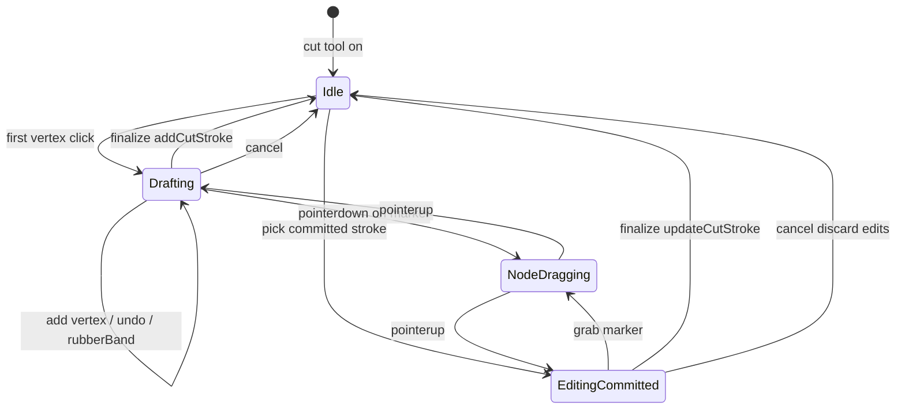
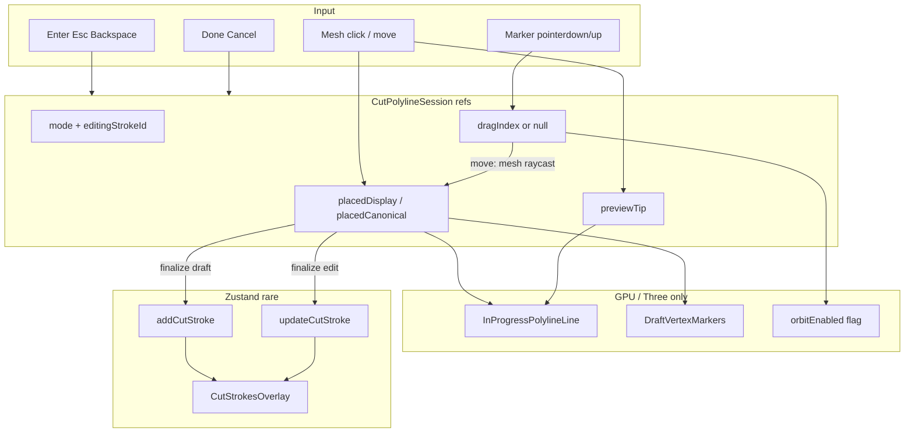

# Polyline Cut Tool + Node Editing (Full Lifecycle Blueprint)

## Context

Phase 1 logic + Zustand are done ([ADR 0100](docs/decisions/product/0100-freeform-cut-strokes.md)): `CutStroke` is already a canonical polyline; `addCutStroke` / `updateCutStroke` / overlays work. Current viewer UX in [`PickableMesh.tsx`](src/viewer/PickableMesh.tsx) is **freehand drag-sample → commit on pointer-up**. This plan **replaces** freehand with click-to-place polylines and designs **node dragging** end-to-end so later slices do not corner the architecture.

**Locked UX defaults:**

| Action | Gesture |
|--------|---------|
| Add vertex | Primary click on mesh (`pointerup`, drag ≤ 5px) |
| Finalize draft | Double-click **or** Enter **or** sidebar **Done** |
| Close loop | Click near first vertex → append close + finalize |
| Undo last vertex | Backspace / Delete while drafting (not while dragging a node) |
| Cancel draft | Escape **or** sidebar **Cancel** **or** leave Cut tool |
| Drag node | Pointerdown on marker → move on mesh surface → pointerup |
| Re-edit committed | Click stroke / marker set → enter draft session; commit via Done / Enter → `updateCutStroke` |

Orbit stays **enabled** while drafting or idle in cut tool; disabled **only** for the duration of an active node grab.

---

## Full lifecycle (avoid cornering later)



**Session modes inside one controller (`useCutPolylineDraft`):**

| Mode | Points live in | Commit path |
|------|----------------|-------------|
| `idle` | — | — |
| `drafting` | refs only | `addCutStroke` |
| `editingCommitted` | refs (copy of stroke) + `editingStrokeId` | `updateCutStroke(id, points)` on finalize; discard on cancel |

Rubber-band tip exists only in `drafting` (appending). While `NodeDragging` or `editingCommitted`, tip is cleared. Zustand / `patternRevision` bump **only** on finalize (add or update), never per drag frame.

---

## Architecture



**Invariant:** pointermove (rubber-band or node drag) mutates refs + Three buffers only. React re-renders for draft are limited to coarse UI flags (`cutDraftActive`, maybe `selectedStrokeId`) — never per-vertex arrays on move.

---

## 1. Raycasting: clicks vs hover vs drag

**Do not use `useFrame` for cut raycasting** in idle/draw/drag. Browser `pointermove` already delivers input-rate updates (~60–120 Hz). A per-frame Raycaster while idle wastes CPU.

| Concern | Mechanism |
|---------|-----------|
| Place vertex | Mesh `onPointerUp`, drag ≤ 5px, valid `faceIndex` |
| Rubber-band tip | Mesh `onPointerMove` when `drafting` and not dragging; `faceIndex != null` |
| Off-mesh tip | Clear tip; never invent air samples |
| Node drag hit | On move while `dragIndex != null`: **manual `THREE.Raycaster`** from camera + NDC pointer against the **pickable mesh** only (same geometry as [`PickableMesh`](src/viewer/PickableMesh.tsx)). Prefer mesh surface constraint over screen-plane drag |
| Double-click finalize | Mesh `onDoubleClick`; suppress duplicate vertex from the paired click |
| Keyboard | `window` keydown while cut tool active |

**Why manual Raycaster during drag:** marker meshes sit slightly above / on the surface and would steal or miss hits; capturing the pointer and raycasting the body mesh keeps the vertex on-surface even when the cursor leaves the small handle.

**Performance budget:** one event-driven raycast per pointermove while hovering or dragging. No continuous `useFrame` loop.

---

## 2. Rubber-band and drag updates without Zustand / React thrash

### Line API

Extend [`InProgressCutStrokeLine`](src/viewer/InProgressCutStrokeLine.tsx) into an imperative polyline:

```ts
type InProgressPolylineHandle = {
  setPlaced(points: readonly DisplayVec3[]): void;
  setPreviewTip(tip: DisplayVec3 | null): void;
  /** Hot path: mutate one vertex + rewrite adjacent segment endpoints in the buffer. */
  updatePlacedVertex(index: number, point: DisplayVec3): void;
  clear(): void;
};
```

- `setPlaced` / `setPreviewTip`: used on click, undo, mode enter — may allocate a new `Float32Array`.
- `updatePlacedVertex`: **drag hot path** — write xyz into the existing position attribute at `index`, update only the two incident segment endpoints if using `LineSegments`, or the single shared vertex if using `THREE.Line`; `attributes.position.needsUpdate = true`; skip `computeBoundingSphere` every move (recompute on pointerup).

### Marker API

```ts
type DraftVertexMarkersHandle = {
  setPositions(points: readonly DisplayVec3[]): void;
  updatePosition(index: number, point: DisplayVec3): void;
  clear(): void;
};
```

Markers are a small pool of `THREE.Mesh` spheres (or `InstancedMesh`) owned imperatively. `updatePosition` sets `mesh.position` — **no React props for xyz during drag**.

### React state that *is* allowed (coarse only)

- `cutDraftActive: boolean` — sidebar Done/Cancel
- `orbitEnabled: boolean` — already in [`MeshViewport`](src/viewer/MeshViewport.tsx)
- Optional: `selectedStrokeId` for committed-edit highlight

**Never** put `placedPoints` or drag tip into Zustand or `useState` on move.

---

## 3. Dragging mechanism (decision)

**Choice: custom R3F / DOM pointer events — not `@use-gesture/react`.**

Reasons:

- Matches existing [`PickableMesh`](src/viewer/PickableMesh.tsx) patterns (`pointerdown` / capture / orbit toggle).
- `@use-gesture/react` is only a **transitive** lockfile entry via drei; it is **not** a direct dependency ([`package.json`](package.json)). Adding it would need an explicit dependency approval ([AGENTS.md](AGENTS.md)); custom events avoid that.
- Surface-constrained drag needs a mesh Raycaster anyway; gesture libs do not remove that work.

### Drag sequence

1. **pointerdown** on marker `i`  
   - `e.stopPropagation()` (do not place a new vertex).  
   - `gl.domElement.setPointerCapture(pointerId)`.  
   - `dragIndex = i`; clear preview tip.  
   - `onOrbitEnabledChange(false)`.
2. **pointermove** (document / canvas listener while captured)  
   - Build NDC from client coords; `Raycaster.setFromCamera` → intersect pickable mesh.  
   - If hit with `faceIndex`: write display local into `placedDisplay[i]` + canonical twin; `line.updatePlacedVertex(i, …)`; `markers.updatePosition(i, …)`.  
   - If no hit: keep last on-surface position (no air drag).
3. **pointerup / pointercancel**  
   - Release capture; `dragIndex = null`; `onOrbitEnabledChange(true)`.  
   - Recompute line bounding sphere once.  
   - Still **no Zustand** if mode is `drafting` / mid `editingCommitted` — commit only on explicit finalize.

### Distinguishing click-to-place vs click-on-marker

Markers render **after** the body mesh in the scene (or use a slightly larger pick radius) and call `stopPropagation` on pointerdown so the mesh never sees “add vertex.” While `dragIndex != null`, mesh click handlers no-op.

### Closed-loop first/last identity

If the draft is closed (`first ≈ last` by construction), dragging vertex `0` also updates the duplicate last point (and vice versa) in the same imperative update — keeps materialize close detection stable.

---

## 4. OrbitControls integration

Reuse the existing `orbitEnabled` React state in [`MeshViewport`](src/viewer/MeshViewport.tsx) (`OrbitControls enabled={orbitEnabled}`).

| Phase | Orbit |
|-------|-------|
| Idle / drafting / rubber-band | **Enabled** (orbit between clicks) |
| Node `pointerdown` (grab) | **Disabled** immediately |
| Node `pointerup` / cancel / tool leave | **Re-enabled** |
| Accidental path | `pointercancel`, unmount, `editTool` change → always re-enable in a single `endDrag()` cleanup |

**Do not** disable orbit for the whole draft session (that was freehand’s mistake for this UX). Grab duration only.

Placement clicks still use the 5px drag threshold so a rotate gesture that starts on the mesh does not add a vertex.

---

## 5. Viewer component hierarchy

```text
MeshViewport
  PickableMesh                 // seam pick + cut place/hover events → draft controller
  CutStrokesOverlay            // committed strokes; Slice D may enable raycast for stroke pick
  CutPolylineSession           // owns useCutPolylineDraft + wires refs
    InProgressPolylineLine     // placed + rubber-band; imperative drag updates
    DraftVertexMarkers         // pickable spheres; drag source; Slice B visual → Slice C interactive
  FitCameraToMesh / OrbitControls  // enabled gated by orbitEnabled
```

| File | Role |
|------|------|
| [`PickableMesh.tsx`](src/viewer/PickableMesh.tsx) | Seam + cut place/hover; no freehand; no long-lived orbit disable |
| `src/viewer/cutPolyline/useCutPolylineDraft.ts` | Modes, refs, add/undo/cancel/finalize, drag start/move/end, close-loop, keyboard |
| `src/viewer/cutPolyline/InProgressPolylineLine.tsx` | Imperative line (`setPlaced` / `setPreviewTip` / `updatePlacedVertex`) |
| `src/viewer/cutPolyline/DraftVertexMarkers.tsx` | Imperative markers + pointer handlers (Slice C) |
| `src/viewer/cutPolyline/raycastDisplayMesh.ts` | Pure helper: camera + NDC + mesh → display hit (unit-tested) |
| [`MeshViewport.tsx`](src/viewer/MeshViewport.tsx) | Compose session; `orbitEnabled`; `cutDraftActive` upward |
| [`AppSidebar.tsx`](src/ui/layout/AppSidebar.tsx) | Done / Cancel; later “editing stroke” hint |
| [`cutDrawSampling.ts`](src/viewer/cutDrawSampling.ts) | Cap + min-distance for discrete clicks only |
| Page / [`useHomeSession`](src/ui/hooks/useHomeSession.ts) | `onCutStrokeCommit` → `addCutStroke`; Slice D → `updateCutStroke` |

**Controller surface (expanded):**

```ts
// useCutPolylineDraft
addPointFromHit(displayLocal, normalization)
setHoverTip(displayLocal | null)
beginNodeDrag(index, pointerId)
moveNodeDrag(ndc, camera, mesh)   // → imperative line + markers
endNodeDrag()
finalize() → { kind: "add" | "update"; id?: string; points: Vec3[] } | null
undoLast() / cancel()
enterEditCommitted(stroke: CutStroke)
isClosedClick(displayLocal, first, radius)
```

---

## 6. Implementation slices (gradual execution)

Execute in order; each slice is shippable and testable without unlocking the next.

### Slice A — Point-to-point drawing
- Replace freehand in `PickableMesh` with click place + rubber-band tip + finalize triad + Escape/Cancel/Backspace.
- `useCutPolylineDraft` in `drafting` / `idle` only; commit via `addCutStroke`.
- Orbit remains enabled while drafting.
- Tests: close-loop helper, min-distance, finalize ≥2, dblclick no duplicate.

### Slice B — Draft vertex markers (visual)
- `DraftVertexMarkers` imperative positions synced on `setPlaced` / undo / cancel.
- `raycast={() => undefined}` — non-interactive.
- Proves hierarchy and handle APIs before gesture complexity.

### Slice C — Node editing (drag) on draft
- Enable marker raycast; implement custom drag sequence (capture, mesh Raycaster, `updatePlacedVertex`).
- Orbit disable on grab / enable on release via shared `endDrag()`.
- Closed-loop paired endpoint update.
- Tests: `raycastDisplayMesh` hits; drag move updates index without store calls (logic/unit where pure).
- Manual: drag middle vertex at 60fps feel; orbit works between edits; finalize still adds one stroke.

### Slice D — Committed stroke re-edit
- Pick a committed stroke (overlay or per-stroke pick proxies) → `enterEditCommitted` (copy points into refs, hide or dim that stroke in overlay while editing).
- Same markers + drag path as Slice C.
- Finalize → `updateCutStroke`; Cancel → discard; Delete selected stroke → existing `deleteCutStroke`.
- Does **not** change ADR materialize rules.

### Slice E — Docs + QA
- Update [phase-1-freeform-cut-strokes.md](docs/plans/product/phase-1-freeform-cut-strokes.md) key files / UX note (polyline + node edit lifecycle).
- QA matrix: draw, orbit between clicks, rubber-band, drag node, finalize, re-edit committed, Flatten, base mesh unchanged until Flatten.
- `npm test` / `npm run lint`.

**Still out of scope (future, not this blueprint’s execution):** freehand mode toggle, mid-segment vertex insert, multi-stroke box select, 2D blueprint editing, new npm dependencies unless later approved.

---

## 7. Risks / edge cases (explicit)

- Double-click vs drag: if pointerdown on marker moves past threshold, treat as drag not finalize; dblclick finalize only from mesh / Done / Enter.
- Marker vs mesh event races: markers always `stopPropagation` on pointerdown.
- Orbit stuck disabled: every exit path calls `endDrag()` (cancel, tool switch, unmount, pointercancel).
- Drag off-mesh: freeze last hit; do not place air points (aligns with VIEW-S3-005 fix intent).
- Cap 512: refuse add with user-visible feedback (VIEW-S3-001).
- Closed stroke drag on endpoint 0/n−1: keep both ends synchronized.
- Slice D overlay flicker: while editing committed id, filter that id out of `CutStrokesOverlay` and show draft line instead so the user does not see double geometry.
- No `@use-gesture/react` unless product later approves a direct dependency — architecture does not require it.
