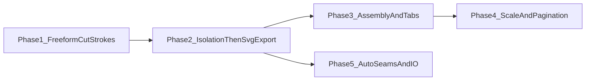
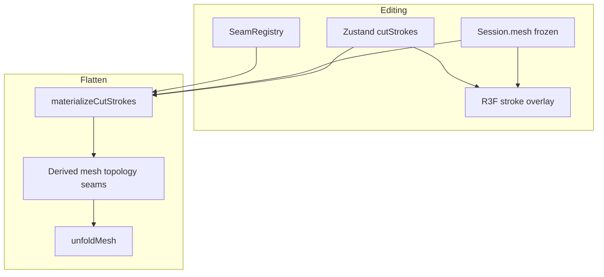
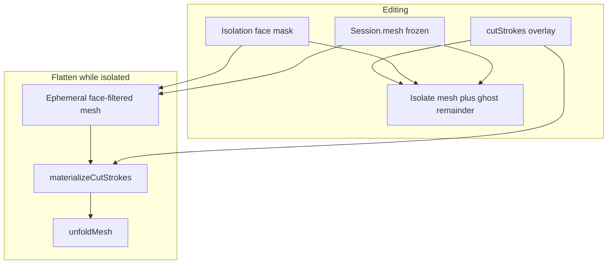

# 3DFlatter — Product roadmap

**Status:** Active (post-PoC)  
**PoC baseline:** Frozen — see [docs/plans/poc/PROJECT_SUMMARY.md](docs/plans/poc/PROJECT_SUMMARY.md) and [docs/plans/poc/README.md](docs/plans/poc/README.md). PoC ADRs **0001–0004** in [docs/decisions/poc/](docs/decisions/poc/) are **not amended** for product features unless a product ADR explicitly extends them.

**Architecture numbering:** Product-phase ADRs start at **0100** in [docs/decisions/product/](docs/decisions/product/).

**Implementation plans:** Product specs under [docs/plans/product/](docs/plans/product/); PoC specs under [docs/plans/poc/archive/](docs/plans/poc/archive/).

---

## PoC → product transition

| | PoC (closed) | Product (current) |
|---|--------------|-------------------|
| **Goal** | Prove pipeline in the browser | Usable papercraft-style workflow |
| **Seams** | Manual edge pick (`EdgeKey`) | Edge pick **+** freeform cut strokes |
| **Mesh edits** | Load-only `MeshModel` | Overlay strokes; **lazy materialize** on Flatten |
| **Export** | SVG tier 1 preview | Tier 2 manufacturing, edge IDs, folds, pagination (later) |
| **Docs** | [PROJECT_SUMMARY.md](docs/plans/poc/PROJECT_SUMMARY.md), [plans/poc/](docs/plans/poc/) | **This file** + ADR 0100+ |

The PoC codebase remains the foundation: `src/logic/` purity, triangle-soup unfold ([ADR 0002](docs/decisions/poc/0002-unfold-step-1-hinge-island.md)), quality detect-and-report ([ADR 0003](docs/decisions/poc/0003-unfold-quality-detection.md)).

---

## Roadmap overview

| Phase | Theme | Status | ADR / plan |
|-------|--------|--------|------------|
| **1** | Freeform cut strokes (3D) | **Complete** | [ADR 0100](docs/decisions/product/0100-freeform-cut-strokes.md) · [plan](docs/plans/product/phase-1-freeform-cut-strokes.md) |
| **2** | Mesh isolation (P2-E2 first); SVG tier 2 still Planned | **Active** | [ADR 0101](docs/decisions/product/0101-mesh-isolation.md) · [plan](docs/plans/product/epic-mesh-isolation.md) |
| 3 | Glue flaps / tabs; edge ID matching on SVG | Planned | TBD |
| 4 | Real-world scale (cm); A4/Letter pagination | Planned | TBD |
| 5 | Mountain vs valley folds in export; auto seams; GLB | Planned | TBD |

---

## Phase 1 — Freeform cut strokes (complete)

**Intent:** Mark cuts on the 3D model by **drawing** across face interiors, not only toggling existing mesh edges. Editing is **non-destructive** until Flatten.

### Approved design (summary)

| Topic | Decision |
|-------|----------|
| **Editing** | `cutStrokes` overlay in Zustand (canonical `Vector3` polylines); **base `session.mesh` unchanged** while editing |
| **Commit** | `materializeCutStrokes(baseMesh, strokes, manualSeams)` runs on **Flatten** only (pure logic in `src/logic/`) |
| **Seams** | Materialized cut edges become `EdgeKey` seams; manual edge-pick seams **union** at materialize time |
| **Open loops** | Allowed; validation **warns** (toast) but user may proceed — define slit vs island semantics in ADR 0100 |
| **Internal stops / zigzags** | Subdivide with interior Steiner points + fan triangulation; reject self-intersecting strokes per face |
| **Snapping** | Scale-aware epsilon: snap to existing vertices (and edges) to avoid sliver geometry |
| **Versioning** | `meshLoadVersion` bumps **only** on file load; stroke edits use **`patternRevision`**; flatten fingerprint also includes **`seamsContentKey`** for stale pattern UI |
| **Future hooks** | Stroke `id`, optional later `foldKind`; `CutManifest` at materialize for edge ID matching (not in Phase 1 UI) |

### Architecture

### Implementation slices (execution order)

1. **Logic** — `materializeCutStrokes`, segment–triangle cuts, fan splits, snap, Vitest fixtures  
2. **State** — stroke CRUD, `patternRevision`, wire [useFlattenExport](src/ui/useFlattenExport.ts)  
3. **Viewer** — polyline point-to-point draw, markers, node drag, committed re-edit, `CutStrokesOverlay` ([blueprint](.cursor/plans/polyline_cut_tool_318885f7.plan.md) A–D)  
4. **Docs + QA** — [phase-1 plan](docs/plans/product/phase-1-freeform-cut-strokes.md) + ADR 0100 + [qa-audits.md](docs/plans/product/qa-audits.md) Slice E matrix

### Phase 1 non-goals

Short list from ADR 0100; full parked inventory is under [Deferred backlog](#deferred-backlog-not-scheduled).

- Glue tabs, page layout, fold line styling in SVG  
- 2D blueprint stroke editing  
- Persisting strokes across reload (file reload clears overlay)  
- Web Worker flatten (still deferred from PoC audit UI-004)

### Verification (Phase 1)

- Base mesh vertex count unchanged after draw/delete stroke  
- Flatten materializes cuts → correct islands / seam overlay / 2D lines  
- Open-loop fixture → warning toast, unfold still runs  
- `npm test`, `npm run lint`

---

## Phase 2 — Mesh isolation (active) + manufacturing SVG (planned)

**First active epic: P2-E2.** Isolate a connected region on a dense mesh (seed-flood bounded by bracelet cut strokes and/or seams) so seams, cuts, and Flatten run on a face mask while the rest of the model is ghosted. **SVG tier 2 / laser-ready paths** remains a Planned theme under this phase — not dropped, not started.

### Approved design (P2-E2 summary)

| Topic | Decision |
|-------|----------|
| **Selection** | Seed-flood + fence `EdgeKey`s from committed stroke surface walks (not materialize); Shift-add / Alt-subtract; no lasso |
| **Canonical** | Two closed bracelets (shoulder + wrist) → click the arm → isolate that band |
| **Session** | Face-index mask overlay; base `session.mesh` frozen; load clears mask; `meshLoadVersion` unchanged |
| **Viewer** | Full-mesh display normalization; two index buffers; **ghost** remainder (not hide); camera frames isolate |
| **Flatten** | Ephemeral face-filtered mesh (keep verts); inside strokes only; crossing strokes **skip + toast** |
| **Seams** | Pick/clear only edges with an isolated incident face; ghost-side seams stay in the registry |

### Architecture

### Implementation slices (execution order)

See [epic-mesh-isolation.md](docs/plans/product/epic-mesh-isolation.md). Logic → state → Flatten wiring → viewer ghost/frame → sidebar → QA. Do not implement from this roadmap summary alone.

### Phase 2 remaining (Planned)

- **SVG tier 2 / laser-ready paths** — path dedup, cut order, outer boundary + seam layers. ADR/plan TBD when scheduled.
- **P2-E1** PDF A4 and **P2-E3** heatmap — still in [Deferred backlog](#deferred-backlog-not-scheduled).

### Verification (P2-E2)

- Two bracelets + seed between them → ghosted remainder, Flatten unfolds only the band
- Whole-mesh seed flood → warn, no auto-isolate
- Crossing stroke → skip + toast; exit isolate restores full mesh with edits persisted
- `npm test`, `npm run lint`

---

## Deferred backlog (not scheduled)

Living checklist of parked Phase 2+ work, cut-tool v2, and technical debt. **Source of truth** for what is deferred — other product docs should link here instead of re-listing IDs.

**How to use:** do not implement from this section alone. Promote an item → Active row in [docs/plans/product/README.md](docs/plans/product/README.md) + product ADR **0102+** + a concrete phase plan. Do not silently extend Phase 1 “Complete” or P2-E2 v1.

**Findings history:** [docs/plans/product/qa-audits.md](docs/plans/product/qa-audits.md) (snapshots only; deferred status points here).

### Suggested scheduling order

1. **P2-E2** mesh isolation — **Active** ([ADR 0101](docs/decisions/product/0101-mesh-isolation.md) · [plan](docs/plans/product/epic-mesh-isolation.md)).
2. Roadmap **Phase 2** manufacturing SVG (still Planned under the same phase).
3. **P2-E1** PDF A4 — once SVG manufacturing is underway (aligns with Phase 4 pagination).
4. **CUT-UX-001/002/003** + **POLYCUT-C-002** — after cut UX is stable on dense meshes; separate ADR.
5. **P2-E3** heatmap — can start as a logic-only spike; may depend on **UI-004** for large meshes.
6. **UI-004** Worker — when main-thread Flatten becomes unacceptable on real client meshes.
7. Phases **3 → 4 → 5** (tabs/IDs → scale/pages → folds/auto/GLB).

### Roadmap phases 2–5

Themes already in [Roadmap overview](#roadmap-overview). Phase 2 isolation is Active; remaining Phase 2–5 themes TBD when scheduled.

| Phase | Theme | Why parked |
|-------|--------|------------|
| **2** | SVG tier 2 / laser-ready paths (path dedup, cut order, outer boundary + seam layers) | Planned under Phase 2; isolation (P2-E2) is the first Active epic |
| **3** | Glue flaps / tabs; edge ID matching on SVG | Needs manufacturing export + `CutManifest` / edge IDs |
| **4** | Real-world scale (cm); A4/Letter pagination | Depends on printable 2D layout |
| **5** | Mountain/valley folds in export; auto seams; GLB | Later automation + I/O |

### Client epics (detail: phase2-epics)

Deep specs: [docs/plans/product/phase2-epics.md](docs/plans/product/phase2-epics.md). Captured 2026-08-25. **P2-E2 promoted** 2026-09-02.

| ID | Epic | Status | Priority (client) |
|----|------|--------|-------------------|
| **P2-E1** | 2D PDF A4 export (nested booklet) | Parked — fits Phase 4 + manufacturing export; PDF dependency needs approval | High |
| **P2-E2** | Mesh isolation / sub-mesh selection | **Active** — [ADR 0101](docs/decisions/product/0101-mesh-isolation.md) · [plan](docs/plans/product/epic-mesh-isolation.md) | High |
| **P2-E3** | Developability heatmap (strain / curvature) | Parked — guidance before cuts; large meshes may need Worker (UI-004) | High |

### Isolation v2 (ADR 0101 non-goals)

Parked **2026-09-02** with P2-E2 v1. Do **not** extend the isolation epic with these until a follow-on ADR.

| ID | Item | Why parked |
|----|------|------------|
| **ISO-001** | Auto-split crossing strokes at the isolation boundary | v1 is skip + toast; clip/mutate user polylines needs 3D intersection math ([ADR 0101](docs/decisions/product/0101-mesh-isolation.md)) |
| **ISO-002** | Screen-space lasso selection | Seed-flood + bracelet fences is v1 |
| **ISO-003** | Hide-remainder toggle | v1 is ghost only (spatial context) |
| **ISO-004** | Geodesic paint-brush radius / grow-by-N-rings | v1 is seed flood + single-face add/subtract |

### Cut-tool UX v2

Parked **2026-08-16**. Product features, not Slice D defects — do **not** reopen polyline Slice E. Current re-edit: pick stroke → drag markers and/or **append at the end** → Done/`updateCutStroke`.

| ID | Request | Why parked |
|----|---------|------------|
| **CUT-UX-001** | Insert vertex mid-segment while editing a stroke | Blueprint deferred mid-segment insert; mesh clicks still append |
| **CUT-UX-002** | General undo stack (beyond Backspace last draft vertex) | No history for node drag, Done, delete stroke, or Flatten |
| **CUT-UX-003** | Draw-time snap / weld to cut verts, mesh verts/edges, manual seams | Materialize snaps at Flatten; draw/drag does not, so joins are easy to miss |
| *(related)* | Connect a new cut to an existing polyline | Same bucket; not a separate phase yet |

### Cut geometry and overlay

| ID | Item | Why parked |
|----|------|------------|
| **POLYCUT-C-002** | Geodesic / opposite-face surface wrap | Frozen; overlay walk cannot leave start face (`it.skip` documents intent) |
| **POLYCUT-B-007** | Digon close `A,B,A` (min-3 vertices) still allowed | Low; deferred from Slice B |
| **POLYCUT-B-006** | Marker spawn flash at origin | Optional Medium polish |
| — | Geometric sliver cull after splits | Known limit (ties to PoC LOGIC-004 index-only degeneracy) |
| — | Incomplete `CutManifest` `edgeKeys` when connect fails mid-stroke | Needed later for SVG edge-ID matching |

### Technical debt and performance

| ID | Item | Why parked |
|----|------|------------|
| **UI-004** | Web Worker flatten (materialize + unfold off main thread) | Deferred since PoC [ADR 0004](docs/decisions/poc/0004-tech-debt-remediation-strategy.md); dense meshes still hitch |
| — | BVH / spatial face locate | CUT-008 follow-on; vertex→faces cache already landed |
| — | Sync Flatten UI (`Flattening…` may never paint; Orbit freezes) | Symptom of UI-004 |
| **POLYCUT-008** | Rubber-band buffer realloc every move | Low optional |
| **VIEW-S3-008** | New `BufferAttribute` every draw sample | Low micro-opt |
| — | Flatten/commit locate cost on dense meshes | Not fixed by Phase 1 PERF hotfixes (hover/drag only) |

### UX polish

| ID | Item | Why parked |
|----|------|------------|
| **POLYCUT-009** | Esc cancels draft and closes sidebar | Low dual-handler behavior |
| **VIEW-S3-005** | Off-mesh pointer gaps → straight jump in stroke | Future clamp or dashed off-mesh preview |
| **VIEW-S3-002** | No feedback when `MAX_STROKE_POINTS` is hit | Low polish |
| — | Islands sidebar ignores overlay strokes until Flatten | Expected (ADR 0100 / POLYCUT-B-001) |
| — | Quality overlay sticky across pattern revisions | Low structural note |
| — | Toast storm (many materialize warnings) | Can hide open-loop / self-intersect messages |

### Test and QA debt

Left out of Phase 1 remediation or residual after it. See [qa-audits.md](docs/plans/product/qa-audits.md) and [remediation-phase1.md](docs/plans/product/remediation-phase1.md).

| ID | Gap |
|----|-----|
| **HOLISTIC-TS-008** | Non-manifold fixture (`incidents > 2`) for topology / seam eligibility |
| **HOLISTIC-TS-010** | `flattenSnapshotUi` stale-key coverage for `patternRevision` / seams |
| **HOLISTIC-TS-007** residual | OBJ `v/vt` token + negative-relative index paths untested |
| **HOLISTIC-TS-009** residual | STL `loadMeshFile`, overlapping `loadSeq`, ineligible-seam toast |
| **HOLISTIC-TS-005** residual | `demoMeshes.test.ts` still tautological `> 0` smoke |
| — | Consolidate duplicate `CUBE_OBJ` fixtures |
| — | Playwright / R3F component tests |
| — | Logic/viewer regression pass (called out in product README as still waiting) |

### Phase 1 / ADR 0100 non-goals still parked

From [ADR 0100](docs/decisions/product/0100-freeform-cut-strokes.md) and Phase 1 plan — not bugs.

| Item | Notes |
|------|--------|
| Glue flaps / tabs, page scale, fold line styling in SVG | Roadmap Phases 3–4 |
| Persisting strokes across reload | File reload clears overlay |
| Editing strokes in the 2D blueprint | Separate UX surface |
| Persisting the materialized mesh in session state | Flatten stays ephemeral |
| `CutManifest` → SVG edge-ID matching / folds / tabs | Schema reserved; unused in Phase 1 UI |
| Stroke `role` / `foldKind` (mountain \| valley) | Schema hooks only |
| True per-face 2D self-intersect | Phase 1 uses whole-stroke 3D (CUT-007 deferred ADR-strict version) |
| Seam-cycle detection for closed shells | Better open-loop / split messaging |

---

## How to work on product features

1. Read PoC ADRs 0001–0004 and [AGENTS.md](AGENTS.md).  
2. Add or update a **product ADR** (`0100+`) before non-trivial code.  
3. Add a row to **this roadmap** and a spec under [docs/plans/product/](docs/plans/product/). Promote items from [Deferred backlog](#deferred-backlog-not-scheduled) when scheduling — do not implement from the backlog alone.  
4. Do **not** extend [docs/plans/poc/PROJECT_SUMMARY.md](docs/plans/poc/PROJECT_SUMMARY.md) with product delivery history — update this file instead.  
5. Run `npm test` (and `npm run lint` when touching TS/React) before marking a slice complete.
