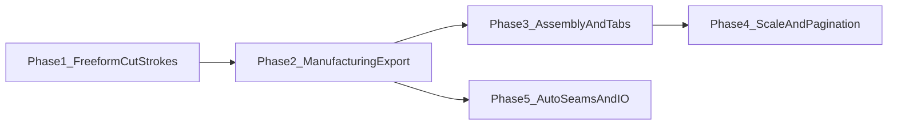
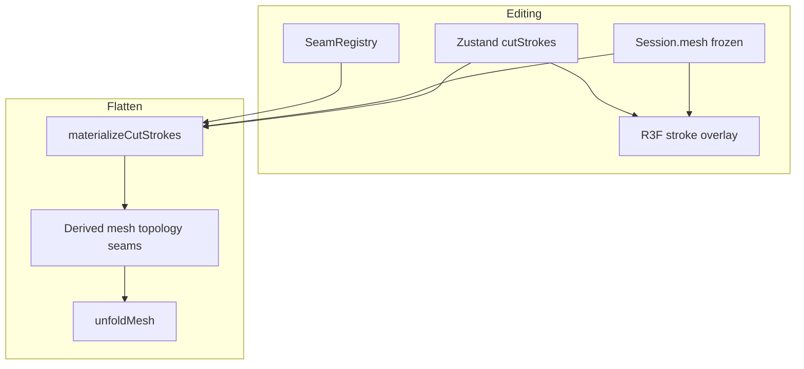

# 3DFlatter — Product roadmap

**Status:** Active (post-PoC)  
**PoC baseline:** Frozen — see [docs/plans/poc/PROJECT_SUMMARY.md](docs/plans/poc/PROJECT_SUMMARY.md) and [docs/plans/poc/README.md](docs/plans/poc/README.md). PoC ADRs **0001–0004** in [docs/decisions/poc/](docs/decisions/poc/) are **not amended** for product features unless a product ADR explicitly extends them.

**Architecture numbering:** Product-phase ADRs start at **0100** in [docs/decisions/product/](docs/decisions/product/).

**Implementation plans:** Product specs under [docs/plans/product/](docs/plans/product/); PoC specs under [docs/plans/poc/archive/](docs/plans/poc/archive/).

---

## PoC → product transition

| | PoC (closed) | Product (current) |
|---|--------------|-------------------|
| **Goal** | Prove pipeline in the browser | Usable papercraft-style workflow |
| **Seams** | Manual edge pick (`EdgeKey`) | Edge pick **+** freeform cut strokes |
| **Mesh edits** | Load-only `MeshModel` | Overlay strokes; **lazy materialize** on Flatten |
| **Export** | SVG tier 1 preview | Tier 2 manufacturing, edge IDs, folds, pagination (later) |
| **Docs** | [PROJECT_SUMMARY.md](docs/plans/poc/PROJECT_SUMMARY.md), [plans/poc/](docs/plans/poc/) | **This file** + ADR 0100+ |

The PoC codebase remains the foundation: `src/logic/` purity, triangle-soup unfold ([ADR 0002](docs/decisions/poc/0002-unfold-step-1-hinge-island.md)), quality detect-and-report ([ADR 0003](docs/decisions/poc/0003-unfold-quality-detection.md)).

---

## Roadmap overview

| Phase | Theme | Status | ADR / plan |
|-------|--------|--------|------------|
| **1** | Freeform cut strokes (3D) | **Complete** | [ADR 0100](docs/decisions/product/0100-freeform-cut-strokes.md) · [plan](docs/plans/product/phase-1-freeform-cut-strokes.md) |
| 2 | SVG tier 2 / laser-ready paths | Planned | TBD |
| 3 | Glue flaps / tabs; edge ID matching on SVG | Planned | TBD |
| 4 | Real-world scale (cm); A4/Letter pagination | Planned | TBD |
| 5 | Mountain vs valley folds in export; auto seams; GLB | Planned | TBD |

---

## Phase 1 — Freeform cut strokes (complete)

**Intent:** Mark cuts on the 3D model by **drawing** across face interiors, not only toggling existing mesh edges. Editing is **non-destructive** until Flatten.

### Approved design (summary)

| Topic | Decision |
|-------|----------|
| **Editing** | `cutStrokes` overlay in Zustand (canonical `Vector3` polylines); **base `session.mesh` unchanged** while editing |
| **Commit** | `materializeCutStrokes(baseMesh, strokes, manualSeams)` runs on **Flatten** only (pure logic in `src/logic/`) |
| **Seams** | Materialized cut edges become `EdgeKey` seams; manual edge-pick seams **union** at materialize time |
| **Open loops** | Allowed; validation **warns** (toast) but user may proceed — define slit vs island semantics in ADR 0100 |
| **Internal stops / zigzags** | Subdivide with interior Steiner points + fan triangulation; reject self-intersecting strokes per face |
| **Snapping** | Scale-aware epsilon: snap to existing vertices (and edges) to avoid sliver geometry |
| **Versioning** | `meshLoadVersion` bumps **only** on file load; stroke edits use **`patternRevision`**; flatten fingerprint also includes **`seamsContentKey`** for stale pattern UI |
| **Future hooks** | Stroke `id`, optional later `foldKind`; `CutManifest` at materialize for edge ID matching (not in Phase 1 UI) |

### Architecture

### Implementation slices (execution order)

1. **Logic** — `materializeCutStrokes`, segment–triangle cuts, fan splits, snap, Vitest fixtures  
2. **State** — stroke CRUD, `patternRevision`, wire [useFlattenExport](src/ui/useFlattenExport.ts)  
3. **Viewer** — draw tool, ref-based in-progress stroke, `CutStrokesOverlay`  
4. **Docs** — [docs/plans/product/phase-1-freeform-cut-strokes.md](docs/plans/product/phase-1-freeform-cut-strokes.md) + ADR 0100

### Phase 1 non-goals

- Glue tabs, page layout, fold line styling in SVG  
- 2D blueprint stroke editing  
- Persisting strokes across reload (file reload clears overlay)  
- Web Worker flatten (still deferred from PoC audit UI-004)

### Verification (Phase 1)

- Base mesh vertex count unchanged after draw/delete stroke  
- Flatten materializes cuts → correct islands / seam overlay / 2D lines  
- Open-loop fixture → warning toast, unfold still runs  
- `npm test`, `npm run lint`

---

## Later phases (outline only)

Details will get their own ADRs (0101+) when scheduled.

- **Manufacturing export** — path dedup, cut order, outer boundary + seam layers (tier 2).  
- **Assembly** — glue flaps as geometry or annotation layer; **matching edge IDs** on 2D SVG for physical build.  
- **Scale & pagination** — user units (cm), fit layout to A4/Letter with margins.  
- **Folds & automation** — mountain/valley fold metadata in export; auto seam suggestions; GLB import.

---

## How to work on product features

1. Read PoC ADRs 0001–0004 and [AGENTS.md](AGENTS.md).  
2. Add or update a **product ADR** (`0100+`) before non-trivial code.  
3. Add a row to **this roadmap** and a spec under [docs/plans/product/](docs/plans/product/).  
4. Do **not** extend [docs/plans/poc/PROJECT_SUMMARY.md](docs/plans/poc/PROJECT_SUMMARY.md) with product delivery history — update this file instead.  
5. Run `npm test` (and `npm run lint` when touching TS/React) before marking a slice complete.
