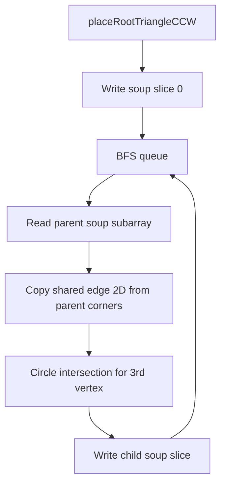

## ADR 0002: Unfold Step 1 — hinge island unfold + triangle soup

### Context

README Phase 3 / roadmap step 4 requires incrementally flattening each connected island into the **XY plane** (zero material thickness). Step 1 delivers the pure-logic core before orchestration, layout, and SVG export.

Upstream dependencies (ADR 0001):

- `MeshModel` with canonical 3D vertices for edge-length math
- `Topology` / `getNeighborAcrossEdge` for BFS adjacency walks
- `partitionIslands` — caller passes one island; seams are already applied at partition time

### Problem: vertex identity in 2D

An early plan draft proposed storing 2D positions in a structure keyed by `VertexIndex` — either as final output or as a transient `Map<VertexIndex, Vec2>` during BFS.

That approach is **rejected** because:

1. **Triangle soup export** needs independent per-face corners for SVG/PDF.
2. **Slits and darts** (future intra-island cuts) require one 3D vertex index to appear at **multiple different 2D positions** on different faces.
3. A global map keyed by `VertexIndex` **overwrites** the apex of a slit when BFS reaches it from two paths, distorting the mesh.

### Decision

#### Public API

```typescript
unfoldIsland(mesh, topology, islandFaces) → UnfoldIslandResult
```

- Does **not** read `SeamRegistry` — island list is pre-partitioned.
- On `error`, callers **must discard** `positions2d` (buffer may be partially filled).

#### Output: triangle soup (not per-vertex placement)

`FlattenedTriangleSoup` = `Float32Array` of length `6 × faceCount`:

- For face `i` in `UnfoldIslandResult.faces` order: `[x0,y0, x1,y1, x2,y2]`
- Corner order matches `mesh.faces` for that face (`v0, v1, v2`)
- **2D winding follows `mesh.faces`** (CCW or CW as stored — not forced global CCW)
- One `VertexIndex` may have different `(x,y)` on different faces

#### Algorithm: BFS hinge unfold with parent-soup-copy

1. Place root face (`islandFaces[0]`) via `placeRootTriangleCCW` in `placeTriangle2d.ts`.
2. Write root corners into `positions2d` slice `[0..5]`.
3. BFS over in-island topology neighbors:
   - Read **parent face soup subarray** (`positions2d.subarray(6×parentIdx, …)`).
   - Identify shared edge on neighbor (directed toward parent).
   - Copy shared edge 2D coords **from parent soup corners** for those vertex indices.
   - Hinge third vertex via 3D edge lengths → `circleIntersection2d` (discriminant clamped `≥ 0`).
   - Pick branch matching neighbor face's `mesh.faces` winding.
   - **Immediately write** neighbor `[x0,y0,x1,y1,x2,y2]` into soup.
4. Post-check: all island faces reached; return or `error`.

**Rejected:** `Map<VertexIndex, Vec2>` for placement (transient or final).

**Accepted:** localized parent-to-child coordinate passing via soup slices.



#### Hinge math (`placeTriangle2d.ts`)

- 3D distances from canonical `MeshModel.vertices` (not display-normalized geometry)
- `EPS = 1e-6` numeric tolerance (consistent with `weldVertices`)
- `Math.max(0, discriminant)` before `sqrt` to prevent NaN from float drift

### Invariants (on successful unfold)

| # | Invariant |
|---|-----------|
| 1 | Output lives in XY (`z` implicit zero) |
| 2 | Each triangle's 2D edge lengths ≈ 3D edge lengths |
| 3 | **BFS tree edges only:** parent and child soup agree on shared vertex 2D coords along the placement edge |
| 4 | All soup values finite |
| 5 | `unfoldIsland` does not read seams |

### Known non-invariants

| # | Non-invariant | Notes |
|---|---------------|-------|
| 1 | Global injectivity | Closed shells as one island overlap in 2D |
| 2 | All adjacent pairs agree | Sibling faces (same BFS grandparent) may disagree on shared vertex 2D position |
| 3 | Absolute CCW winding | Mixed OBJ winding preserved |

### Consequences

- Step 2 (`unfoldMesh`, layout offsets, SVG) must treat each island soup as **independent** until global offsets are applied.
- SVG renders soup polygons directly; seam edges are a separate overlay concern.
- Do not reintroduce per-vertex 2D maps without a new ADR.

### Deferred to Step 2+

- `unfoldMesh()` multi-island orchestrator + island XY packing
- `UnfoldViewer2D` / SVG export UI
- Collision / overlap detection within an island
- Intra-island slits without island partition
- 2D corner re-welding across non-tree shared edges

### Implementation files

| File | Role |
|------|------|
| `src/logic/mesh/types.ts` | `FlattenedTriangleSoup`, `UnfoldIslandResult` |
| `src/logic/unfold/placeTriangle2d.ts` | Root + circle intersection helpers |
| `src/logic/unfold/unfoldIsland.ts` | BFS unfold |
| `src/logic/unfold/unfoldIsland.test.ts` | Diamond, open box, icosahedron, cube |
| `src/logic/unfold/placeTriangle2d.test.ts` | Numeric edge cases |

### References

- [ADR 0001](0001-mesh-model-and-topology.md) — mesh, topology, XY plane
- [Plans & roadmap](../plans/README.md) — Step 2 orchestration + 2D viewer (archive: [step-2-flattening.md](../plans/archive/step-2-flattening.md))
