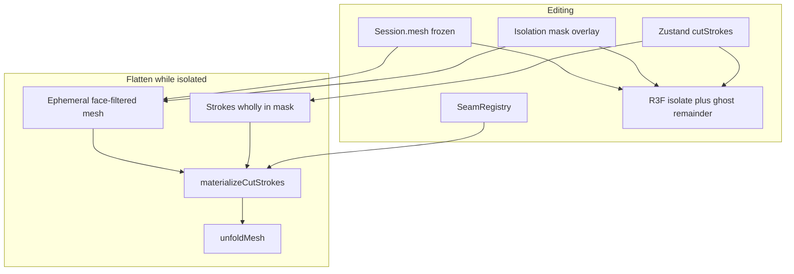

## ADR 0101: Mesh isolation (face-mask overlay + seed-flood fences)

### Context

On dense production assets (full-body avatars, ~84k triangles) the mesh is typically **one connected component**. Island picking via [`partitionIslands`](../../../src/logic/mesh/partitionIslands.ts) therefore selects the whole model unless the user has already seamed it apart. Users need to **select a part** (for example an arm between shoulder and wrist), **isolate** it, and edit seams/cuts / Flatten on that subset while the rest of the model stays visible as spatial context.

Isolation is both **visual** (ghost the remainder, frame the selection) and **computational** (Flatten must not walk the full 84k faces). It must not break [ADR 0001](../poc/0001-mesh-model-and-topology.md) `EdgeKey` identity or [ADR 0100](0100-freeform-cut-strokes.md) overlay strokes.

### Decision

#### Isolate tool vs isolation mode

These are orthogonal:

- **`meshEditTool: "isolate"`** — selection gestures (seed flood, add/subtract). The user may switch back to `"seam"` or `"cut"` while a mask exists.
- **Isolation mode** — `isolation.active === true`: the viewport ghosts the remainder, picking/cuts/Flatten operate on the mask. Exit restores full visibility; seams and strokes persist on the shared session.

#### Selection: seed-flood + bracelet fences

v1 does **not** use a screen lasso or a paint brush. The user bounds a region with existing tools, then grows from a seed:

1. Draw one or more **committed cut polylines** and/or pick **manual seams** as barriers. Canonical scenario: two closed “bracelet” strokes (shoulder and wrist); click a face on the arm between them.
2. With the Isolate tool, **click a seed face**. Flood-fill across manifold neighbors, stopping at:
   - manual seams (`EdgeKey` in `SeamRegistry`)
   - **fence edges** derived from committed cut-stroke surface walks (see below)
   - mesh boundary
3. **Shift-click** adds another connected component (other bodies or other fenced regions). **Alt-click** subtracts the flooded component. Single-face add/subtract is allowed for cleanup.
4. **Isolate** confirms the mask. If a seed flood would take **every** non-orphan face, **warn and do not auto-isolate** — the mesh is still one component; the user needs another bracelet or a subtract.

Fence edges come from the same face-local surface walk used for overlay preview ([`surfacePath.ts`](../../../src/logic/cuts/surfacePath.ts) / [`cutSurfaceWalk.ts`](../../../src/logic/cuts/cutSurfaceWalk.ts)). Collect crossed `EdgeKey`s as **virtual seams for flood only**. Do **not** run `materializeCutStrokes` to build fences — materialize stays Flatten-only ([ADR 0100](0100-freeform-cut-strokes.md)).

If a stroke walk cannot produce exit edges, fall back to treating faces touched by that stroke as opaque blockers and toast that the fence is approximate. When exit edges **do** exist, those keys alone are the flood fences (thin virtual seams); cut-through / walked faces are **not** opaque blockers — otherwise a stroke ribbon would silently thicken the isolate boundary and defeat whole-mesh detection for “mesh minus scar.”

#### Session overlay (not a cloned MeshModel)

- Base `session.mesh` stays frozen while isolating, drawing, or toggling seams ([ADR 0100](0100-freeform-cut-strokes.md)).
- Isolation lives as an overlay: `{ active: boolean; mask: Uint8Array }` with `mask.length === faceCount`, `1` = included, keyed by original [`FaceIndex`](../../../src/logic/mesh/types.ts).
- Isolation does **not** bump `meshLoadVersion`. Stroke CRUD still bumps `patternRevision` only. Flatten fingerprint gains an **isolation content key** (mask bits + `active`), not a `patternRevision` bump for mask edits.
- Successful file load clears the mask (same as `cutStrokes`).
- Do **not** store a remapped sub-`MeshModel` in session state. Packing vertices would invalidate every `EdgeKey` and every cut overlay.

#### Viewer: ghost remainder, full-mesh display scale

- Shared display **position** buffer from the full mesh. **Display normalization stays full-mesh** ([`displayNormalization.ts`](../../../src/viewer/displayNormalization.ts)) so isolating an arm does not explode its scale.
- Two **index** buffers (or two meshes sharing positions): isolate (pickable) and remainder (**ghost** material, `raycast` disabled).
- v1 remainder is always ghosted — spatial context of how the part connects. No hide toggle in v1.
- Orbit **target / framing** fits the isolate bbox in display space (camera only; not a topology or normalization change).
- While isolation is active, seam pick and cut draw hit only the isolate mesh. Ghost faces are not pickable.

#### Flatten, cuts, and seams

**Ephemeral subset for the Flatten call only:** keep the **full vertex array**, pack only faces where `mask[i] === 1`, then `buildTopology` on that subset. Isolation boundary becomes a mesh boundary. `EdgeKey`s stay valid because vertex indices are unchanged.

**Strokes:**

- A stroke is **inside** if every face on its surface path is in the mask; **outside** if none are; **crossing** otherwise.
- Flatten materializes **inside** strokes only. Crossing and outside strokes are **skipped** with a toast. v1 does **not** clip or mutate user polylines.

**Seams:**

- `toggleSeamAt` while isolated only for edges with at least one incident isolated face.
- “Clear seams” while isolated clears only seams that touch isolated faces. Ghost-side seams remain in the registry and apply again after exit.
- Isolated flatten filters the seam set to keys with ≥1 remaining incident face on the subset.

**Sidebar islands:** while isolated, report partition stats **within the mask**. Overlay strokes still do not affect island counts until Flatten ([ADR 0100](0100-freeform-cut-strokes.md)).

### Explicit non-goals (v1)

- Hide-remainder toggle (ghost only).
- Screen-space lasso or geodesic paint-brush radius.
- OBJ groups / objects / `usemtl` as selection primitives ([ADR 0001](../poc/0001-mesh-model-and-topology.md) import scope unchanged).
- Destructive boolean split persisted into `session.mesh`.
- Isolation editing on the 2D blueprint.
- Auto-split / clip of crossing strokes at the isolation boundary (deferred below).
- Web Worker flatten (still [UI-004](../../../PRODUCT_ROADMAP.md#technical-debt-and-performance)).
- CAD assembly / multi-body file formats.

### Deferred

Parked on [PRODUCT_ROADMAP.md — Deferred backlog](../../../PRODUCT_ROADMAP.md#deferred-backlog-not-scheduled) (isolation v2) unless a later ADR promotes them:

- **ISO-001 — Auto-split crossing strokes at the isolation boundary** — clip a polyline where its surface path leaves the mask so the inside fragment can Flatten without skip+toast. Deferred to avoid 3D intersection math and mutating user data in v1.
- **ISO-002** screen lasso; **ISO-003** hide-remainder toggle; **ISO-004** brush radius / grow-by-N-rings beyond seed flood.
- Named isolation groups; persisting mask across reload.

### Consequences

- `flattenSnapshotKey` must include isolation identity in addition to `meshLoadVersion`, `patternRevision`, and `seamsContentKey`.
- Agents implement **logic first** (mask, fence edges, flood, face-subset extract + Vitest), then Zustand, then Flatten wiring, then viewer ghost/frame, then sidebar.
- `src/logic/` stays free of React and Three.js. Selection mask is a pure index buffer.

### Implementation

Named as future modules — not written in this ADR pass.

| Path | Role |
|------|------|
| `src/logic/isolation/` (planned) | `FaceMask`, fence edges from strokes, `floodFromFace`, face-subset extract (keep verts) |
| [`src/state/meshSessionStore.ts`](../../../src/state/meshSessionStore.ts) | Isolation overlay; flatten fingerprint |
| [`src/state/meshEditTool.ts`](../../../src/state/meshEditTool.ts) | `"isolate"` tool |
| Plan | [epic-mesh-isolation.md](../../plans/product/epic-mesh-isolation.md) |
| Roadmap | [PRODUCT_ROADMAP.md](../../../PRODUCT_ROADMAP.md) Phase 2 / P2-E2 |

### References

- [ADR 0001](../poc/0001-mesh-model-and-topology.md) — mesh / `EdgeKey` / seams
- [ADR 0002](../poc/0002-unfold-step-1-hinge-island.md) — triangle-soup unfold
- [ADR 0100](0100-freeform-cut-strokes.md) — overlay strokes, lazy materialize
- [phase2-epics.md](../../plans/product/phase2-epics.md) — original P2-E2 problem statement
