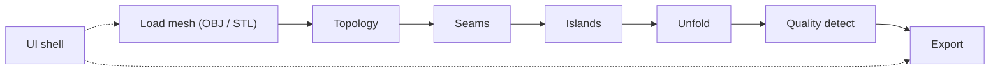

# Plans & roadmap

**Single home for all implementation plans.** ADRs (`docs/decisions/`) hold architecture contracts; this folder holds phased delivery plans and archived specs. Do **not** leave the only copy of a plan under `.cursor/plans/` — when Cursor generates a plan, promote it here and link it from the status table.

**Prioritized backlog:** [thoughts.txt](../../thoughts.txt) (local, gitignored).

---

## Status

| Phase | Topic | Status | Detail |
|-------|-------|--------|--------|
| Step 1 | Hinge-island unfold (triangle soup) | **Complete** | [ADR 0002](../decisions/0002-unfold-step-1-hinge-island.md) |
| Step 2 | `unfoldMesh` + layout + 2D viewer | **Complete** | [archive/step-2-flattening.md](archive/step-2-flattening.md) |
| Step 2 stretch | 2D seam overlay on blueprint | **Complete** | [archive/step-2-seam-overlay.md](archive/step-2-seam-overlay.md) |
| I/O | STL import (ASCII / binary) | **Complete** | `src/logic/io/stl/parseStl` |
| Export | SVG preview (tier 1) | **Complete** | `src/logic/export/svg/` |
| Export | SVG manufacturing / laser (tier 2) | Planned | See [thoughts.txt](../../thoughts.txt) |
| Step 3 | Unfold quality detection (3a + 3b) | **Complete** | [ADR 0003](../decisions/0003-unfold-quality-detection.md), [archive/step-3-quality-detection.md](archive/step-3-quality-detection.md) |
| Step 3 stretch | Quality overlay in 2D viewer | **Complete** | [archive/step-3-quality-overlay.md](archive/step-3-quality-overlay.md) |
| UI shell | Responsive layout (sidebar, split, mobile tabs, peek) | **Complete** | [archive/mobile-responsive-layout.md](archive/mobile-responsive-layout.md) |
| QA | Audit remediation (Slices 0–5; 6–7 backlog) | **In progress** (Slices 0–1 complete) | [ADR 0004](../decisions/0004-tech-debt-remediation-strategy.md), [archive/qa-audit-remediation.md](archive/qa-audit-remediation.md), [qa-audit.md](../qa-audit.md) |
| Phase 2 | Auto seam suggestions | Planned | [thoughts.txt](../../thoughts.txt) |

---

## Shipped deliverables (quick reference)

| Area | Key modules |
|------|-------------|
| I/O | `parseObj`, `parseStl`, `polygonConvexity`, `weldVertices` |
| Topology | `buildTopology`, `partitionIslands` |
| Seams | `seamRegistry`, `edgeEligibility`, `resolvePick` |
| geom2d | `tolerances`, `segment2d`, `triangle2d`, `spatialGrid`, `vec2` |
| Unfold | `unfoldIsland`, `unfoldMesh`, `layoutIslands`, `seamSegments2d` |
| Quality (Step 3) | `soupToTriangles`, `buildUnfoldTreeEdges`, `detectCollisions`, `detectTears`, `analyzeUnfoldedIsland` |
| Export | `buildSvgDocument`, `tier1Preview` |
| UI | `MeshViewport`, `UnfoldViewer2D`, `useFlattenExport`, `src/ui/layout/*` |

Manual regression (Step 2): load cube → seam top face → Flatten → two separated islands + red cut lines (MT-1 … MT-6 in [step-2 archive](archive/step-2-flattening.md)).

---

## Backlog

See **[thoughts.txt](../../thoughts.txt)** for the prioritized engineering backlog (single source of truth).

When starting non-trivial work, add or extend an `archive/<phase>.md` spec and update the status table above.

---

## Archive

Completed (or in-progress) implementation specs (historical detail, substeps, risks):

| Plan | Description |
|------|-------------|
| [step-2-flattening.md](archive/step-2-flattening.md) | Orchestration, layout, `UnfoldViewer2D`, manual test table |
| [step-2-seam-overlay.md](archive/step-2-seam-overlay.md) | `listSeamSegments2d`, `UnfoldMeshResult.seamSegments` |
| [step-3-quality-detection.md](archive/step-3-quality-detection.md) | ADR 0003 wiring: collision + tear detection |
| [step-3-quality-overlay.md](archive/step-3-quality-overlay.md) | 2D viewer overlay + toast + Flatten card toggle (Step 3 stretch) |
| [mobile-responsive-layout.md](archive/mobile-responsive-layout.md) | Collapsible sidebar, 2D split, mobile tabs, peek-through |
| [qa-audit-remediation.md](archive/qa-audit-remediation.md) | Sliced tech-debt fixes from [qa-audit.md](../qa-audit.md); policy in [ADR 0004](../decisions/0004-tech-debt-remediation-strategy.md) |

When a backlog item ships, add an archive doc and update the status table above.

---

## How to add a plan

1. Add a row to **Status** in this file.
2. For non-trivial work, add `archive/<phase-name>.md` with scope, substeps, tests, and manual checks (archive-style header: Status / ADR / links — not Cursor YAML).
3. If Cursor created a file under `.cursor/plans/`, **move or copy** it into `docs/plans/archive/` (or this folder while active), fix links, and delete the `.cursor` copy so this hub stays the source of truth.
4. Link the archive from this README; link ADRs when contracts change.
5. Agents: see [AGENTS.md](../../AGENTS.md) planning workflow — plan before implement.
