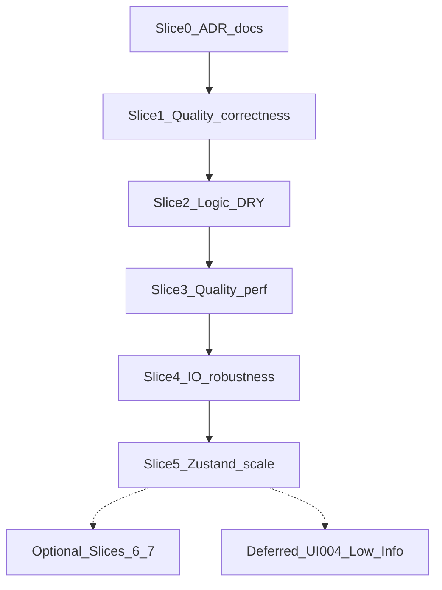

# QA audit remediation

**Status:** Complete (Slices 0–5; 6–7 remain Optional / Backlog)  
**Source audit:** [qa-audit.md](../../qa-audit.md) (2026-07-19 Staff refresh)  
**ADR:** [0004 — Tech-debt remediation strategy](../../decisions/0004-tech-debt-remediation-strategy.md)  
**Depends on:** ADRs [0001](../../decisions/0001-mesh-model-and-topology.md)–[0003](../../decisions/0003-unfold-quality-detection.md)  
**Hub:** [Plans & roadmap](../README.md)

## Goal

Remediate open findings from the QA audit in **ordered slices** that share cause or goal, without stalling product momentum. Execute **Slices 0–5** to stabilize the core geometry / session engine. Treat **Slices 6–7 as Optional / Backlog**. Defer Web Worker flatten (`UI-004`) and Low/Info polish until a later phase.

## Non-goals

- Feature work (auto-seams, SVG tier 2) from `thoughts.txt`
- Web Worker / off-main-thread flatten (`UI-004`) — see Deferred
- Halting feature delivery to refactor UI chrome (Slices 6–7 stay backlog)
- Changing ADR 0001–0003 geometry contracts beyond the amends in Slice 0 / tear-kind text

## Strategy (ADR 0004)

1. Prefer granular Zustand selectors + island memoization over Web Workers for seam-toggle jank.
2. Mandate **manual visual QA** for algorithmic geometry DRY/perf slices (2 and 3).
3. Defer layout/UI structural refactors so core engine work finishes first.

## Slice overview

| Slice | Theme | Status | Audit IDs |
|-------|--------|--------|-----------|
| **0** | ADR / docs sync | **Complete** (2026-07-19) | DOC-001, DOC-002, DOC-003 (+ tear-kind ADR interim note) |
| **1** | Quality correctness | **Complete** (2026-07-19) | TEAR-001, LOGIC-006 (assert), LOGIC-025 |
| **2** | Logic DRY foundation | **Complete** (2026-07-19) | LOGIC-007, LOGIC-008, LOGIC-012 |
| **3** | Quality hot-path perf | **Complete** (2026-07-19) | LOGIC-009, LOGIC-010, LOGIC-011, PERF-002 |
| **4** | I/O + seam robustness | **Complete** (2026-07-19) | LOGIC-004, LOGIC-005, LOGIC-013–015, IO-001, IO-002, IO-003 |
| **5** | Zustand session scale | **Complete** (2026-07-19) | STATE-003, ARCH-001, ARCH-003, UI-008 |
| **6** | Layout + a11y | **Optional / Backlog** | LAYOUT-*, A11Y-002/003, STATE-006, VIEW-001 |
| **7** | UI structure / DRY | **Optional / Backlog** | UI-001–003, APP-001–003, LAYOUT-007 |
| **Deferred** | Worker + Low/Info | Deferred | UI-004, remaining Low, Info LOGIC-020–023 |

**Dependency rules:** Slice 2 before 3. Slice 0 can ship alone. One slice per Agent pass. Run `npm test` after each slice; also `npm run lint` when touching TypeScript/React. Update [qa-audit.md](../../qa-audit.md) statuses when a slice ships.

---

## Slice 0 — ADR / docs sync

**Goal:** Make ADRs match shipped reality so agents stop drifting.

**In scope:** Amend ADR 0001 (STL + index-only degeneracy + welding consequence), ADR 0002 (mark Step 2+ deferred list superseded), ADR 0003 (W2 assertion wording; tear-kind table aligned with TEAR-001 intent once Slice 1 lands — or document interim taxonomy).

**Out of scope:** Application code.

**Primary files:**

- [docs/decisions/0001-mesh-model-and-topology.md](../../decisions/0001-mesh-model-and-topology.md)
- [docs/decisions/0002-unfold-step-1-hinge-island.md](../../decisions/0002-unfold-step-1-hinge-island.md)
- [docs/decisions/0003-unfold-quality-detection.md](../../decisions/0003-unfold-quality-detection.md)

**Approach:**

- DOC-001: STL subsection (ASCII/binary, weld, warning kinds) pointing at `parseStl`.
- DOC-002: Replace stale “Deferred to Step 2+” with pointers to completed plans / ADR 0003.
- DOC-003: Soften W2 to test-enforced until Slice 1 adds a production assert, then re-tighten.

**Done when:**

- [x] ADR text matches AGENTS.md I/O and shipped Step 2/3
- [x] Hub / audit DOC-* marked addressed
- [x] No `src/` changes required for this slice

---

## Slice 1 — Quality correctness

**Goal:** Tear kinds, BFS tree fidelity, and stable island indices across warnings vs reports.

**In scope:** TEAR-001, LOGIC-006, LOGIC-025.

**Primary files:**

- [src/logic/unfold/detectTears.ts](../../../src/logic/unfold/detectTears.ts)
- [src/logic/unfold/buildUnfoldTreeEdges.ts](../../../src/logic/unfold/buildUnfoldTreeEdges.ts)
- [src/logic/unfold/unfoldIsland.ts](../../../src/logic/unfold/unfoldIsland.ts)
- [src/logic/unfold/unfoldMesh.ts](../../../src/logic/unfold/unfoldMesh.ts)
- [src/logic/unfold/layoutIslands.ts](../../../src/logic/unfold/layoutIslands.ts)
- [src/logic/unfold/toGlobalQualityReports.ts](../../../src/logic/unfold/toGlobalQualityReports.ts)
- [src/logic/mesh/types.ts](../../../src/logic/mesh/types.ts) (if adding `sourceIslandIndex`)

**Approach:**

- Fix `classifyTearKind` dead branch; make parallel-offset kinds meaningful (or collapse taxonomy and amend ADR 0003).
- Share BFS walker **or** assert `treeEdges.size === faces - 1` after successful unfold in analysis path.
- Carry partition `sourceIslandIndex` through unfolded → layout → quality reports and warning strings.

**Tests / verification:**

- Update `detectTears.test.ts`, `buildUnfoldTreeEdges.test.ts`, `unfoldMesh.test.ts`
- Manual: cube no seams → Flatten → warnings/overlay island labels agree if any island fails

**Done when:**

- [x] Tear kinds match ADR 0003 (or ADR amended)
- [x] Production tree-size guard or shared walker in place
- [x] Warning index === report `islandIndex` / `sourceIslandIndex`
- [x] `npm test` green

---

## Slice 2 — Logic DRY foundation

**Goal:** One home for face/edge/key/tolerance helpers before perf refactors.

**In scope:** LOGIC-007, LOGIC-008, LOGIC-012.

**Primary files:**

- New: `src/logic/mesh/faceUtils.ts` (or equivalent)
- [src/logic/mesh/edgeKey.ts](../../../src/logic/mesh/edgeKey.ts) — add `parseEdgeKey`
- [src/logic/geom2d/tolerances.ts](../../../src/logic/geom2d/tolerances.ts)
- Call sites: `unfoldIsland.ts`, `buildUnfoldTreeEdges.ts`, `partitionIslands.ts`, `unfoldEdge2d.ts`, `displaySeamSegments.ts`, `seamSegments2d.ts`, `detectTears.ts`, `weldVertices.ts`, `polygonConvexity.ts`, `resolvePick.ts`

**Approach:**

- Centralize `faceVertices`, `directedEdgeForSlot`, `EDGE_SLOTS`, `edgeKeyForFace`.
- Single `parseEdgeKey` beside `makeEdgeKey`.
- Export weld/pick-related epsilons from `tolerances.ts` (or document deliberate exceptions).

**Tests / verification:**

- Existing unfold / tear / partition / seam tests must stay green (behavior-preserving refactor)
- **Manual visual QA with a complex seamed model** (ADR 0004 Decision 2): load a non-trivial mesh, set several seams, Flatten, inspect 2D canvas for face fill, seam overlay, and quality markers — no geometry/render regressions vs pre-slice baseline

**Done when:**

- [x] No duplicate local `parseEdgeKey` / near-copy face helpers remain in listed call sites
- [x] Tolerances documented/centralized
- [x] `npm test` green
- [x] **Manual visual QA with a complex seamed model** recorded — **Pass** (2026-07-19): no geometry/render regressions on seamed Flatten (face fill, seam overlay, quality markers)

---

## Slice 3 — Quality hot-path performance

**Goal:** Remove redundant SAT/clip work and O(mesh)×island tear scans without changing detection semantics.

**In scope:** LOGIC-009, LOGIC-010, LOGIC-011, PERF-002.

**Depends on:** Slice 2 (shared face/edge helpers).

**Primary files:**

- [src/logic/unfold/detectCollisions.ts](../../../src/logic/unfold/detectCollisions.ts)
- [src/logic/unfold/detectTears.ts](../../../src/logic/unfold/detectTears.ts)
- [src/logic/unfold/unfoldEdge2d.ts](../../../src/logic/unfold/unfoldEdge2d.ts)
- [src/logic/geom2d/triangle2d.ts](../../../src/logic/geom2d/triangle2d.ts)
- [src/logic/geom2d/spatialGrid.ts](../../../src/logic/geom2d/spatialGrid.ts)

**Approach:**

- One SAT + one clip polygon; derive area/centroid from it (LOGIC-011).
- `Map<FaceIndex, soupIndex>` once per island (LOGIC-010).
- Island-local edge iteration for tears (LOGIC-009).
- Numeric pair keys / avoid per-call string `seen` in spatial grid (PERF-002).

**Tests / verification:**

- Collision/tear tests: same counts/kinds on fixtures (closed cube, seamed cube)
- **Manual visual QA with a complex seamed model:** Flatten before/after — collision centroids and tear segments still appear in the expected places on the 2D canvas; no missing/extra overlay noise from changed narrow-phase

**Done when:**

- [x] No triple-SAT / double-clip on the collision hot path
- [x] Tear scan not O(full mesh edges) per island
- [x] Fixture detection counts unchanged (within documented tolerance) — closed cube: 20 collisions, 7 tears
- [x] `npm test` green
- [x] **Manual visual QA with a complex seamed model** recorded — **Pass** (2026-07-19): collision centroids and tear segments correct on seamed Flatten; no missing/extra overlay noise

---

## Slice 4 — I/O + seam robustness

**Goal:** Safer import, user-visible topology warnings, trustworthy seam export.

**In scope:** LOGIC-004, LOGIC-005, LOGIC-013, LOGIC-014, LOGIC-015, IO-001, IO-002, IO-003.

**Primary files:**

- [src/logic/mesh/buildTopology.ts](../../../src/logic/mesh/buildTopology.ts)
- [src/logic/io/stl/parseStl.ts](../../../src/logic/io/stl/parseStl.ts)
- [src/logic/io/obj/parseObj.ts](../../../src/logic/io/obj/parseObj.ts)
- [src/logic/unfold/seamSegments2d.ts](../../../src/logic/unfold/seamSegments2d.ts)
- [src/state/meshSessionStore.ts](../../../src/state/meshSessionStore.ts)

**Approach:**

- Structured topology warnings instead of `console.warn`; toast via load path (LOGIC-005).
- Document or optionally detect geometric degeneracy (LOGIC-004) — prefer ADR-aligned “index-only for v1” unless implementing a threshold.
- STL epsilon + ASCII/binary heuristic hardening; soft file/triangle budget (IO-001/002).
- OBJ full-token integers (IO-003).
- Seam list: eligibility filter + skip diagnostics (LOGIC-014/015).

**Done when:**

- [x] Degenerate topology skips are user-visible (toast or structured warning)
- [x] Soft load budget returns a clear error
- [x] Seam export does not silently invent geometry for ineligible keys
- [x] `npm test` green; smoke-load OBJ + STL — **Pass** (2026-07-19): local `3d_models` parse/topo smoke; frog STL correctly rejected at 607k tris soft limit

---

## Slice 5 — Zustand session scale (not Web Worker)

**Goal:** Cheap seam-toggle responsiveness via selectors and island memoization. Preview/export seam parity.

**In scope:** STATE-003, ARCH-001, ARCH-003 (document dual-ownership contract), UI-008.

**Explicitly out of scope:** UI-004 (synchronous flatten → Web Worker) — see Deferred and ADR 0004 Decision 1.

**Primary files:**

- [app/page.tsx](../../../app/page.tsx)
- [src/state/meshSessionStore.ts](../../../src/state/meshSessionStore.ts)
- [src/ui/useFlattenExport.ts](../../../src/ui/useFlattenExport.ts)
- [src/ui/UnfoldViewer2D.tsx](../../../src/ui/UnfoldViewer2D.tsx)

**Approach:**

- Split Zustand selectors (mesh identity vs seams/stats) so seam toggles do not re-render the entire page (ARCH-001).
- Memoize `partitionIslands` / session stats on seams content (or equivalent hash), not whole `session` object identity (STATE-003).
- Keep flatten snapshot local; document version contract (ARCH-003) — no new flatten store required.
- Wire `includeSeamsInExport` (or shared flag) into 2D preview (UI-008).

**Done when:**

- [x] Seam toggle does not re-partition unless seams changed — `seamsContentKey` + page `useMemo` deps
- [x] Page no longer selects entire `session` wholesale for unrelated subtrees — split mesh identity / seams / chrome / actions
- [x] Preview seam visibility matches export toggle — `UnfoldViewer2D` `showSeams={includeSeamsInExport}`
- [x] `npm test` + `npm run lint` green
- [ ] Manual: rapid seam picks remain responsive on a mid-size mesh — **pending user verify** (see notes after ship)

---

## Slice 6 — Layout + a11y *(Optional / Backlog)*

**Status:** Optional / Backlog — do not block product work on this slice.

**Audit IDs:** LAYOUT-001, LAYOUT-002, LAYOUT-004, LAYOUT-008, LAYOUT-009, LAYOUT-010, A11Y-002, A11Y-003, STATE-006, VIEW-001.

**When to pull forward:** Mobile/desktop shell bugs blocking users, or a dedicated a11y pass.

**Primary files:** `src/ui/layout/*`, `PickableMesh.tsx`, `globals.css`.

---

## Slice 7 — UI structure / DRY *(Optional / Backlog)*

**Status:** Optional / Backlog — do not halt momentum for orchestrator/prop-drilling refactors.

**Audit IDs:** UI-001, UI-002, UI-003, APP-001, APP-002, APP-003, LAYOUT-007.

**When to pull forward:** Before a large UI feature that would otherwise multiply prop drilling, or when preview/export drift becomes a bug.

**Primary files:** `app/page.tsx`, `AppSidebar.tsx`, `UnfoldViewer2D.tsx`, `tier1Preview.ts`, demo API / `demoModels.ts`.

---

## Deferred

| ID | Reason |
|----|--------|
| **UI-004** | Synchronous flatten → Web Worker is a large architectural shift (serialization of mesh/topology/seams, async messaging, progress UX). Seam-toggle jank is addressed by Slice 5 (Zustand selectors + memoization). Per ADR 0004 Decision 1, workers stay deferred for PoC scope. |
| **Low polish** | STATE-005, UI-005, UI-007, LAYOUT-005/006, VIEW-002–004, APP-002/003 remnants, IO-003 if not finished in Slice 4, LOGIC-016–019, PERF-002 if not finished in Slice 3 |
| **Info / PoC limits** | LOGIC-020–023, ARCH-SoC — document only; no code required |

---

## Execution checklist (per slice)

1. Confirm slice status is **Execute** (not Optional/Deferred).
2. Implement minimal diff; extend existing modules; ask before new dependencies or public type shape changes beyond this plan.
3. `npm test`; `npm run lint` if TS/React touched.
4. For Slices **2** and **3**: complete **Manual visual QA with a complex seamed model**.
5. Mark audit IDs fixed in [qa-audit.md](../../qa-audit.md); tick Done-when boxes here.
6. One slice per PR / Agent pass preferred.

---

## References

- [qa-audit.md](../../qa-audit.md)
- [ADR 0004 — Tech-debt remediation strategy](../../decisions/0004-tech-debt-remediation-strategy.md)
- [AGENTS.md](../../../AGENTS.md)
