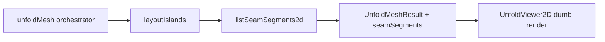

# 2D Seam Overlay + Plan / Notes Update

## Context

Core Step 2 is shipped: [`unfoldMesh`](src/logic/unfold/unfoldMesh.ts), [`layoutIslands`](src/logic/unfold/layoutIslands.ts), [`UnfoldViewer2D`](src/ui/UnfoldViewer2D.tsx), Flatten UI in [`app/page.tsx`](app/page.tsx). ADR 0002 already states seam strokes are a **separate overlay concern** — no new ADR needed.



---

## Part 1 — Documentation updates

### [`docs/plans/archive/step-2-flattening.md`](../archive/step-2-flattening.md)

- Change frontmatter `status: planned` → `status: complete` with an active stretch subsection.
- Replace stale line 29 (`Not done yet: multi-island orchestration…`) with a **Delivered (core)** table listing shipped files.
- Move **Seam strokes overlaid on 2D edges** from **Out of scope** → new **Step 2 stretch (in progress)** section with:
  - `listSeamSegments2d` in `src/logic/unfold/seamSegments2d.ts`; called as final step inside `unfoldMesh`
  - `seamSegments: SeamSegment2d[]` on `UnfoldMeshResult` (viewer stays dumb — no mesh/topo/seams props)
  - Red `<line>` overlay in `UnfoldViewer2D` from `result.seamSegments` (match 3D `#ff4444`)
  - Vitest: seamed cube → `2 × seamCount` segments on result
  - Manual test MT-6: seamed cube → red cut lines on island boundaries
- Add MT-6 row to manual test table.

### [`thoghts.txt`](thoghts.txt)

- Update header date / note Step 2 core complete (~42 tests).
- Resolve or strike **STEP 2 OPEN QUESTIONS** items that are decided (compute on demand, split viewport, row-wrap fix).
- Add new section **FUTURE BACKLOG (not Step 2 stretch)**:
  - **SVG export** — download pattern + optional seam layer
  - **2D seam pick** — face-aware edge click → `toggleSeam`; soup duplicate-vertex picking
  - **Step 3** — intra-island collision, BFS root/branch optimization, 2D corner re-weld
  - **Auto seam suggestions** — sphere stripes, curvature heuristics (README Phase 2)
  - **2D editor** — drag/reorder faces (explicitly deferred in Step 2 plan)
  - **UI polish** — self-overlap hint on closed meshes, face index labels, 3D/2D tab toggle

---

## Part 2 — Seam overlay implementation

### Orchestrator integration — [`src/logic/unfold/unfoldMesh.ts`](src/logic/unfold/unfoldMesh.ts)

After `layoutIslands`, compute segments and attach to the result contract:

```typescript
const islands = layoutIslands(unfolded);
return {
  islands,
  bounds: combinedBounds(islands),
  seamSegments: listSeamSegments2d(mesh, topology, seams, islands),
};
```

On error, return `seamSegments: []`.

### Types — [`src/logic/mesh/types.ts`](src/logic/mesh/types.ts)

```typescript
export type SeamSegment2d = { x0: number; y0: number; x1: number; y1: number };

export type UnfoldMeshResult = {
  islands: LayoutedIsland[];
  bounds: Bbox2d;
  seamSegments: SeamSegment2d[];
  error?: string;
};
```

### Logic — new [`src/logic/unfold/seamSegments2d.ts`](src/logic/unfold/seamSegments2d.ts)

Pure function (no React):

```typescript
export function listSeamSegments2d(
  mesh: MeshModel,
  topology: Topology,
  seams: SeamRegistry,
  islands: LayoutedIsland[],
): SeamSegment2d[]
```

Algorithm:

1. Build `faceId → { island, faceIdxInSoup }` from `result.islands`.
2. For each `EdgeKey` in `seams.seams`:
   - Look up incidents in `topology.edgeToFaces`.
   - For each incident face present in the map:
     - Read soup slice at `6 * faceIdxInSoup`.
     - Find 2D coords of edge endpoints `va`, `vb` by matching `mesh.faces` corner order (same approach as private `cornerForVertexOnFace` in [`unfoldIsland.ts`](src/logic/unfold/unfoldIsland.ts)).
     - Push `{ x0, y0, x1, y1 }`.
3. Skip seams with missing faces (shouldn't happen on valid unfold); boundary-only seams draw one segment.

Optional small helper in [`soupBounds.ts`](src/logic/unfold/soupBounds.ts): `corner2dForVertexOnFaceSlice(mesh, faceId, soup, faceIdxInSoup, vi)` to avoid duplicating corner lookup.

### Tests — [`src/logic/unfold/seamSegments2d.test.ts`](src/logic/unfold/seamSegments2d.test.ts)

- Reuse seamed-cube fixture from [`unfoldMesh.test.ts`](src/logic/unfold/unfoldMesh.test.ts).
- Assert segment count = `2 × seamCount` (4 seams → 8 segments).
- Assert each segment endpoints are finite and length ≈ 3D edge length.

### Viewer — [`src/ui/UnfoldViewer2D.tsx`](src/ui/UnfoldViewer2D.tsx)

- Props unchanged: `UnfoldMeshResult | null` only (strictly presentational).
- Inside existing flip `<g>`, render `<polygon>`s first, then iterate `result.seamSegments`:

```tsx
<line x1={seg.x0} y1={seg.y0} x2={seg.x1} y2={seg.y1}
  stroke="#ff4444" strokeWidth={2} vectorEffect="non-scaling-stroke" />
```

No changes to [`app/page.tsx`](app/page.tsx) wiring.

---

## Part 3 — Verification

```bash
npm test
npm run lint
```

Manual: load cube → seam top face (4 edges) → Flatten → red lines on both island pieces at cut boundaries; icosahedron with 12 seams → lines on all 4 island boundaries.

---

## Out of scope (parked in thoghts.txt only)

- 2D seam editing, unfold optimization, SVG download, collision — not in this slice.
