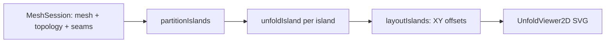
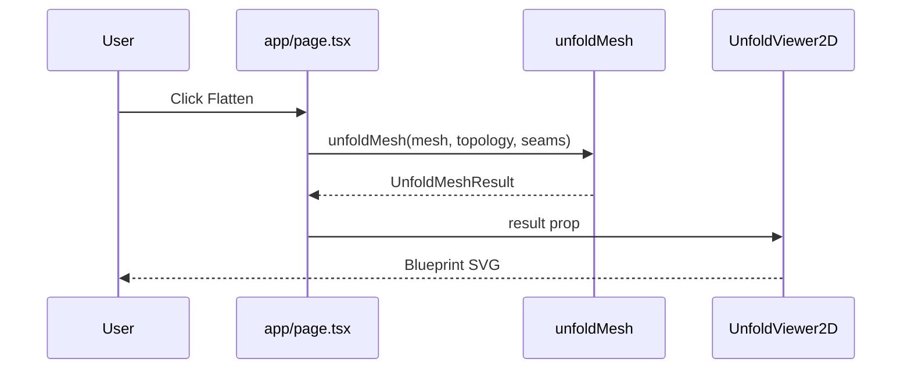

# Flattening Algorithm — Step 2: Orchestration + 2D Viewer

## Step 1 complete (prerequisites)

Documented in [ADR 0002](../decisions/0002-unfold-step-1-hinge-island.md). Do not reimplement.

| Delivered | Location |
|-----------|----------|
| `unfoldIsland(mesh, topology, islandFaces)` | `src/logic/unfold/unfoldIsland.ts` |
| Triangle soup output (`6 floats`/face) | `src/logic/mesh/types.ts` |
| Hinge math + discriminant clamping | `src/logic/unfold/placeTriangle2d.ts` |
| Parent-soup-copy BFS (no vertex map) | `unfoldIsland.ts` |
| Tests: diamond, open box, icosahedron, cube | `src/logic/unfold/*.test.ts` |

**Contracts to preserve:**

- 2D winding matches `mesh.faces` order
- One `VertexIndex` may have different 2D positions per face
- BFS tree edges: parent/child soup coords match on shared edge
- `error` set → discard `positions2d`
- `unfoldIsland` does not read `SeamRegistry`

**Not done yet:** multi-island orchestration, layout offsets, SVG, UI.

---

## Goal

User clicks **Flatten** → see a **blueprint-style 2D SVG** of all islands laid out side-by-side without global overlap between islands.



---

## Scope

### In scope

| Item | Rationale |
|------|-----------|
| `unfoldMesh(mesh, topology, seams)` | Orchestrator: partition → unfold each island → layout |
| `layoutIslands.ts` | Row-pack island bboxes with gap (no inter-island overlap) |
| `UnfoldMeshResult` type | Islands with offsets + per-island soup (or offset-applied soup) |
| `soupToSvg.ts` or inline in viewer | Pure helpers: bbox, polygon points string |
| `UnfoldViewer2D.tsx` | React SVG: dark blueprint, thin strokes, one `<polygon>` per face |
| Sidebar **Flatten** button + 2D panel | Minimal UI wiring via Zustand or local state |
| Vitest: `unfoldMesh.test.ts` | Seamed cube → 2 islands separated; icosahedron → 1 island |
| Error handling | Any island `error` → fail whole unfold, toast user |

### Out of scope

| Item | Deferred |
|------|----------|
| Collision detection within an island | Step 3 |
| PDF export | Later |
| Interactive 2D editor (drag faces) | Later |
| Seam strokes overlaid on 2D edges | Optional stretch; not required v1 |
| New npm dependencies | Use native SVG in React |

---

## Ordered implementation substeps

### 1. Types — `src/logic/mesh/types.ts`

```typescript
export type Vec2 = { x: number; y: number }; // or import from placeTriangle2d

export type LayoutedIsland = {
  islandIndex: number;
  faces: FaceIndex[];
  /** Soup with layout offset already applied (global XY). */
  positions2d: FlattenedTriangleSoup;
  offset: Vec2;
  bounds: { minX; minY; maxX; maxY };
};

export type UnfoldMeshResult = {
  islands: LayoutedIsland[];
  bounds: { minX; minY; maxX; maxY };
  error?: string;
};
```

### 2. Layout — `src/logic/unfold/layoutIslands.ts`

- Input: array of `UnfoldIslandResult` (successful, no error)
- Per island: compute axis-aligned bbox from soup
- **Wrapped row** layout (not infinite horizontal strip): `maxRowWidth ≈ sqrt(sum of island bbox areas)`; greedy wrap with `ISLAND_GAP` (e.g. 0.5 units). Soup stays **math Y-up**; SVG flip only in viewer.
- Output: copy soup with offset added to every `x,y` pair
- Pure function, unit tested

### 3. Orchestrator — `src/logic/unfold/unfoldMesh.ts`

```typescript
export function unfoldMesh(
  mesh: MeshModel,
  topology: Topology,
  seams: SeamRegistry,
): UnfoldMeshResult
```

1. `partitionIslands(mesh, topology, seams)`
2. For each island: `unfoldIsland(...)` — if any `error`, return `{ error, islands: [] }`
3. `layoutIslands(unfoldResults)`
4. Return combined result

### 4. SVG helpers — `src/logic/unfold/soupBounds.ts` (optional small module)

- `boundsFromSoup(positions2d) → { minX, minY, maxX, maxY }`
- `polygonPointsFromSoupSlice(soup, faceIndex) → string` for SVG `points` attr

Keep React out of `src/logic/`.

### 5. Viewer — `src/ui/UnfoldViewer2D.tsx`

- Props: `UnfoldMeshResult | null`, optional `className`
- **Y-axis:** unfold/layout soup is math Y-up; SVG is Y-down. Wrap islands in `<g transform={`translate(0, ${minY + maxY}) scale(1, -1)`}>` — **not** bare `scale(1,-1)` (clips/mirrors through origin).
- **viewBox:** `${minX - pad} ${-maxY - pad} ${width} ${height}` so flipped content is centered and visible.
- **Strokes:** `vector-effect="non-scaling-stroke"` + `strokeWidth={1}` on each `<polygon>` (crisp 1px at any zoom).
- Blueprint aesthetic: dark background, light fill, `#7dd3fc` stroke; one `<polygon>` per face.
- `preserveAspectRatio="xMidYMid meet"`; empty state: "Click Flatten to generate pattern"

### 6. Store + UI wiring

**Option A (recommended):** compute on demand, no persist in store

- `app/page.tsx`: `const [flattenResult, setFlattenResult] = useState<UnfoldMeshResult | null>(null)`
- Button **Flatten** in sidebar (disabled if no session):
  ```typescript
  const result = unfoldMesh(session.mesh, session.topology, session.seams);
  if (result.error) { toast; return; }
  setFlattenResult(result);
  ```
- `useEffect(() => setFlattenResult(null), [session])` — clears on file load **and** seam toggle/clear (stale 2D prevention)

**Option B:** add `flattenPattern` to `meshSessionStore` — only if reuse across components needed.

**Layout:** split viewport or tab toggle 3D / 2D:

- Minimal PoC: below 3D viewport or replace main with split `grid` rows when `flattenResult` set
- Toggle "Show 3D" / "Show flatten" or side-by-side on wide screens

### 7. Tests — `src/logic/unfold/unfoldMesh.test.ts`

| Test | Assert |
|------|--------|
| Seamed cube (top face free) | 2 islands, bbox centers separated by > gap |
| Icosahedron no seams | 1 island, finite bounds, 20×6 soup values |
| Empty / error propagation | Mock or degenerate case returns `error` |

### 8. CSS — `app/globals.css`

- `.flatten-panel`, `.flatten-svg` container (flex, min-height, border)

---

## Data flow (UI)



---

## Manual test plan (MT)

| # | Steps | Expected |
|---|-------|----------|
| MT-1 | Load cube OBJ, seam top face, Flatten | 2 island groups separated in 2D view |
| MT-2 | Load icosahedron, Flatten | Single connected pattern, no crash |
| MT-3 | Load mesh, Flatten with no seams on closed cube | Pattern shows (may self-overlap within island) |
| MT-4 | Load new file after flatten | 2D view clears or updates |
| MT-5 | Flatten with no file | Button disabled |

---

## Risks

| Risk | Mitigation |
|------|------------|
| Large mesh slow unfold | Accept for PoC; show loading state on button |
| Closed shell intra-island overlap | Document in UI hint; collision deferred |
| SVG viewBox tiny/huge | Normalize from layout bounds + padding |
| React 19 unstable selectors | Keep unfold result in `useState`, not selector returning new object |

---

## Files to create/modify (summary)

| Action | Path |
|--------|------|
| Create | `src/logic/unfold/unfoldMesh.ts` |
| Create | `src/logic/unfold/layoutIslands.ts` |
| Create | `src/logic/unfold/unfoldMesh.test.ts` |
| Create | `src/logic/unfold/layoutIslands.test.ts` |
| Create | `src/ui/UnfoldViewer2D.tsx` |
| Modify | `src/logic/mesh/types.ts` |
| Modify | `app/page.tsx` |
| Modify | `app/globals.css` |

---

## Verification

```bash
npm test
npm run lint
npm run build
# Manual: dev server → load OBJ → seams → Flatten → see 2D pattern
```
