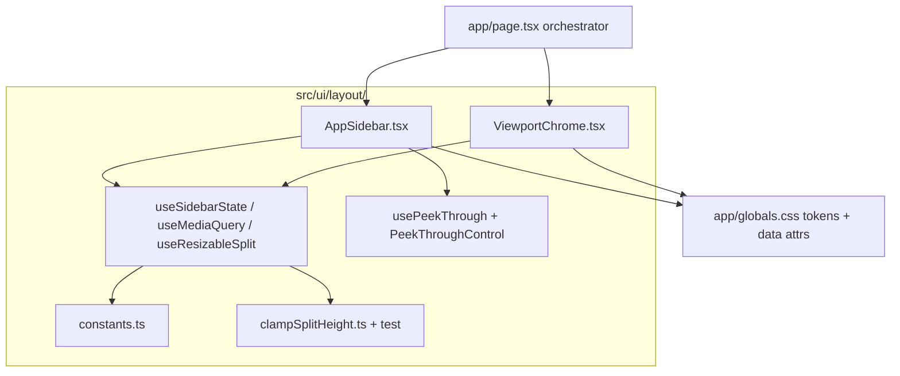

# UI shell — Mobile responsive layout

**Status:** Complete  

**Hub:** [Plans & roadmap](../README.md)  
**QA:** [qa-audit.md](../qa-audit.md) (layout slice health check)

Responsive shell: collapsible sidebar, labeled toggles, draggable desktop 2D split, mobile 3D/2D tabs, auto-close on major actions, peek-through on continuous controls — via `src/ui/layout/`.

**v1 shell + UX polish shipped** (desktop open / mobile closed by default; single-line toggles; outside close tab; mobile Flatten → close menu + 2D tab).

### Delivery checklist

| Id | Work | Status |
|----|------|--------|
| layout-constants | `constants.ts` + `clampSplitHeight` (+ test) + CSS `:root` tokens | Done |
| layout-hooks | `useMediaQuery`, `useSidebarState`, `useResizableSplit` | Done |
| layout-peek | `usePeekThrough` + `PeekThroughControl`; `data-sidebar-peek` CSS | Done |
| layout-components | `AppSidebar` + `ViewportChrome`; mobile auto-close | Done |
| layout-css | `globals.css` tokens + data attrs; desktop vs mobile drawer | Done |
| a11y-keyboard | Escape, aria, tabs, separator valuemin/max/now | Done |
| verify | `npm test` / `npm run lint` / manual QA | Done |
| ux-polish-default-open | Sidebar open by default on **desktop**; **closed** on mobile | Done |
| ux-polish-toggle-oneline | Menu/Close toggles: single horizontal line; stable vertical band | Done |
| ux-polish-close-outside | Close control sits on the **outside** right edge of the menu | Done |
| ux-polish-mobile-drawer-hide | Collapsed mobile drawer: `visibility: hidden` + `translateX(-100%)` (not a lingering off-screen panel) | Done |
| ux-polish-flatten-to-2d | Successful Flatten on mobile: close drawer **and** switch to 2D tab | Done |

---

## Architecture principles (aligned with [AGENTS.md](../../../../AGENTS.md))

| Principle | Decision |
|-----------|----------|
| **Thin route, fat UI module** | [`app/page.tsx`](../../../../app/page.tsx) orchestrates; layout UI lives in [`src/ui/layout/`](../../../../src/ui/layout/) |
| **No logic in `src/logic/`** | Layout is presentation-only; clamp math in `src/ui/layout/` with Vitest |
| **No new dependencies** | CSS transitions, `useSyncExternalStore`, Pointer Events, `localStorage` |
| **Single source of truth** | Breakpoint + dimensions in `constants.ts`; mirrored as CSS custom properties in `:root` |
| **Respect user intent** | Breakpoint / default sets **initial** state only; never force open/close on resize after the user toggles |
| **Mobile UX is explicit** | Auto-close, peek-through, and Flatten→2D tab are first-class, gated on `!isDesktop` |
| **Polish before reinvent** | Toggle placement and defaults are CSS/state tweaks — keep the rail + drawer model |

---

## Current state (as implemented)

**Shell + UX polish:** shipped.

- Shell: [`app/page.tsx`](../../../../app/page.tsx) → [`src/ui/layout/`](../../../../src/ui/layout/) (`AppSidebar`, `ViewportChrome`, hooks)
- CSS: [`app/globals.css`](../../../../app/globals.css) — tokens, `data-sidebar` / `data-sidebar-peek`, desktop in-flow width vs mobile overlay drawer
- Desktop: collapsible sidebar, draggable 2D split (both viewports always visible)
- Mobile: rail + overlay drawer, 3D/2D tabs, auto-close on major actions, scale-slider peek-through
- Default: `sidebarOpen = userOverride ?? isDesktop` (desktop open, mobile closed)
- Toggles: single-line (`flex-direction: row`); Close tab `left: 100%` outside drawer; scroll on `.sidebar-drawer-body`
- Mobile collapsed: `visibility: hidden` + `translateX(-100%)` (driven by `data-sidebar`, not a default-only transform)
- **Flatten (mobile):** `handleFlatten` in `page.tsx` — on success sets `mobilePanel` to `"2d"`; `AppSidebar` still calls `closeIfMobile()`
- Storage helper: [`readLayoutStorage.ts`](../../../../src/ui/layout/readLayoutStorage.ts)



---

## File layout

```
src/ui/layout/
  constants.ts
  clampSplitHeight.ts (+ test)
  useMediaQuery.ts
  useSidebarState.ts
  usePeekThrough.ts
  useResizableSplit.ts
  PeekThroughControl.tsx
  AppSidebar.tsx
  ViewportChrome.tsx
  readLayoutStorage.ts
app/page.tsx
app/globals.css
```

---

## CSS design tokens (`:root`)

```css
:root {
  --layout-breakpoint: 769px;
  --sidebar-open-width: 360px;
  --sidebar-rail-width: 80px;
  --sidebar-peek-opacity: 0.15;
  --split-2d-default: 280px;
  --split-2d-min: 140px;
  --split-2d-max-ratio: 0.6;
  --z-backdrop: 30;
  --z-sidebar: 40;
  --z-toast: 20;
}
```

State on `.page`:

```html
<div
  class="page"
  data-sidebar="open|collapsed"
  data-sidebar-peek="true|false"
>
```

(`data-mobile-panel` is optional; mobile panel can stay in React state as today.)

---

## Part 1 — Collapsible sidebar (shipped model)

### Interaction

| State | Visible | Toggle |
|-------|---------|--------|
| **Collapsed** | Rail: title + `› Menu` | Open control in top band of rail |
| **Open** | Full panel (intro + cards) | `‹ Close` **outside** right edge of panel, same top band |

### Desktop vs mobile mechanics

**Desktop (`min-width: 769px`) — in-flow column width**

- `.page` grid: `var(--sidebar-current-width) 1fr`
- Column animates `80px → 360px` via `--sidebar-current-width`
- No backdrop; viewport expands when collapsed
- No `translateX` drawer on desktop

**Mobile (`max-width: 768px`) — overlay drawer**

- Grid always reserves rail: `var(--sidebar-rail-width) 1fr`
- Drawer fixed at `left: var(--sidebar-rail-width)`, slides with `translateX`
- Backdrop covers viewport column only (not rail); tap / Escape closes
- **Collapsed vs open (explicit CSS):** both states set on `.page[data-sidebar=…]` — open → `translateX(0)` + `visibility: visible`; collapsed → `translateX(-100%)` + `visibility: hidden` + `pointer-events: none` (avoids a lingering off-screen “open” panel)

### State: `useSidebarState`

**Shipped default:**

```tsx
const isDesktop = useMediaQuery(DESKTOP_MEDIA_QUERY);
const [userOverride, setUserOverride] = useState<boolean | null>(() =>
  readStoredBoolean(STORAGE_KEY_SIDEBAR),
);

// First visit: desktop open, mobile closed
const sidebarOpen = userOverride ?? isDesktop;
```

| Rule | Detail |
|------|--------|
| **Default** | Desktop open, mobile closed (open-on-mobile left the overlay off-screen / confusing vs rail) |
| **Persist** | After explicit toggle / close / `closeIfMobile`, write `3dflatter.sidebarOpen` |
| **No snap on resize** | Crossing 769px must not override `userOverride` |
| **Mobile auto-close** | Still calls `closeIfMobile()` after successful major actions — that is intentional close, not a change to the default |
| **SSR** | `getServerSnapshot → true` (desktop); mobile may flash open→closed on hydrate ([LAYOUT-004](../qa-audit.md)) — acceptable for PoC |

`useMediaQuery` stays on `useSyncExternalStore` (unchanged).

### Toggle affordance — **polish (approved)**

Staff / UX decisions for the three reported issues:

#### 1. Single horizontal line (open and closed)

- `.sidebar-toggle`: `display: inline-flex; flex-direction: row; align-items: center; gap: …; white-space: nowrap`
- Icon + label always on **one line** (`› Menu` / `‹ Close`) — never stacked column
- Keep min **44×44** touch target via padding/min-size, not by stacking text
- Narrow rail (80px): prefer slightly tighter padding / label size over wrapping; do **not** reintroduce `flex-direction: column`

#### 2. Stable vertical band (“one line” of chrome)

- Open and Close controls share the **same top band** (under / beside the title row) — no mid-panel `top: 50%` jump when opening
- Collapsed: open control stays in `.sidebar-rail` top stack
- Open: close control vertically aligned to that same band (e.g. top of drawer content / title-aligned), not vertically centered on the full drawer height

#### 3. Close tab on the **outside** edge of the menu

```
┌──────── rail ──┬──────── drawer (menu) ────────┬──┐
│  3D Flatter    │  intro + cards …              │‹│  ← Close sits OUTSIDE
│  [› Menu] *    │                               │C │     right edge
└────────────────┴───────────────────────────────┴──┘
  * Menu only when collapsed
```

| Rule | Detail |
|------|--------|
| **Anchor** | Position relative to `.sidebar-drawer` right edge; tab **protrudes into the viewport** (`left: 100%` or equivalent — not `right: 0` flush inside) |
| **Shape** | Outside tab: radius on the **viewport** side (`border-radius: 0 10px 10px 0`); shadow toward the viewport |
| **Clipping** | Drawer shell `overflow: visible`; scroll only `.sidebar-drawer-body` so the outside Close tab is not clipped |
| **Hit testing** | `z-index` above backdrop; tab remains clickable while drawer is open |
| **Desktop** | Outside tab may overlap the 3D viewport slightly — intentional; do not widen the grid column just for the tab |
| **Reduced motion** | No change to motion preference rules |

### Accessibility (shipped + polish-safe)

- `aria-expanded`, `aria-controls` on toggles
- Escape closes when open; restore focus to open control when collapsing
- Mobile backdrop remains a real `<button aria-label="Close menu">`
- Outside close tab keeps `aria-label="Close menu"`; visible “Close” text stays for sighted users

---

## Part 2 — Draggable 2D split (desktop only) — shipped

- Pure `clampSplitHeight` + Vitest
- `useResizableSplit`: pointer capture on handle, persist on `pointerup`, `body.is-resizing`
- `ViewportChrome`: desktop `1fr / handle / 2d`; mobile hides handle

---

## Part 3 — Mobile 3D / 2D tabs — shipped

- `mobilePanel: "3d" | "2d"` state in [`app/page.tsx`](../../../../app/page.tsx); [`ViewportChrome`](../../../../src/ui/layout/ViewportChrome.tsx) owns tablist / tabpanels
- Toasts stay in 3D host

### Flatten → 2D (mobile only)

After a **successful** Flatten on mobile, the user should see the pattern immediately — not stay on the 3D tab behind a closed drawer.

| Layer | Responsibility |
|-------|----------------|
| [`app/page.tsx`](../../../../app/page.tsx) `handleFlatten` | Calls `onFlatten()`; if `ok && !isDesktop`, `setMobilePanel("2d")` |
| [`AppSidebar`](../../../../src/ui/layout/AppSidebar.tsx) `handleFlatten` | Calls the page handler; if `ok`, `closeIfMobile()` |

```tsx
// app/page.tsx
const handleFlatten = useCallback((): boolean => {
  const ok = onFlatten();
  if (ok && !isDesktop) {
    setMobilePanel("2d");
  }
  return ok;
}, [isDesktop, onFlatten]);
```

- **Desktop:** no panel switch — split already shows 3D + 2D
- **Failed flatten:** no close, no tab switch
- File upload / Load demo: still **close only** (stay on 3D) — pattern tab is Flatten-specific

---

## Part 4 — Mobile sidebar refinements — shipped

### Control taxonomy

| Type | Examples | Mobile behavior |
|------|----------|-----------------|
| **Major actions** | File upload, Load demo | Auto-close drawer after success; stay on current tab (usually 3D) |
| **Major + navigate** | Flatten | Auto-close drawer **and** switch to **2D** tab after success |
| **Continuous** | Model scale range | Peek-through while dragging |
| **Discrete** | Seam mode, view toggles, select, Export/Clear | Stay open and opaque |

### Peek-through

- `data-sidebar-peek` on `.page`; scoped `pointer-events` so the slider keeps receiving moves
- Desktop: `enabled={false}` — no CSS change

---

## Part 5 — General polish — shipped

- `100dvh`, safe-area insets, file input `max-width: 100%`
- Z-index: sidebar > backdrop > toasts

---

## Explicitly avoided (anti-patterns)

| Avoided | Why |
|---------|-----|
| All logic in `page.tsx` | Monolith; untestable drag/clamp |
| Snapping sidebar on breakpoint resize | Overrides explicit user choice |
| `padding-left` viewport hack | Grid rail column is cleaner |
| `translateX` drawer on desktop | Width animation on grid column is simpler |
| `pointer-events: none` on whole drawer without `.peek-through-target` | Breaks range slider |
| Inline peek opacity in React | Use `data-sidebar-peek` + CSS var |
| Auto-close in Zustand | Layout concern, not session |
| Auto-switch to 2D after flatten on desktop | N/A — split already shows both |
| Stacked column toggle labels | Fails “one line” UX; awkward in 80px rail |
| Close tab centered mid-drawer | Breaks stable chrome band with Menu |
| Close tab inside clipped drawer (`right: 0` + `overflow-x: hidden`) | Looks inset; cannot sit outside |

---

## Optional follow-ups (out of scope)

- Swipe-from-left-edge to open drawer
- Keyboard shortcut `[` to toggle sidebar on desktop
- Extend peek-through to desktop
- Reduce mobile SSR open→closed flash ([LAYOUT-004](../qa-audit.md))

---

## Verification

### Shell (already expected green)

1. `npm test` / `npm run lint`
2. Desktop split drag + persist
3. Mobile tabs + aria
4. Mobile file/demo auto-close; scale peek-through; discrete controls stay open
5. Escape closes; reduced motion disables transitions

### UX polish (shipped)

1. **Default:** clear `localStorage` key `3dflatter.sidebarOpen` → reload → sidebar **open** on desktop, **closed** (rail + Menu) on mobile
2. **One line:** collapsed rail shows `› Menu` on a **single horizontal line**; open shows `‹ Close` on a single horizontal line (no stacked icon/label)
3. **Stable band:** open ↔ close does not jump the control from title area to vertical center of the panel
4. **Outside edge:** Close tab sits on the **outer** right edge of the menu and protrudes into the viewport; not clipped by drawer overflow; still clickable above the backdrop
5. **Mobile collapsed:** drawer is not an off-screen open panel — `visibility: hidden` + `translateX(-100%)` when collapsed; tap Menu slides it on-screen
6. **Flatten → 2D (mobile):** successful Flatten closes the drawer and selects the **2D** tab; desktop Flatten leaves the split as-is; failed Flatten does neither
7. After user toggles once, refresh keeps that choice (persist still wins over default)
