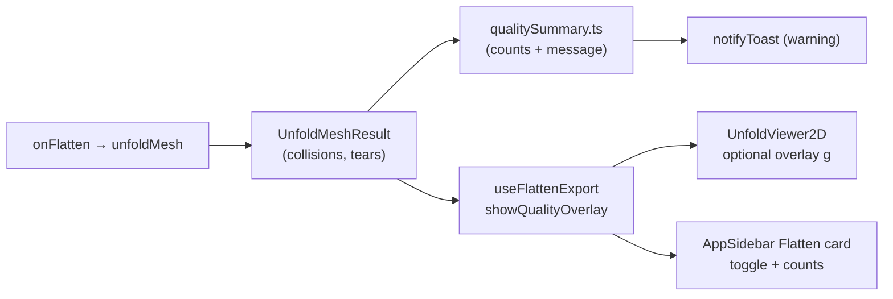

# Step 3 stretch — 2D viewer quality overlay

**Status:** Complete  
**ADR:** [0003 — Unfold quality detection](../../../decisions/poc/0003-unfold-quality-detection.md) (consume only; no logic changes)  
**Depends on:** [step-3-quality-detection.md](step-3-quality-detection.md), [step-2-seam-overlay.md](step-2-seam-overlay.md), [mobile-responsive-layout.md](mobile-responsive-layout.md)  
**Hub:** [Plans & roadmap](../README.md)

## Goal

Surface existing `UnfoldMeshResult.collisions` and `UnfoldMeshResult.tears` in the UI:

1. Immediate post-flatten notification (toast)
2. Optional SVG overlay in `UnfoldViewer2D`
3. User-controlled toggle that fits the responsive layout shell

**Non-goals (this stretch):** auto-fix, SVG export of quality layers, 3D viewport markers, Zustand refactor, capping logic-side detection.

---

## Architectural alignment

| Existing pattern | How we extend it |
|------------------|------------------|
| **Dumb 2D viewer** — `UnfoldViewer2D` takes only `UnfoldMeshResult` ([step-2 seam overlay](step-2-seam-overlay.md)) | Add one optional display prop (`showQualityOverlay`); still no mesh/topo/seams |
| **Overlay layer in SVG** — faces → seams inside `yFlip` `<g>` | Add quality `<g>` **after seams** so markers sit on top |
| **Shared stroke colors** — `tier1Preview.ts` constants used by viewer + export | Add `TIER1_COLLISION_*` / `TIER1_TEAR_*` alongside existing seam colors |
| **Flatten hook owns flatten UI state** — `useFlattenExport` holds `flattenSnapshot`, `includeSeamsInExport` | Co-locate `showQualityOverlay` + setter in the same hook |
| **3D view toggles in sidebar View card** | Quality is **2D-specific** → place toggle in **Flatten card**, not View |
| **Toasts via Zustand** — `notifyToast` from `meshSessionStore`, fired from hooks | Reuse `warning` tone; do **not** add quality fields to the store |
| **Detection does not imply error** (ADR 0003) | Toast is informational/warning, not blocking; export stays enabled |



---

## 1. Toasts / notifications

### Where

**`src/ui/useFlattenExport.ts` → `onFlatten`**, immediately after a successful flatten (same block that today handles `result.warnings`).

**Why here:** Flatten is the only moment quality data becomes available; this hook already owns flatten lifecycle and already calls `notifyToast`. Keeps `unfoldMesh` pure and avoids pushing ephemeral UI concerns into Zustand.

### What to show

Add a tiny pure helper (testable, no React):

**`src/logic/unfold/qualitySummary.ts`**

```typescript
countQualityIssues(result): { collisionCount, tearCount, hasIssues }
formatQualityIssueToast(counts): string | null  // null when clean
capForOverlay<T>(items, max): { visible, total, truncated }
formatTruncatedOverlayHint(shown, total, kind): string | null
QUALITY_OVERLAY_MAX_COLLISIONS = 50
QUALITY_OVERLAY_MAX_TEARS = 50
```

**Toast copy (ADR W4 — separate counts, W5 — summarize only):**

- Both nonzero: `"Pattern issues: 42 face overlaps, 18 edge tears. Toggle overlay in Flatten panel."`
- Collisions only / tears only: single-kind variant
- When counts exceed overlay cap, append truncation hint: `"Overlay shows first 50 of 142 overlaps."` (and tears if applicable)
- **Tone:** `"warning"` (matches existing flatten warnings; not `"info"` because issues are actionable)
- **When clean:** no extra toast (flatten success is implicit via 2D pattern appearing)

**Why a logic helper:** Count formatting is deterministic and should stay unit-testable without mounting React. Mirrors how seam segments live in logic but render in UI.

### Mobile fix (prerequisite)

Today `ToastStack` lives inside the **3D tab panel** (`app/page.tsx`). After Flatten on mobile, the shell switches to the **2D tab** — so flatten toasts (including existing island warnings) are **hidden**.

**Change:** Move `<ToastStack>` to the `.page` root (sibling of sidebar + viewport), keeping existing `z-index: var(--z-toast)`.

**Why:** One-line structural fix; required for the quality toast to be seen on the primary mobile flatten path. Does not alter sidebar/viewport architecture.

---

## 2. 2D canvas overlay (`UnfoldViewer2D.tsx`)

### Props

```typescript
UnfoldViewer2D({
  result: UnfoldMeshResult | null;
  showQualityOverlay?: boolean; // default false
})
```

**Why optional prop from parent:** Preserves the “presentational viewer” contract from Step 2. Display intent stays in `useFlattenExport` / `page.tsx`; geometry stays on `result`.

### Render strategy

Inside the existing `yFlipGroupTransform` `<g>`, **after** polygons and seam lines:

```tsx
<g id="quality-overlay" aria-hidden={!showQualityOverlay}>
  {/* collisions */}
  {/* tears */}
</g>
```

Skip the entire group when `!showQualityOverlay` or both arrays empty (cheap early return).

### Collisions (3a)

For each `TriangleCollision2d`:

- **Marker:** `<circle>` at `centroid.x / centroid.y`
- **Style:** filled disc + contrasting stroke (e.g. orange `#f97316` fill at ~0.85 opacity, dark stroke)
- **Radius:** fixed in **layout coordinates** (e.g. `r = 0.015 × max(viewBox.width, viewBox.height)`) so markers scale with the pattern, not the panel pixel size

**Why centroid-only (ADR 0003):** `centroid` is precomputed for UI highlight; no intersection polygon is stored. Drawing full overlap regions would require new logic types and violate “consume only” for Step 3 logic.

**Marker cap (approved UX):** Render at most `QUALITY_OVERLAY_MAX_COLLISIONS` (50) collision markers and `QUALITY_OVERLAY_MAX_TEARS` (50) tear pairs via `capForOverlay`. Sidebar, toast, and in-viewer legend show full totals plus a truncation hint when capped (`"Showing 50 of 142 overlaps"`).

**Efficiency:** O(cap) SVG nodes when overlay on — not O(n) for bad closed meshes. No runtime geometry. Overlay gated behind toggle so clean views pay zero cost.

### Tears (3b)

For each `EdgeTear2d`:

- **Two `<line>` elements:** `segmentA` (solid) and `segmentB` (dashed)
- **Color:** shared tear hue (e.g. amber `#fbbf24`) — visually distinct from seam red `#ff4444` and face cyan
- **`strokeWidth`:** 2, `vectorEffect="non-scaling-stroke"` (same as seams)
- **Optional `data-tear-kind`:** attribute for future styling; v1 can use one color pair for all kinds (ADR W7: `skew` low priority)

**Why both segments:** Shows *where* the 3D edge disagrees in 2D (gap/overlap/skew) without re-deriving geometry.

### Colors

Add to **`src/logic/export/svg/tier1Preview.ts`** (same file as `TIER1_SEAM_STROKE`):

- `TIER1_COLLISION_FILL`, `TIER1_COLLISION_STROKE`
- `TIER1_TEAR_STROKE_A`, `TIER1_TEAR_STROKE_B` (or one color + dash pattern)

**Why:** Keeps viewer and future SVG tier visually aligned, matching the seam overlay precedent. Quality overlay **not** included in tier-1 SVG export unless explicitly requested later.

### Accessibility

- Update root SVG `aria-label` when overlay on: e.g. `"Flattened mesh pattern with quality issue overlay"`.
- Compact text legend (see §3) provides visible counts for sighted users.

---

## 3. Toggle / UX

### State ownership

In **`useFlattenExport`**:

```typescript
const [showQualityOverlay, setShowQualityOverlay] = useState(false);
```

**Why not Zustand:** Matches `includeSeamsInExport`, `wireframe`, `showGrid` — session-local UI prefs, not mesh session data. Avoids store bloat and preserves `meshLoadVersion` invariants.

### Auto-enable behavior (approved UX)

On successful flatten **when `hasIssues` and overlay has not been auto-enabled yet this mesh session:**

- Set `showQualityOverlay` to `true` once.
- Track via `hasAutoEnabledQualityOverlay` ref in `useFlattenExport`; reset when `meshLoadVersion` changes.

If the user toggles overlay **off**, respect that on subsequent flattens (no forced re-enable).

On successful flatten **when clean:**

- Leave toggle as-is (user preference); overlay group renders nothing anyway.

**Why:** First flatten with issues surfaces markers immediately (especially on mobile → 2D tab); repeat flattens do not override an explicit user off.

### Toggle placement — sidebar **Flatten card**

In **`AppSidebar.tsx`**, inside the existing Flatten card, below the Flatten button:

1. **Issue summary** (when `flattenResult` exists and `hasIssues`):
   - Muted meta line: `"12 face overlaps · 18 edge tears"`
2. **Toggle** (same `.toggle` pattern as Export / View cards):
   - Label: `"Show quality overlay"`
   - `disabled={!flattenResult || !hasIssues}`
   - Checked ↔ `showQualityOverlay`

**Why Flatten card, not View card:** View controls are 3D-specific (grid, axes, wireframe, scale). Quality data is a flatten output concern, analogous to how **Export → Include seam overlay** sits next to export actions.

**Why not a 2D panel toolbar:** Avoids extending `ViewportChrome` API and keeps the responsive shell unchanged (per mobile layout ADR).

### In-viewer legend (required for mobile)

When overlay is on and issues exist, render a small absolutely positioned badge inside `.flatten-panel` (top-right):

`"● overlaps  ● tears"` with color swatches matching SVG constants, plus truncation hint when capped.

**Why:** On mobile, sidebar closes after Flatten; legend is the only always-visible context for marker colors and capped counts. Pure CSS in `globals.css`; no layout component changes.

### Wiring

```
page.tsx
  useFlattenExport → showQualityOverlay, setShowQualityOverlay
  AppSidebar       → toggle + counts (from flattenResult)
  UnfoldViewer2D   → result + showQualityOverlay
```

---

## 4. Implementation slices

| Slice | Scope | Verify |
|-------|--------|--------|
| **1 — Summary helper** | `qualitySummary.ts` + Vitest (counts, toast, cap helpers, truncation hints) | `npm test` |
| **2 — Toast + mobile fix** | `useFlattenExport` toast on issues; auto-once overlay flag; relocate `ToastStack` to `.page` root | Manual: mobile Flatten → toast visible on 2D tab |
| **3 — Viewer overlay** | Constants in `tier1Preview.ts`; capped collision circles + tear lines in `UnfoldViewer2D` | Manual: closed cube → ≤50 markers + truncation hint |
| **4 — Toggle wiring** | `showQualityOverlay` in hook; Flatten card UI in `AppSidebar`; pass prop from `page.tsx` | Manual: toggle off → clean view; on → markers |
| **5 — Legend + a11y** | In-panel legend CSS; SVG `aria-label` / `aria-hidden` on overlay group | Visual + screen reader spot check |
| **6 — Regression** | `npm test`, `npm run lint`; manual table below | All green |

### Manual QA table (MT-Q1 … MT-Q5)

| Id | Steps | Expected |
|----|-------|----------|
| MT-Q1 | Cube, no seams → Flatten | Warning toast with full counts + truncation hint; overlay auto-on once; ≤50 orange dots + ≤50 tear pairs; legend shows "of N" |
| MT-Q2 | Same → toggle overlay off | Clean blueprint (faces + red seams only) |
| MT-Q3 | Cube, top face seamed → Flatten | Fewer/zero issues possible; toast only if counts > 0 |
| MT-Q4 | Mobile: Flatten | Drawer closes, 2D tab active, toast visible, overlay on if issues |
| MT-Q5 | Export SVG with overlay on | SVG unchanged (no quality layer in tier-1 export) |

---

## Risks & explicit deferrals

| Risk | Mitigation |
|------|------------|
| Large collision/tear arrays (ADR W5) | Cap SVG markers at 50 per kind; full counts + truncation hint in toast/sidebar/legend |
| Toast hidden on mobile 2D tab | Slice 2 page-level `ToastStack` |
| Marker clutter on bad patterns | Default toggle off when clean; user can disable; legend explains colors |
| Tear/seam color confusion | Distinct palette (orange/amber vs seam red); tears dashed vs seams solid |

**Deferred:** quality layer in SVG export, 3D viewport hints, per-kind tear styling, localStorage for overlay preference, smart marker sampling beyond fixed cap.

---

## Files touched (expected)

| File | Change |
|------|--------|
| `src/logic/unfold/qualitySummary.ts` | **New** — counts + toast formatter |
| `src/logic/unfold/qualitySummary.test.ts` | **New** |
| `src/logic/export/svg/tier1Preview.ts` | Quality color constants |
| `src/ui/useFlattenExport.ts` | Toast, overlay state, auto-enable |
| `src/ui/UnfoldViewer2D.tsx` | Overlay `<g>` |
| `src/ui/layout/AppSidebar.tsx` | Flatten card toggle + counts |
| `app/page.tsx` | Wire props; move `ToastStack` |
| `app/globals.css` | Optional legend styles |
| `docs/plans/README.md` | Status → complete when shipped |

**No changes to:** `unfoldMesh`, Zustand session shape, `ViewportChrome`, or detection modules.
