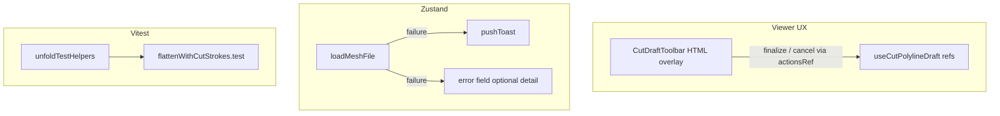

# Phase 1 remediation — Holistic QA findings

**Status:** In progress — Slice 4 and Slice 1 implemented; remaining slices not started  
**Date:** 2026-08-18  
**Branch:** current (post–Phase 1 complete)  
**Source audits:** [qa-audits.md — Holistic CI gate](qa-audits.md#audit--2026-08-17--holistic-ci-gate--test-suite-health)  
**Strategy:** [qa-holistic-post-phase1.md](qa-holistic-post-phase1.md)  
**ADRs:** PoC [0001–0003](../../decisions/poc/), product [0100](../../decisions/product/0100-freeform-cut-strokes.md) — **no ADR amendments required**

## Goal

Close Phase 1 holistic QA findings without pulling in v2 scope (geodesic opposite-face walk / **POLYCUT-C-002**, mid-segment insert, general undo stack, draw-time snap/weld, Web Worker flatten).

Three outcome areas:

1. **UI/UX & workflow** — Done/Cancel visible while drafting in the 3D viewport; sidebar stable during cut interaction; instructional copy matches supported gestures.
2. **Error visibility** — Parse/load failures surface as prominent toasts; prior session preserved.
3. **Test integrity** — Vitest asserts real cut/unfold contracts; audit tests stop encoding frozen limits as success specs.

## Findings in scope

| ID | Severity | Summary |
|----|----------|---------|
| HOLISTIC-UI-001 | Medium | Missing **Done** / **Cancel** in the viewer during draft / re-edit |
| HOLISTIC-UI-002 | Medium | Sidebar jumps when a draft point is appended |
| HOLISTIC-UI-003 | Medium | Stale cut-tool copy (Backspace / double-click called out incorrectly) |
| HOLISTIC-UI-004 | Low / Medium | Load errors only in sidebar footer; no toast |
| HOLISTIC-TS-001 | High | `flattenWithCutStrokes` weak island assertions |
| HOLISTIC-TS-002 | Medium | `materializeCutStrokes` never checks island partition |
| HOLISTIC-TS-003 | Medium | Slice C audit locks in C-002 as passing behavior |
| HOLISTIC-TS-004 | Low | Slice D “Cancel” test is tautological |
| HOLISTIC-TS-005 | Low | Tautological quality / demo smoke asserts |
| HOLISTIC-TS-006 | High | No ADR 0002 soup checks on derived meshes after flatten-with-cuts |
| HOLISTIC-TS-007 | Medium | Thin `parseObj` error-path coverage vs STL |
| HOLISTIC-TS-009 | Medium | Store: failed load identity + no load-failure toast contract |

**Explicitly out of scope:** HOLISTIC-TS-008 (non-manifold fixture — valuable but not tied to a manual finding), HOLISTIC-TS-010 (flattenSnapshotUi stale-key — low), full test deduplication (`CUBE_OBJ` consolidation), Playwright/R3F component tests, **POLYCUT-C-002** geometry fix.

---

## Architecture overview



**Principle:** Draft geometry stays in viewer refs (ADR 0100). Remediation adds a **viewport-local control surface** and reduces **page-level draft UI churn** so the sidebar does not reflow on every vertex. Load failures reuse the existing toast channel already used for ineligible seams and demo fetch errors.

---

## Slice 1 — Viewport cut-draft toolbar (HOLISTIC-UI-001)

### Problem

Done/Cancel exist in [AppSidebar.tsx](../../../src/ui/layout/AppSidebar.tsx) but only when `meshEditTool === "cut" && cutDraftActive`, at the bottom of a long scrollable drawer. During Journey C the operator works in the 3D viewport — especially on mobile with the sidebar closed — and never sees those controls. Keyboard shortcuts (Enter / Esc) are insufficient as the only affordance.

### Proposed solution

Add a small **HTML overlay toolbar** anchored to the 3D viewport panel (sibling to `Canvas`, not inside R3F):

| Control | Behavior |
|---------|----------|
| **Done** | Calls existing `cutDraftActionsRef.current?.finalize()`; disabled when `!canFinalize` |
| **Cancel** | Calls `cutDraftActionsRef.current?.cancel()` |
| Optional label | “Editing cut” vs “Drawing cut” when `editingStrokeId` is set |

**Files (expected):**

- New: `src/ui/layout/CutDraftToolbar.tsx` (pure presentational; no Three.js)
- [ViewportChrome.tsx](../../../src/ui/layout/ViewportChrome.tsx) or [app/page.tsx](../../../app/page.tsx) — mount toolbar over `viewport3dPanelRef` region
- Reuse existing props: `cutDraftActive`, `cutDraftCanFinalize`, `editingStrokeId`, `onCutDraftDone`, `onCutDraftCancel`, `meshEditTool`

**Design notes:**

- Position: top-right or bottom-center of the 3D panel with `position: absolute` inside the viewport panel wrapper (same stacking context as the loading overlay).
- Show when `meshEditTool === "cut" && cutDraftActive`.
- Keep sidebar Done/Cancel as **secondary** affordances for desktop users who keep the drawer open — do not remove them in this slice (low cost, aids discoverability). If duplication feels noisy after manual QA, hide sidebar buttons when the viewport toolbar is visible (follow-up polish only).

### Success criteria

- Journey C re-edit: operator can commit or discard without opening the sidebar or using keyboard.
- Mobile 3D tab: toolbar visible while drafting with sidebar collapsed.
- Done disabled with fewer than two placed vertices; enabled at ≥2 (matches `canFinalize`).

---

## Slice 2 — Stabilize sidebar during cut drafting (HOLISTIC-UI-002)

### Problem

Each draft UI transition propagates from [useCutPolylineDraft.ts](../../../src/viewer/cutPolyline/useCutPolylineDraft.ts) → [MeshViewport.tsx](../../../src/viewer/MeshViewport.tsx) → [app/page.tsx](../../../app/page.tsx) → full [AppSidebar.tsx](../../../src/ui/layout/AppSidebar.tsx) re-render. When the first vertex is placed:

- `cutDraftActive` flips `false → true`
- Done/Cancel block appears
- Model-scale slider disables and “Scale locked…” copy appears

That inserts new blocks mid-scroll and causes visible jump.

### Proposed solution (layered)

**2A — Decouple layout from draft state**

When `meshEditTool === "cut"`, always reserve space for the draft-control region in the Edit tool card:

- Fixed `min-height` placeholder for the Done/Cancel stack **or** always render the stack with `visibility: hidden` / `aria-hidden` until `cutDraftActive`.
- Always render the scale-lock hint row in cut mode (muted “Scale locks while a cut draft is active”) so enabling the slider does not shift content below.

**2B — Reduce unnecessary React churn**

- Wrap `AppSidebar` in `React.memo` (props are already grouped; verify stable callbacks from `page.tsx`).
- Remove duplicate local `cutDraftActive` / `editingStrokeId` state in [MeshViewport.tsx](../../../src/viewer/MeshViewport.tsx) if only used for `canPickCommittedStroke` — derive from lifted page state via props instead of mirroring in `onDraftUiChange`.
- Consider narrowing `onCutDraftUiChange` fan-out: viewport toolbar can read `canFinalize` from the same callback without forcing flatten/export sections to re-render (split sidebar props so flatten card is memoized separately). **Preferred minimal fix:** memo + reserved layout first; only split props if jump persists after 2A.

**2C — Draft points must not touch Zustand**

Confirm append/drag/hover paths do not bump `patternRevision` or store fields (already true per ADR 0100). No store changes needed unless profiling finds accidental subscriptions.

### Success criteria

- Placing the 1st, 2nd, and 3rd draft vertices does not scroll or resize the Edit tool card abruptly.
- Sidebar stats (verts/tris/seams) unchanged while drafting (overlay-only edits).
- No regression to scale lock during active draft.

---

## Slice 3 — Instructional copy alignment (HOLISTIC-UI-003)

### Problem

[AppSidebar.tsx](../../../src/ui/layout/AppSidebar.tsx) lines 229–235 advertise **“Double-click… to commit”** and **“Backspace undoes last vertex”** as peer instructions to Done/Enter. Journey C flagged this as stale/misleading for the primary workflow.

### Proposed copy (single source)

Replace the cut-tool help block with approved primary gestures:

> Click the mesh to place vertices. Orbit between clicks. Click the **amber first-vertex marker** to close a loop. Press **Enter** or **Done** to commit an open stroke. Press **Esc** or **Cancel** to discard. Click a cyan committed stroke to re-edit.

**Optional secondary line** (muted, smaller):

> While drafting, the last placed vertex can be removed with Backspace.

Do **not** list double-click in primary copy unless manual QA confirms it remains reliable on all platforms after toolbar work; Slice E matrix listed it as a commit path, but the holistic finding treats sidebar emphasis as wrong — de-emphasize or omit from sidebar; keep code behavior unchanged in this slice.

**Also update:** [phase-1-freeform-cut-strokes.md](phase-1-freeform-cut-strokes.md) viewer UX table so product docs match sidebar (docs-only in same PR or immediately after).

### Success criteria

- Sidebar text matches toolbar + keyboard behavior verified in Journey C.
- No mention of “Backspace to undo” as a general undo stack (v2 **CUT-UX-002**).

---

## Slice 4 — Prominent load-error toasts (HOLISTIC-UI-004, HOLISTIC-TS-009 partial)

### Problem

[loadMeshFile](../../../src/state/meshSessionStore.ts) catch path sets `error: message` but does **not** call `pushToast`. The error card renders at the **bottom** of the sidebar ([AppSidebar.tsx](../../../src/ui/layout/AppSidebar.tsx) ~452–456), easy to miss. Demo fetch failures already toast via [useMeshLoadHandlers.ts](../../../src/ui/hooks/useMeshLoadHandlers.ts).

### Proposed solution

In the `loadMeshFile` catch branch (after `loadSeq` guard):

```text
set((s) => ({
  isLoading: false,
  error: message,
  ...pushToast(s, userFacingSummary, "warning"),
}));
```

**Message shaping:**

- Reuse `ObjParseError` / `StlParseError` `.message` for toast (truncate ~120 chars if needed).
- Prefix: `Could not load mesh:` for generic errors.
- Keep `error` field for full text in sidebar (optional detail for power users) **or** clear sidebar error once toast fires — **recommend keep both** so Journey D “session preserved + visible failure” holds.

**Additional minor fixes in scope:**

- Clear `error: null` at the start of a new load attempt (alongside `isLoading: true`) so a prior failure does not linger in the footer after a successful retry.
- Add store test: corrupt OBJ → `notifyToast` path exercised via `toasts` length / last toast text; failed load → same `session` reference (strengthen HOLISTIC-TS-009).

### Success criteria

- Journey D corrupt OBJ: toast appears immediately; prior mesh/session intact.
- Successful reload clears prior error state.
- Store test covers toast + session preservation.

---

## Slice 5 — Tighten flatten + materialize tests (HOLISTIC-TS-001, TS-002, TS-006)

### Problem

Production [flattenWithCutStrokes.test.ts](../../../src/logic/cuts/flattenWithCutStrokes.test.ts) uses `islands.length >= 1` after cuts. Strong closed-loop contracts live only in [polylineClosedLoop.audit.test.ts](../../../src/logic/cuts/polylineClosedLoop.audit.test.ts). Derived meshes never get ADR 0002 soup checks.

### Proposed solution

**5A — Shared unfold assertions**

Extract reusable helpers from [unfoldIsland.test.ts](../../../src/logic/unfold/unfoldIsland.test.ts) into `src/logic/unfold/unfoldTestHelpers.ts` (or `src/logic/geom2d/testHelpers.ts` sibling):

- `assertTriangleCCW`, `assertTriangleEdgeLengthsPreserved`, tree-hinge agreement helpers
- New: `assertUnfoldMeshSoupInvariants(result, mesh, eps)` — per-island length `6F`, finite coords, 3D≈2D edge lengths

**5B — Promote contracts into production flatten tests**

In `flattenWithCutStrokes.test.ts`:

| Case | Assert |
|------|--------|
| Empty strokes | Unchanged vs direct `unfoldMesh` on base mesh (same island count **and** face sets) |
| `singleFaceClosedLoop()` from [cutTestFixtures.ts](../../../src/logic/cuts/cutTestFixtures.ts) | `islands.length >= 2`, `openLoops` empty, `collisionCount === 0` |
| Open dart on triangle | `openLoops.length >= 1`, warning substring; island count **unchanged** vs no-cut baseline |
| Diagonal on triangle | `faceCount` increases vs base **or** island topology changes — **not** merely `>= 1` |

**5C — Materialize partition**

In [materializeCutStrokes.test.ts](../../../src/logic/cuts/materializeCutStrokes.test.ts):

- After closed loop on `unitQuad`: `partitionIslands(derived, seams).length >= 2`
- Replace `seams.size >= 1` with exact expected keys where fixtures allow

**5D — Derived-mesh soup**

One integration test: `flattenWithCutStrokes` + `singleFaceClosedLoop()` → run `assertUnfoldMeshSoupInvariants` on each island (addresses TS-006).

Keep [polylineClosedLoop.audit.test.ts](../../../src/logic/cuts/polylineClosedLoop.audit.test.ts) as a thin wrapper or mark deprecated after promotion — do not delete historical audit ID references in `qa-audits.md`.

### Success criteria

- If materialize becomes a no-op for a closed loop, **production** flatten tests fail.
- `npm test` green with stricter asserts.
- No new dependencies.

---

## Slice 6 — Audit test hygiene + parser/store coverage (HOLISTIC-TS-003, TS-004, TS-005, TS-007)

### Slice C — Freeze C-002 instead of locking it in

In [sliceC.polylineDrag.audit.test.ts](../../../src/logic/cuts/sliceC.polylineDrag.audit.test.ts):

- Split “stays on start face” into `it.skip("opposite-face geodesic wrap — POLYCUT-C-002 deferred", …)` with comment linking frozen limit.
- Keep **C-001** regression: no through-volume chord on same-face and adjacent-face cases (must stay passing).

### Slice D — Real cancel contract

In [sliceD.committedEdit.audit.test.ts](../../../src/logic/cuts/sliceD.committedEdit.audit.test.ts):

- Replace tautological cancel test with helper-level call to `cancel()` API (or document move to store test if cancel is viewer-only — prefer testing `useCutPolylineDraft` cancel via extracted pure reset if needed).
- Tighten dart flatten: expect specific island count change or face-count delta, not `<= before`.

### parseObj parity (TS-007)

Add cases to [parseObj.test.ts](../../../src/logic/io/obj/parseObj.test.ts) mirroring high-value STL rejects:

- Empty file / no faces
- Face before vertices
- Out-of-range vertex index (Journey D scenario)
- Non-finite vertex coordinate
- At least one budget-limit case if cheap to construct

### Low-noise cleanup (TS-005)

- Remove or replace `Array.isArray(collisions)` in [unfoldMesh.test.ts](../../../src/logic/unfold/unfoldMesh.test.ts) with `collisionCount >= 0` pin on cube fixture.
- Tighten one adversarial case: disjoint faces must expect warning substring `"could not connect"` (or actual materialize warning kind).

### Success criteria

- Future geodesic fix does not require deleting a passing test — skipped test documents intent.
- parseObj throws on out-of-range vertex with stable error type/message.
- No weakening of adversarial materialize suite.

---

## Implementation order

| Order | Slice | Rationale |
|-------|-------|-----------|
| 1 | **4** Load-error toasts | **Done** — `loadMeshFile` pushes a warning toast; store tests cover corrupt OBJ + session identity |
| 2 | **1** Viewport toolbar | **Done** — HTML overlay `CutDraftToolbar` on the 3D panel; sidebar Done/Cancel kept |
| 3 | **2** Sidebar stability | Depends on toolbar existing; layout reserve independent |
| 4 | **3** Copy | Quick; do after UX layout settles |
| 5 | **5** Flatten/materialize tests | Logic confidence before release |
| 6 | **6** Audit/parser hygiene | Test-only; can parallelize with 5 |

Each slice: `npm test` + `npm run lint` before marking complete.

---

## Verification matrix (post-remediation)

| Check | How |
|-------|-----|
| Journey C — Done/Cancel in viewport | Manual: draft + re-edit without sidebar |
| Journey C — stable sidebar | Manual: place 3 vertices; no jump |
| Journey C — copy | Manual: read Edit tool card |
| Journey D — corrupt OBJ | Manual: toast + session preserved |
| Closed loop flatten | Automated: `flattenWithCutStrokes` ≥2 islands |
| No-cut regression | Automated: empty strokes ≡ `unfoldMesh` |
| C-002 still frozen | Manual/visual unchanged; skipped unit test documents gap |
| CI | 337+ tests pass; lint clean |

---

## Non-goals (do not implement)

- Geodesic / opposite-face walk (**POLYCUT-C-002**)
- Mid-segment insert (**CUT-UX-001**)
- General undo stack (**CUT-UX-002**)
- Draw-time snap/weld (**CUT-UX-003**)
- Web Worker flatten (**UI-004**)
- Playwright / R3F component tests
- Consolidating duplicate `CUBE_OBJ` fixtures (separate maintainability PR)

---

## Post-remediation documentation

When all slices land:

1. Append a **Remediation complete** subsection to the holistic audit in [qa-audits.md](qa-audits.md) with Pass/Fail per finding ID.
2. Set this plan **Status: Complete**.
3. Update [README.md](README.md) QA table row.
