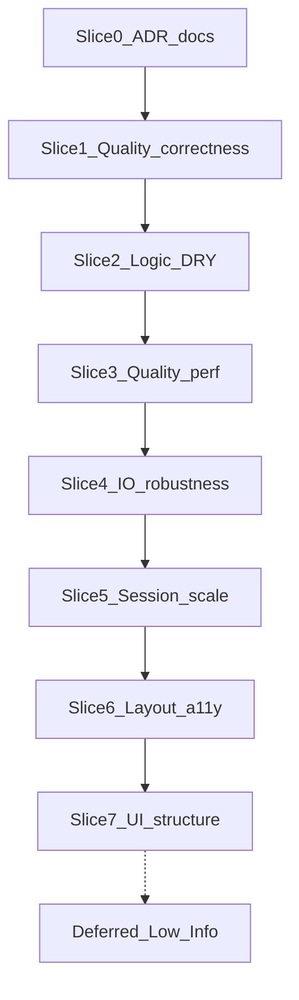

# QA audit remediation plan (docs)

## Goal

Create a new implementation plan markdown that turns [docs/qa-audit.md](docs/qa-audit.md) open findings into **ordered slices** (similar cause / shared files / shared goal). No application code in this step — docs only.

## Deliverables

1. **New plan:** [docs/plans/archive/qa-audit-remediation.md](docs/plans/archive/qa-audit-remediation.md)  
   - Archive-style header: Status / Source audit / ADR impact / Non-goals  
   - Slice table + per-slice scope, audit IDs, key files, tests, done criteria  
2. **Hub link:** Add a Status row in [docs/plans/README.md](docs/plans/README.md) pointing at the new plan (status: **Planned** / In progress when work starts).

## Slice grouping (committed order)

Slices are sequenced so docs and quality-correctness land before DRY/refactors and scale work (avoids rewriting helpers twice).

| Slice | Theme | Audit IDs | Why grouped |
|-------|--------|-----------|-------------|
| **0 — ADR / docs sync** | Amend ADRs to match shipped reality | DOC-001, DOC-002, DOC-003 (+ tear-kind table text with TEAR-001) | Doc-only; unblocks agents; no code risk |
| **1 — Quality correctness** | Tear kinds, BFS tree fidelity, island index identity | TEAR-001, LOGIC-006, LOGIC-025, DOC-003 assert | Same pipeline: unfold tree → tears → layout reports |
| **2 — Logic DRY foundation** | Shared face/edge/key/tolerance helpers | LOGIC-007, LOGIC-008, LOGIC-012 | One `faceUtils` / `parseEdgeKey` / tolerances home; enables Slice 3 cleanly |
| **3 — Quality hot-path perf** | Collision/tear algorithmic waste | LOGIC-009, LOGIC-010, LOGIC-011, PERF-002 | All inside detect/analyze/geom2d after helpers exist |
| **4 — I/O + seam robustness** | Import edge cases, user-visible warnings, seam export | LOGIC-004, LOGIC-005, LOGIC-013–015, IO-001, IO-002, IO-003 | Load → topology → seam export boundary |
| **5 — Session / scale UX** | Seam toggle cost, selectors, flatten thread, preview parity | STATE-003, ARCH-001, ARCH-003, UI-004, UI-008 | Page/store/flatten coupling |
| **6 — Layout + a11y hardening** | Hydration, peek, keyboard, Escape | LAYOUT-001/002/004/008/009/010, A11Y-002/003, STATE-006, VIEW-001 | Shell-only; independent of geometry |
| **7 — UI structure / DRY** | Orchestrator slim-down, preview/export share | UI-001–003, UI-002, APP-001–003, LAYOUT-007 | Larger refactors; last so contracts are stable |
| **Deferred** | Low polish + Info PoC limits | Remaining Low rows; LOGIC-020–023 Info | Explicit non-blocking backlog inside the same plan |

## Plan doc structure (what the new MD will contain)

For each slice 0–7:

- **Goal** (one sentence)
- **In scope / out of scope**
- **Audit ID checklist**
- **Primary files** (concrete paths from the audit)
- **Approach** (short bullets — e.g. Slice 1: fix `classifyTearKind`; extract shared BFS walker or assert `treeEdges.size === faces-1`; add `sourceIslandIndex` through `unfoldMesh` → `layoutIslands` → quality reports)
- **Tests / verification** (`npm test`, targeted `*.test.ts`, manual QA when UI)
- **Done when** (checklist)
- **ADR touch?** (Slice 0 + tear kinds in 0003; Slice 1 may need tiny type field — ask before new public types if beyond `sourceIslandIndex`)

Also include:

- **Execution rules:** one slice per Agent pass; run `npm test` (and `npm run lint` when TS/React touched); update qa-audit statuses when a slice ships; promote slice notes only in this plan (not `.cursor/plans/`).
- **Dependency note:** Slice 2 before 3; Slice 1 before relying on tear kinds in UI; Slice 0 can ship alone immediately.

## Defaults (locked)

- Scope = **all open findings**, grouped; Low/Info go to **Deferred**, not dropped.
- New file lives under **`docs/plans/archive/`** (hub links it; matches existing archive plans).
- No code changes in the docs-writing pass after this plan is approved — only the plan MD + README hub row unless you later ask to implement a slice.

## Out of scope for the docs pass

- Implementing any audit fix in `src/`
- New ADRs beyond amending 0001–0003 text called out in Slice 0
- Feature work (auto-seams, SVG tier 2) from thoughts.txt
